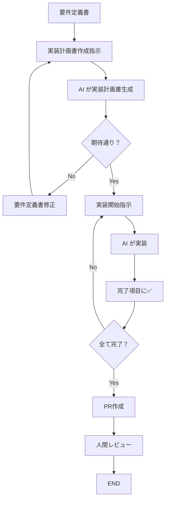

## 概要

リンクアンドモチベーションのエンジニアリングマネージャー川津雄介氏による、AI Agentを活用した高速開発における品質担保の実践的アプローチについての発表資料。新規プロダクト開発を20倍速化する取り組みの中で確立された、AI Agentが自走できるための「ガードレール」設計について詳しく解説している。

## 登壇者情報

### 川津雄介

- 株式会社リンクアンドモチベーション エンジニアリングマネージャー
- SRE・プラットフォームエンジニア
- AI による生産性20倍向上の取り組みに従事

## 会社背景

### 株式会社リンクアンドモチベーション

- 創業：2000年4月7日
- 上場：東京証券取引所プライム市場
- 従業員数：約1,500名（グループ全体）
- 売上：374億円（グループ全体、2024年12月期）
- 事業内容：国内初の組織改善クラウドサービス
- 組織状態の可視化・分析サービスを提供（12,870社、532万人のデータベース）

## AI開発の現状と目標

### コード生成比率の目標

- **新規プロダクト**：目標100%（現在は平均20%程度）
- **既存開発**：目標60%

### AI ツールの使い分け

- **Claude Code（Cursor）**：完全に独立した作業に適用
- **Devin**：順序性のある一連の作業に適用

## AI Agent開発における課題

### 良い点

- **爆速での実装**：人間が1日かかる作業を数分で完了
- 詳細な指示があれば実装完了まで自走可能

### 課題

1. **期待と異なる実装**
   - 保守観点での問題（SOLID原則に反するなど）
   - 機能面での齟齬

2. **頻繁なエラーとオーバーヘッド**
   - 細かいエラーの頻発
   - 期待と異なる仕様による修正指示
   - 「実装→確認→訂正指示」の繰り返し

### 根本原因の分析

#### ① AI が自分でミスに気づけない

- ランタイム例外
- API仕様齟齬
- データ齟齬
- 構文エラー

#### ② AI が機能開発の詳細を人間と期待値調整できていない

- AIの常識は世間一般の常識（開発者の職場の常識ではない）
- 決まっていない仕様は世間一般の方法に準拠してしまう

## 弊社の開発プロセス

### 新規プロダクト開発（0→1）のプロセス

1. **要件定義**（人間主導）
2. **デザイン（モックアップ）**（v0やClaude Codeで生成、PdMレビュー）
3. **実装計画（AI作成の詳細設計）**（AI作成、人間レビュー・承認）
4. **実装（UT & 動作確認）**（AI主導、実装計画書で自走）
5. **テスト（リリース）**（人間主導）
6. **イテレーション**

## 課題解決のアプローチ

### ① AI がミスに気づくための「ガードレール」

#### アーキテクチャの工夫

##### 技術スタック（弊社の一例）

- Client Component + Server Component
- Route Handler + tRPC
- PostgreSQL（Row level security）
- Auth + Queue + Functions
- Vercel + Supabase（コード実装量低減目的）

#### 具体的なガードレール設計

##### 1. 型や静的解析による検知

- **TypeScript**：コード間の呼び出し不整合をコンパイル時に検知
- **ESLint**：静的解析によるコード品質チェック
- **ユニットテスト**：カバレッジ80-90%を目標
- **npm run build**：これらすべてを通過しなければ完成ではないとAI Agentに認識させる

##### 2. モノレポ構成（Next.js）

- フロントエンド・バックエンドを同一リポジトリで管理
- AI が両者の構造を把握しやすく設計

##### 3. tRPCによる型共有

- フロントエンドとバックエンド間で型が共有
- 関数・メソッドの直接呼び出しに近い体験
- AI Agent自身がAPI呼び出しのバグを認識可能

#### その他の有効な取り組み

- **Playwright MCP**：画面上のエラー検知
- **Figma MCP**：画面仕様との乖離検知
- **Aurora, PostgREST MCP**：DBデータ・Schema齟齬検知
- **Sentry通知**：実行時エラー検知

### ② 期待値調整のための「実装計画書」

#### 実装計画書とは

- 従来の詳細設計よりもさらに詳細なレベルでAIに記述させた実装手順書
- チェックリスト形式で進捗管理も兼ねる
- ファイル・クラス粒度での詳細設計

#### 実装計画書の構成

1. **実装全体のルール・方針**
2. **詳細な実装項目（チェックリスト形式）**
3. **完了項目への✅マーク**

#### 作成プロセス

##### INPUT情報

- 要件定義書（Markdown形式）
- デザイン（画面生成の場合）

##### 作成手順

1. AIに「要件番号XXXの実装計画書を作成してください」と指示
2. 人間が実装計画書をレビュー・承認
3. 期待と異なる場合は要件定義書を修正して再生成
4. 設計ルールの問題は*.mdc、CLAUDE.mdなどのルールファイルを更新

##### 重要な原則

- **チャット欄での直接指示は最小限に**
- **具体的な指示は永続的な文書情報として管理**
- **プロンプトでの直接修正ではなく、INPUT文書を修正して再生成**

#### 実装フェーズ

##### 実装の進め方

1. 「実装計画書の項目ZZZの実装を行ってください」と具体的に指示
2. 小さな単位で「実装→動作確認」のイテレーション
3. 完了した項目はAI自身に✅をつけさせる
4. PRはAI Agentに作成させる（GitHub CLIやGitHub MCP活用）
5. 最終的に人間がPRレビュー・承認

## ディレクトリ構成例

```text
/
├── app/                    # React ページ・コンポーネント (.tsx)
│   ├── api/trpc/[trpc]/   # Next.js Route Handler (tRPC受付のみ)
├── components/            # React共通コンポーネント (.tsx)
└── trpc/routers/         # tRPCによるバックエンドAPI定義 (.ts)
```

## 実装計画書のワークフロー



## 重要な気づき

### AI Agentの本質

- **「優秀な部下」ではなく「新しい入力デバイス」**
- 従来の「キーボード入力→プログラム作成」から「頭の中の指示→直接実現」へ
- 音声入力でAI Agentに指示する開発者も存在

### エンジニアの役割の変化

- **設計はエンジニアが決定**：AIは実装の高速化ツール
- **より高いエンジニアリング力が必要**：正しい指示を出すための技術力
- **ものづくりの楽しさは不変**：単に実装が速くなっただけ

## 実践的な知見

### レビュー（PR）の単位

- 実装計画書に対して1PRは理想的だが、従来のスモールリリースの観点も重要
- テスト・品質面を考慮したリリース可能な最小単位での開発が推奨

### 文書管理の重要性

- 実装計画書はgit branchで構成管理
- feature branch毎に内容を丸ごと書き換え
- マージ（開発完了）時に不要になる一時的な文書

## まとめ

AI Agent時代における高速開発では、以下の2つのアプローチが重要：

1. **技術的ガードレール**：AI自身がミスに気づける仕組み
   - 型安全性（TypeScript）
   - 静的解析（ESLint）
   - テスト自動化
   - モノレポ構成
   - tRPCによる型共有

2. **プロセス的ガードレール**：実装計画書による期待値調整
   - 詳細な実装計画書の事前作成
   - 人間による計画書レビュー・承認
   - 永続的文書による指示管理
   - 小さな単位でのイテレーション

これらのアプローチにより、AI Agentが人間の介入を最小限に抑えて自走でき、従来の20倍速での開発を実現できる。重要なのは、AIはツールであり、設計や判断は依然としてエンジニアの重要な役割であるという認識である。
