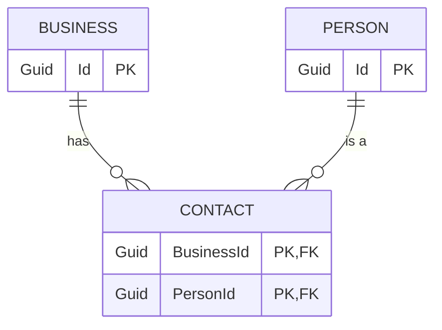

この記事は、単純なフロントエンドツールではなく、ASP.Net Coreを用いた既存アプリケーションに対する、AIを活用した大規模なタスクの実例を紹介するものです。

## タスク：データ変更時にメッセージを送信する

既存のASP.Net Coreアプリケーションには、`Business`と`Person`の間に`Contact`というエンティティで表現されるリレーションシップがあります。

このタスクの目標は、`Business`に`Contact`が追加または削除された際に、`PersonBusinessLink`という型のKafkaイベントを送信することです。

## AIへの指示と最初の試み

まず、既存のKafkaイベント送信の仕組みを理解するために、Claude Codeに「現在、どのようにKafkaイベントをトリガーして送信していますか？」と質問しました。これにより、AIがコード構造のコンテキストを読み込むことを意図しました。

次に、具体的な指示として、`Business`と`Contact`の関係が変更されたときに`PersonBusinessLink`イベントを送信するように依頼し、関連するC#のクラス定義を提示しました。

Claudeは以下の変更を含む、かなり良い初回の提案を生成しました。

* `Business`サービスの作成、変更、パッチ適用ロジックの修正。
* プロジェクトの規約に従った新しいドメイン型`PersonBusinessLinkType`の追加。
* Kafkaメッセージを生成する新しいマッパーメソッドの追加。
* 新しいKafkaトピック "person-business-link" の追加（これはAIの推測で、完全には正しくなかった）。
* 新しいイベントタイプに基づいてメッセージをディスパッチするハンドラーの追加。
* `BusinessService`への`Dispatcher`の注入。

## 人間によるコース修正

AIが逸脱しすぎないように、変更を監視し続けました。例えば、AIが間違ったKafkaトピックを選択した際には、その変更を拒否し、正しいトピック名を指示しました。

以下のような修正指示を行いました。

* パーティションキーとしてビジネスIDを使用するよう指示。
* Outboxパターンが機能するように、Unit of Workをコミットする前にイベントをディスパッチするよう指示。
* 適切な名前空間にコードを配置するよう指示。
* 不要なログや自明なコメントを追加しないよう指示。

これらの指示は、コードを書くことなく、まるでジュニア開発者を指導するように行えました。

### より大きな問題の修正

AIは、ビジネス情報を更新するメソッドで一つ間違いを犯しました。このメソッドは、モナド的な`Result`と`Option`型を返す関数をチェーンさせており、AIにとって理解が困難でした。

AIは、変更前のビジネス情報を取得するために、メソッドのシグネチャを変更してタプル `Result<(originalBusiness, businessToUpdate)>` を渡すようにリファクタリングを試みましたが、一部のエラーパスで構文エラーが発生し、修正を断念しました。

最終的に、この部分は人間が介入して修正しました。AIが無限ループに陥るよりも、ギブアップしてくれた方が好ましいと言えます。

## テスト

本来はテスト駆動開発（TDD）で行うべきでしたが、後からAIにテストの作成を依頼しました。

> 「新しいイベントをテストできる統合テストを見つけてください。まずは1つのテストだけ変更して、動作するか確認してください。」

この指示に対し、Claudeは既存の統合テスト（Test Containersを使用）を見つけ出し、他のテストファイルのパターンを参考に、非常に賢明な方法でテストコードを修正しました。ビジネス関連のテストにはKafkaのテストがなかったにもかかわらず、AIは自律的に適切なパターンを発見しました。

しかし、テストを実行すると失敗しました。AIは修正を試みましたが、有効な解決策を見つけられませんでした。人間がデバッガで調査した結果、Kafkaのセットアップに新しいProducerを追加する必要があることが判明しました。

この修正後、テストはパスし、AIの助けを借りて他のエンドポイントにも同様のテストを追加し、タスクは完了しました。

## これは10倍の速さではないが、ジャンクでもない

この例は、「AIが開発者を置き換える」という極論と「AIは役に立たない」という極論の中間点を示す良い事例です。

* **人間のガイダンスが必要**: このタスクは人間の助けなしには完遂できませんでした。将来的な改善により、必要な助けは減るかもしれませんが、完全に自律的に動作するようになるには時間がかかるでしょう。
* **得意なタスク**: 機能フラグの追加や、簡単なオンデマンドスクリプト（Gitのコミット履歴のグラフ化など）の作成は非常に得意です。
* **ツールの使い分け**: いつAIを使い、いつ自分でコードを書くべきかを見極めるスキルが重要になります。

## AIの負の側面を忘れてはならない

AIツールには負の側面も存在します。

* **巨大テック企業による支配**: AIは、個人の権力と民主主義の不安定化を目的とする「Broligarchs（技術系富豪）」によって推進されています。
* **環境負荷**: AIは膨大な電力を消費し、化石燃料の燃焼や水不足を加速させ、気候危機を悪化させています。
* **持続可能性への懸念**: 現在のAIへの投資は、持続不可能なバブルである可能性があり、将来的にツールの崩壊や価格の高騰、サービスの質の低下（Enshittification）が起こるかもしれません。
