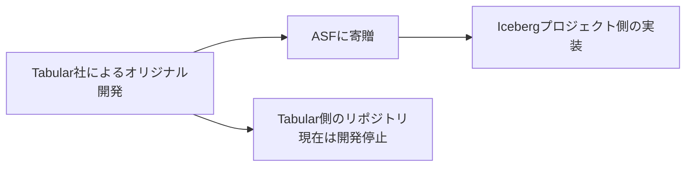

## 概要

本記事では、RDBMSからApache IcebergへのCDC（Change Data Capture）を実現するためのKafka Iceberg Sink Connectorについて、その現状と利用時の重要な留意点を解説している。

---

## CDCが必要とされる背景

### CDCとは

データ分析基盤において、業務システムのRDBMS上のデータを連携する際のアプローチの一つ。

**CDCの仕組み**:

- ソースDB上のイベント（MySQLのbinlogなど）をDebeziumなどでキャプチャ
- キャプチャした変更イベントを分析基盤に反映

### CDCの重要な特徴

| アプローチ | UPDATE/DELETE処理 | 処理効率 |
|-----------|------------------|---------|
| CDC | 変更イベントベースで差分のみ処理 | ✅ 効率的 |
| 断面取得（CDC不使用） | 全レコード突き合わせ or テーブル全体洗い替え | ❌ 非効率（大規模テーブルでは現実的でない） |

### CDCとリアルタイム性について

- CDCは本質的には**変更差分をベースとするレプリケーション**を指す
- 必ずしもリアルタイム処理である必要はない
- バッチベースでまとめて反映する実装も可能
- ただし、リアルタイム連携ではCDCの効率が良いため、結果的に併用されることが多い

---

## Apache Iceberg Sink Connector

### 基本構成

Icebergプロジェクトが提供するKafka Connectとして開発されたコネクタ。

**典型的な連携フロー**:

```
RDBMS → Debezium（変更イベントキャプチャ） → Kafka → Iceberg Sink Connector → Icebergテーブル
```

### 実際の導入事例

**Slack社のユースケース**:

- SlackへのあらゆるメッセージをアプリケーションのMySQLからIcebergへCDC
- ※ただし、Tabular側の実装を使用

---

## ⚠️ 2つのIceberg Sink Connector（重要な留意点）

### 開発の歴史的経緯



| 実装 | リポジトリ | 状態 |
|-----|-----------|------|
| Tabular版（オリジナル） | [databricks/iceberg-kafka-connect](https://github.com/databricks/iceberg-kafka-connect) | 開発停止 |
| Icebergプロジェクト版 | [apache/iceberg/kafka-connect](https://github.com/apache/iceberg/tree/main/kafka-connect) | 開発継続（推奨） |

### 2つの実装間の差異

Icebergプロジェクト側への移管後に**Breaking Changeが複数存在**。

**例：設定項目の違い**

- Tabular版：`iceberg.tables.upsert-mode-enabled`（Upsert有効化）
- Icebergプロジェクト版：**存在しない**

### ⚡ 重大な制約：UPDATE / DELETEを反映できない

**最も重要な差異**：Icebergプロジェクト側のコネクタには**delta writerが実装されていない**

| 機能 | Tabular版 | Icebergプロジェクト版 |
|-----|-----------|---------------------|
| INSERT | ✅ | ✅ |
| UPDATE | ✅ | ❌ |
| DELETE | ✅ | ❌ |
| delta writer | 実装済み | **未実装** |

**delta writerが削除された理由**:
> 「変更の反映がequality deletesに依存していることによる性能への懸念」

**現在の開発状況**:

- [Issue #10842](https://github.com/apache/iceberg/issues/10842)で改善版delta writerの導入を検討中
- [PR #12070](https://github.com/apache/iceberg/pull/12070)で開発進行中

---

## 現状の対応策（ワークアラウンド）

UPDATE/DELETEを含むCDCが必要な場合の代替手段：

### SparkやFlinkによるカスタム実装

- Debeziumがキャプチャした変更イベントを自前で反映する処理を実装
- **利点**: 処理内容を細かくコントロール可能
- **参考**: 著者のOpenSearchCon North America 2025での発表
  - [セッション](https://sched.co/25Gp6)
  - [スライド: Flexible OpenSearch Data Management With Apache Iceberg](https://static.sched.com/hosted_files/opensearchconna2025/1e/Flexible%20OpenSearch%20Data%20Management%20With%20Apache%20Iceberg.pdf)

---

## まとめ

### 重要ポイント

1. **2つの実装の存在を理解する**
   - Tabular版（開発停止）とIcebergプロジェクト版（推奨・開発継続）が存在
   - インターネット上の情報の多くはTabular版を前提としている点に注意

2. **現状の制約**
   - Icebergプロジェクト版では**UPDATE/DELETEを反映できない**
   - INSERT専用のユースケースでのみ利用可能

3. **UPDATE/DELETEが必要な場合**
   - SparkやFlinkによるカスタム実装を検討

### 今後の展望

- Iceberg Sink Connectorは活発に改善が進んでおり、delta writer機能の再実装が進行中
- 今後のIcebergへのデータ連携を支える強力なソフトウェアとして期待

---

## 参考リンク

- [Apache Iceberg Kafka Connect Documentation](https://iceberg.apache.org/docs/nightly/kafka-connect/)
- [Icebergプロジェクト版リポジトリ](https://github.com/apache/iceberg/tree/main/kafka-connect)
- [Tabular版リポジトリ（開発停止）](https://github.com/databricks/iceberg-kafka-connect)
- [delta writer再実装のIssue](https://github.com/apache/iceberg/issues/10842)
- [MicroAd社の解説記事](https://developers.microad.co.jp/entry/2024/04/05/180000)
- [Slack社のCDC事例](https://bering.hatenadiary.com/entry/2024/09/29/125835)
