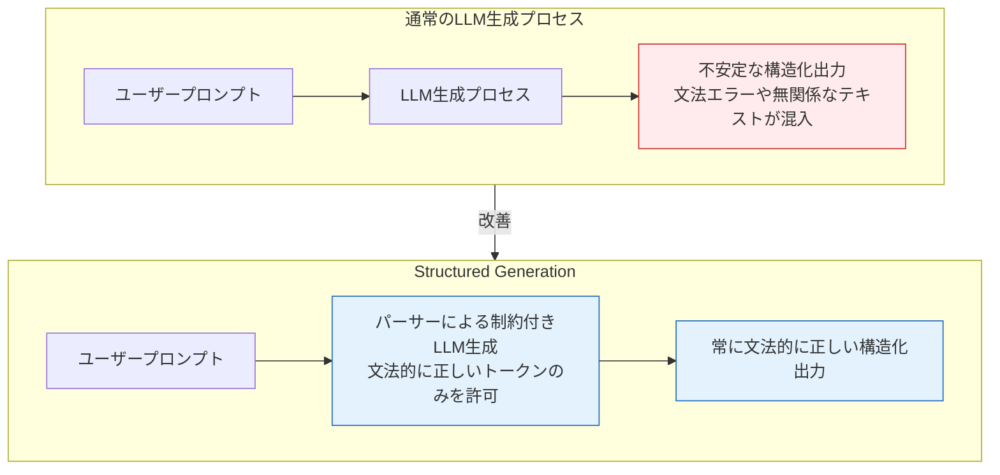
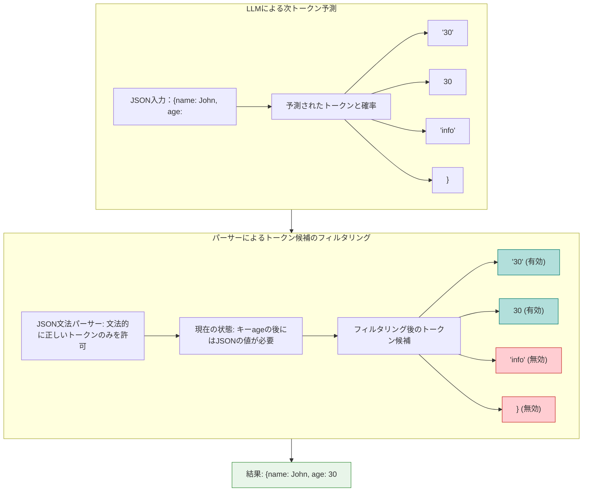
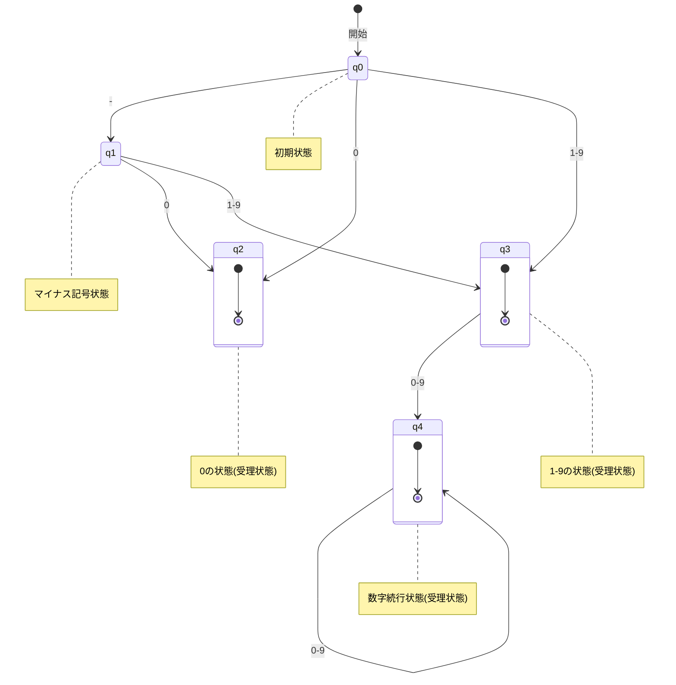
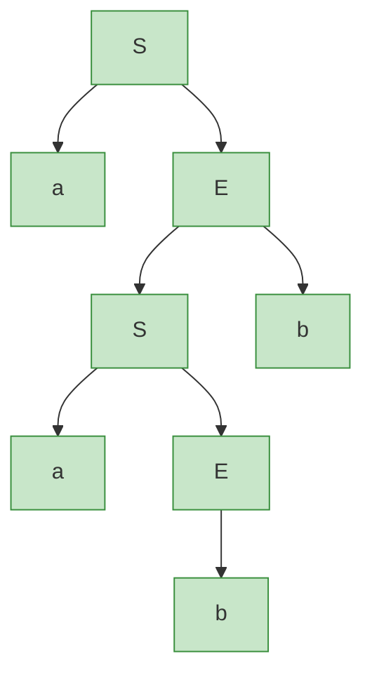

# LLMにJSONやソースコードを出力させるStructured Generationの技術

ref: <https://engineers.ntt.com/entry/202503-structured-generation/entry>

## 1. Structured Generationの基本概念



Structured Generationとは、大規模言語モデル(LLM)にJSONやプログラミング言語のソースコードなどの構造化データを正確に出力させるための生成手法です。従来のLLM出力ではプロンプトだけでは構造を保証できませんでしたが、この技術では文法規則に従った出力を強制することが可能になります。

**主な応用例:**

- **Code Interpreter (OpenAI)**: LLMとPython実行環境を接続し、ユーザーの自然言語要求をコードに変換して処理
- **アシスタントロボット (Meta)**: 音声入力をテキストに変換後、LLMが構造化された命令列に変換

**従来の問題点:**

- プロンプトで「JSONのみを出力して」と指定しても、無関係なテキストや誤った形式が混入
- 構造が崩れるとシステム全体が機能しなくなる致命的な問題が発生
- ファインチューニングやプロンプト工夫だけでは根本解決に不十分

## 2. パーサーを用いた制約手法



LLMが次のトークンを生成する際、通常は確率分布に基づいて選択しますが、Structured Generationでは文法的に正しくないトークンの確率を0にすることで、常に正しい構造を維持します。

**動作原理:**

1. LLMが次のトークン候補とその確率を予測
2. 各トークン候補に対してパーサーで妥当性を検証
3. 文法的に不正なトークンの確率を0に設定
4. 残った候補から確率に従って選択

**技術的課題:**
単純実装では膨大な計算コストが発生します。LLMの語彙サイズは数万にも及ぶため、毎回すべての候補をパーサーでチェックすると非効率です。そこで計算を効率化するためのアルゴリズムが開発されています。

## 3. 正則言語のStructured Generation



正則言語は後方参照を使わない正規表現で表現可能な言語です。例えば整数は `/0|(-?[1-9][0-9]*)/` として表現できます。

**決定性有限オートマトン(DFA)の活用:**

- 状態と入力文字によって次の状態が一意に決まる機械
- 整数判定のDFAでは、「-16」は受理状態に到達するため有効、「0-1-1」や単独の「-」は不正と判定
- 各状態からの遷移を事前計算することで効率化が可能

**効率化アルゴリズム:**
状態数 `Q` と語彙数 `T` に対して、各状態 `q` から各語彙 `t` を入力した時の遷移結果を `dict[q][t]` として前計算しておくことで、`Q*T` のメモリ消費で効率的な判定が可能になります。これにより、語彙ごとにDFAを実行するオーバーヘッドが大幅に削減されます。

## 4. 文脈自由言語と構文木

```mermaid
classDiagram
    class "文脈自由文法a^n b^n" {
        終端記号: a, b
        非終端記号: S, E
        開始記号: S
        変換規則: S→aE, E→Sb|b
        BNF記法: <S> ::= "a" <E>
                <E> ::= <S> "b" | "b"
        生成例: S→aE→aSb→aaEb→aabb
    }
```



文脈自由言語は正則言語より表現力が高く、JSONやプログラミング言語などのネスト構造を持つ言語を扱えます。

**文脈自由文法の構成要素:**

1. **終端記号**: 文を構成する最小単位（アルファベットなど）
2. **非終端記号**: 文法規則の左辺に現れるシンボル
3. **開始記号**: 構文解析の起点となる特別な非終端記号
4. **変換規則**: 非終端記号から記号列への変換ルール

**具体例: a^n b^n 言語**

```
<S> ::= "a" <E>
<E> ::= <S> "b" | "b"
```

これは「aをn個、bをn個並べた文字列」を表す言語で、例えば `aabb` は構文木を通じて正しく生成・解析できます。このような言語は正規表現では表現できません。

**BNF記法の重要性:**
プログラミング言語の文法定義にはBNF(Backus-Naur Form)やEBNF(Extended BNF)が広く使われています。これらは文脈自由文法を簡潔に記述するための記法です。

## 5. 字句解析と構文解析の二段階処理

```mermaid
flowchart TD
    input["{\"temperature\": 25.7, \"unit\": \"celsius\"}"] --> lexical[字句解析]
    lexical --> tokens["LBRACE STRING COLON NUMBER COMMA STRING COLON STRING RBRACE"]
    tokens --> syntax[構文解析]
    syntax --> ast["構文木 (Object with Key-Value pairs)"]
    
    subgraph lexical_analysis[字句解析（正則言語）]
        lexical
        style lexical fill:#e1bee7,stroke:#7b1fa2
    end
    
    subgraph syntax_analysis[構文解析（文脈自由言語）]
        syntax
        style syntax fill:#e1bee7,stroke:#7b1fa2
    end
    
    style tokens fill:#e1bee7,stroke:#7b1fa2
```

実際のプログラミング言語のパースは、通常2段階で行われます:

**字句解析 (Lexical Analysis):**

- 文字列を「トークン」と呼ばれる意味のある単位に分割
- 正則言語の処理で、DFAで実装可能
- 例: `{"temperature": 25.7}` → `LBRACE STRING COLON NUMBER RBRACE`

**文法解析 (Syntactic Analysis):**

- トークン列から構文木を構築
- 文脈自由言語の処理で、通常LALR(1)パーサーなどが使用される

**トークン例 (JSON):**

- 文字列リテラル (`"John"`) → `STRING`
- 数値リテラル (`-3`, `1.2`) → `NUMBER`
- 配列の括弧 (`[`, `]`) → `LBRACK`, `RBRACK`
- オブジェクトの括弧 (`{`, `}`) → `LBRACE`, `RBRACE`
- 区切り文字 (`:`, `,`) → `COLON`, `COMMA`
- リテラル値 (`true`, `false`, `null`) → `TRUE`, `FALSE`, `NULL`

## 6. 効率的なStructured Generation実装

```mermaid
flowchart TD
    input["LLMの中間出力: {key: ["] --> step1[ステップ1: 字句解析]
    step1 --> tokens[字句解析結果: LBRACE STRING COLON LBRACK]
    tokens --> step2[ステップ2: 文法解析]
    step2 --> next_tokens[次に続く可能性のある終端記号]
    next_tokens --> t1[STRING] & t2[NUMBER] & t3[LBRACE] & t4[LBRACK] & t5[RBRACK]
    t1 & t2 & t3 & t4 & t5 --> step3[ステップ3: DFAによる語彙マスク取得]
    step3 --> masks[各終端記号に対応するDFAから語彙マスクを取得]
    masks --> step4[ステップ4: マスクの統合]
    step4 --> final[マスクの和集合から次に許可されるLLMの語彙を決定]
    final --> allowed[許可される語彙: '123', true, false, null, {, [, ], ...]
    
    style step1 fill:#b3e5fc,stroke:#0277bd
    style step2 fill:#b3e5fc,stroke:#0277bd
    style step3 fill:#b3e5fc,stroke:#0277bd
    style step4 fill:#b3e5fc,stroke:#0277bd
    style t1 fill:#b3e5fc,stroke:#0277bd
    style t2 fill:#b3e5fc,stroke:#0277bd
    style t3 fill:#b3e5fc,stroke:#0277bd
    style t4 fill:#b3e5fc,stroke:#0277bd
    style t5 fill:#b3e5fc,stroke:#0277bd
    style allowed fill:#b3e5fc,stroke:#0277bd
```

正則言語と文脈自由言語を組み合わせた効率的なStructured Generation実装は以下のステップで行われます:

**実装手順:**

1. **字句解析**: LLMの中間出力をトークン列に変換
   - 例: `{"key": [` → `LBRACE STRING COLON LBRACK`
2. **文法解析**: トークン列から次に続く可能性のある終端記号を列挙
   - 例: `{"key": [` の次は `STRING`, `NUMBER`, `LBRACE`, `LBRACK`, `RBRACK` など
3. **語彙マスク取得**: 各終端記号を判定するDFAから、前計算済みの語彙マスクを取得
4. **マスク統合**: 語彙マスクの和集合を取り、次に続くことができるLLMの単語を決定

**計算効率:**

- 文脈自由文法の終端記号の種類数に比例した計算量
- 終端記号の種類数はLLMの語彙数より遥かに少ない
  - 例: Pythonでは94種類の終端記号で表現可能
  - 一般的なLLMの語彙数は数万～数十万単位

**具体例のフロー (JSONオブジェクト内に配列を作成中):**

1. 現在の入力: `{"key": [`
2. 次に可能なトークン:
   - 文字列リテラル (`STRING`)
   - 数値リテラル (`NUMBER`)
   - オブジェクト開始 (`LBRACE`)
   - 配列開始 (`LBRACK`)
   - 空配列終了 (`RBRACK`)
3. これらのトークンに対応する語彙マスクを取得
4. マスクの和集合から、次に許可される語彙を決定:
   - 許可: `"123"`, `42`, `true`, `false`, `null`, `{`, `[`, `]` など
   - 禁止: `,`, `}`, `:` など（この文脈では文法的に不正）

## 7. 実用上の利点とパフォーマンス特性

Structured Generationの実装により、以下の重要な利点が得られます:

**信頼性の向上:**

- 出力が常に文法的に正しく、パース可能であることが保証される
- システム全体の安定性と堅牢性が大幅に向上

**計算効率:**

- 前計算された状態遷移テーブルを利用することで、リアルタイム処理の負荷を軽減
- 状態数と終端記号数の積に比例するメモリを使用（語彙サイズより大幅に少ない）

**柔軟性:**

- 任意の文脈自由文法に対応可能で、JSONだけでなく各種プログラミング言語に適用できる
- 新しい言語や形式にも文法定義を与えるだけで対応可能

この技術によりLLMを活用した高度なシステム開発が現実的になり、特にコード生成、データ分析、API連携などの分野で大きな進展をもたらしています。

## まとめ

Structured Generationは、LLMの出力を文法的に制約することで、JSONやプログラミング言語などの構造化データを確実に生成する革新的な技術です。正則言語と文脈自由言語の理論を基に、効率的なアルゴリズムを用いることで、実用的な応用が可能になりました。この技術は、LLMをより洗練されたコンピュータシステムに統合する上で重要な役割を果たし、自然言語とプログラミングの橋渡しをする新たなアプリケーションの基盤となっています。
