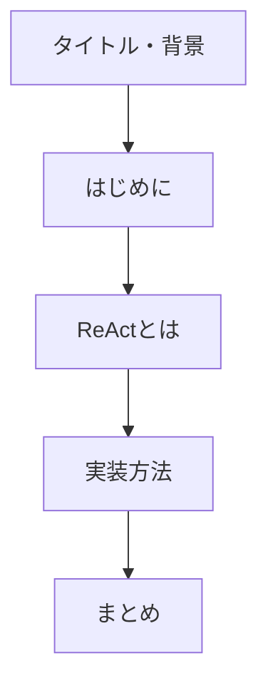
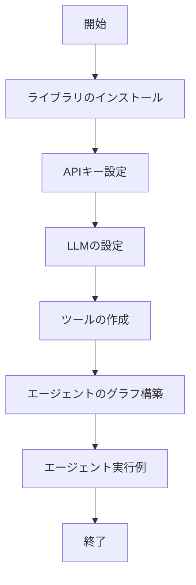

# LangGraphを用いたAIエージェント"ReAct"の実装

ref: <https://qiita.com/t_serizawa/items/0810a2b05c099c08105e>

---

## 目次

1. [タイトル・背景](#タイトル背景)
2. [はじめに](#はじめに)
3. [ReActとは](#reactとは)
4. [実装方法](#実装方法)
5. [まとめ](#まとめ)
6. [記事全体の構造図](#記事全体の構造図)

---

## タイトル・背景

- **タイトル:** LangGraphを用いたAIエージェント "ReAct" の実装
- **掲載場所:** Qiita
- **投稿日:** 2024-12-03（最終更新 2024-12-04）
- **コンテキスト:** 「LLM・LLM活用 Advent Calendar 2024」4日目の記事として公開

---

## はじめに

- 生成AIの盛り上がりにより、特に **AIエージェント** に注目。
- **AIエージェント**：特定のタスクを自律的に実行し、環境と相互作用するシステム。
- 大きく **シングル型** と **マルチ型** に分けられるが、この記事ではシングル型の有名な **ReAct** に焦点を当てる。

---

## ReActとは

- **概要:**
  - 2022年に発表された論文「ReAct: Synergizing Reasoning and Acting in Language Models」で提案された手法。
  - **推論 (Reasoning)** と **行動 (Acting)** を統合することで、「自分で考え、行動し、問題を解決する」能力を実現。
  
- **動作の流れ:**
  1. ユーザがタスク（アイディアや問い合わせ）を入力
  2. AIエージェントが保持するツールから、必要なものを判断して呼び出す
  3. ツールの実行結果をもとに、ユーザへ回答を提示

---

## 実装方法

### 1. ライブラリのインストール

```bash
pip install -U langgraph langchain-openai
```

### 2. APIキーの設定

- APIキーをスクリプト内に直書きするか、セキュリティのため.envファイルに記述

### 3. LLMの設定

```python
import os
from langchain_openai import ChatOpenAI

os.environ["OPENAI_API_KEY"] = "{API KEY}"
model = ChatOpenAI(model="gpt-4o", temperature=0)
```

### 4. ツールの作成

- 例として、東京 (“tokyo”) と岩手 (“iwate”) の天気予報を返す get_weather 関数を定義

```python
from typing import Literal
from langchain_core.tools import tool

@tool
def get_weather(city: Literal["tokyo", "iwate"]):
    """Use this to get weather information."""
    if city == "tokyo":
        return "It might be cloudy in tokyo"
    elif city == "iwate":
        return "It's always snow in iwate"
    else:
        raise AssertionError("Unknown city")

tools = [get_weather]
```

### 5. エージェントのグラフ構築と可視化

```python
from langgraph.prebuilt import create_react_agent
from IPython.display import Image

# graphの構築
graph = create_react_agent(model, tools=tools)

# グラフの可視化
png_data = Image(graph.get_graph().draw_mermaid_png())
with open("output_graph.png", "wb") as f:
    f.write(png_data.data)
```

### 6. エージェントの実行例

- 天気問い合わせの例

```python
def print_stream(stream):
    for s in stream:
        message = s["messages"][-1]
        if isinstance(message, tuple):
            print(message)
        else:
            message.pretty_print()

inputs = {"messages": [("user", "what is the weather in iwate")]}
print_stream(graph.stream(inputs, stream_mode="values"))
```

- ツール不要な問い合わせの例

```python
inputs = {"messages": [("user", "who built you?")]}
# ツール呼び出しせず、LLMの知識から回答を生成
```

---

## まとめ

- ReAct というAIエージェントの仕組みと実装方法について解説。
- ReActは AutoGPT などでも用いられる重要な技術であり、生成AI分野のキャッチアップに役立つ内容。

---

## 記事全体の構造図

以下のmermaid図は、記事の構造と各セクションの関係を示しています。



また、実装方法の詳細なフローは以下の図のようになります。


