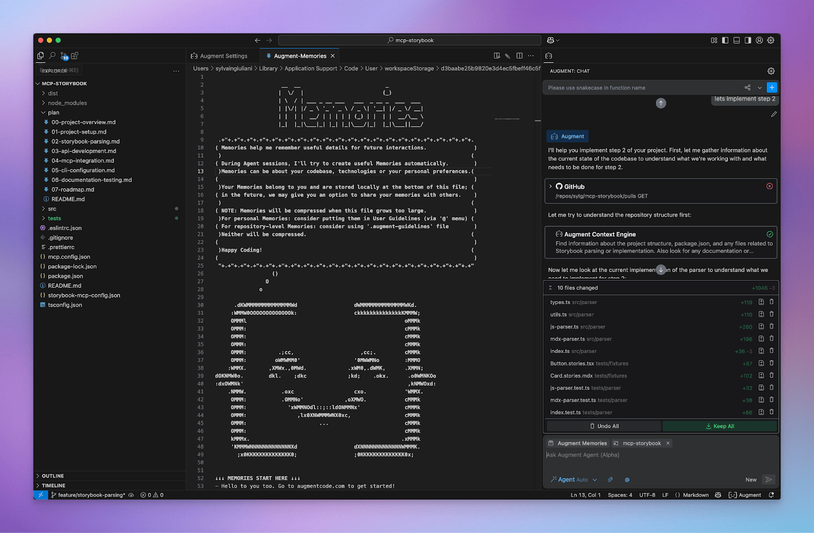
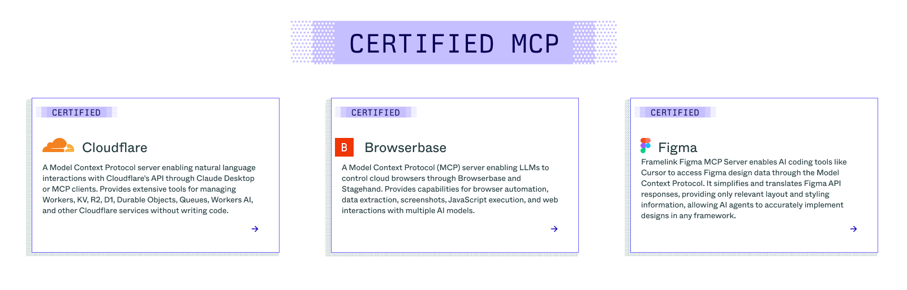
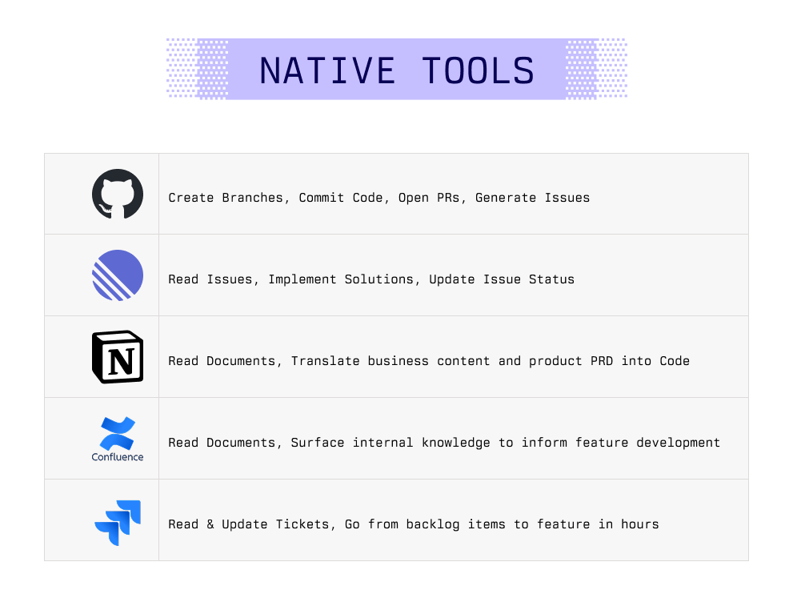
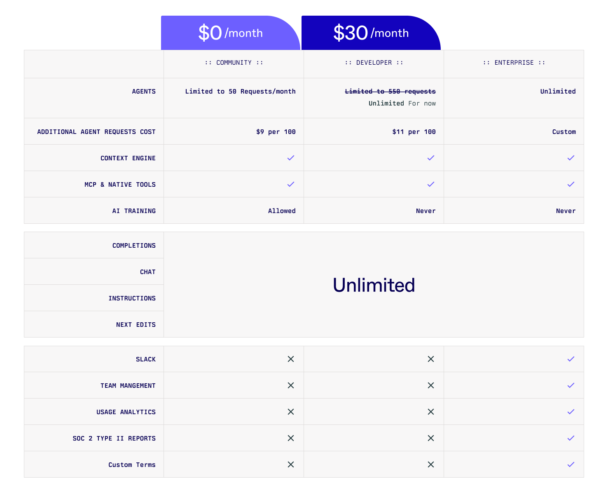

# Meet Augment Agent: Your AI pair programmer that deeply understands your codebase, and learns as you work

ref: <https://www.augmentcode.com/blog/meet-augment-agent>

## Augment Agent概要

Augment Agentは、コードベースを深く理解し、作業中に学習するAIペアプログラマーです。2025年4月2日に発表された新製品で、大規模なコードベースに対応し、高品質なコードを提供するために設計されています。VS CodeとJetBrains IDEに対応しており、14日間の無料トライアルが提供されています。

## 主要機能

### コンテキストの力 - メモリーとツール

- **Context Engine**: あらゆるAI操作に適切なコンテキストを提供する技術
- **Memories（メモリー）**: エージェントと作業する際に自動的に更新され、会話間で持続するため、コード生成の品質向上、タスク解決の高速化、コードスタイルの一致を実現
- **MCP（Model Context Protocol）**: 幅広いツールやシステムへのアクセスを提供し、開発ライフサイクル全体でコンテキストを統合
- **Native Tools**: GitHub、Jira、Confluence、Notion、Linearなどのツールとの統合を提供

### 業界最高レベルのコンテキスト容量

- 最大200Kトークンのコンテキスト容量を持ち、競合ツールの2倍のコンテキスト処理能力
- ツール、コンテキストエンジン、エージェントメモリーからのすべてのコンテキストをシームレスに処理

### その他の機能

- **Code Checkpoints**: エージェントがタスクを処理する間、安心感を提供し、変更を自動的に追跡して簡単にロールバック可能
- **Multi-Modal**: スクリーンショット、Figmaファイルなどを共有してバグ修正やUI実装をサポート
- **ターミナルコマンド**: ファイル検索やコード編集だけでなく、npmインストール、開発実行、Git操作などのコマンド実行も可能
- **Auto Mode**: エージェントのすべてのアクションを確認したくない場合に使用

## 料金体系

AIエージェントの価格設定は難しいため、初期段階では無制限のEarly Adopters価格で提供：

- **Community**: 個人用（無料）
- **Developer**: 個人/チーム用（$30/月）
- **Teams**: ビジネス用（$80/ユーザー/月）

今後価格は変更される可能性があり、CommunityとDeveloperプランのリクエスト制限が追加される見込みです。

## 今後の展開

これは始まりに過ぎず、今後はさらに多くのネイティブツール、ターミナルやIDEとの統合強化、複数のエージェントとの同時作業機能などが予定されています。
