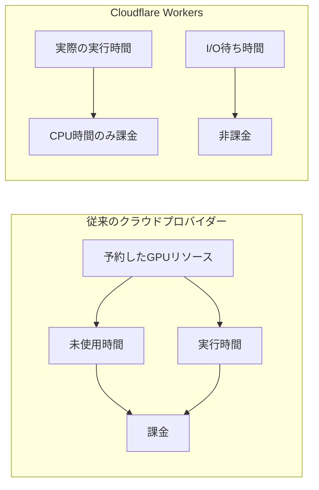
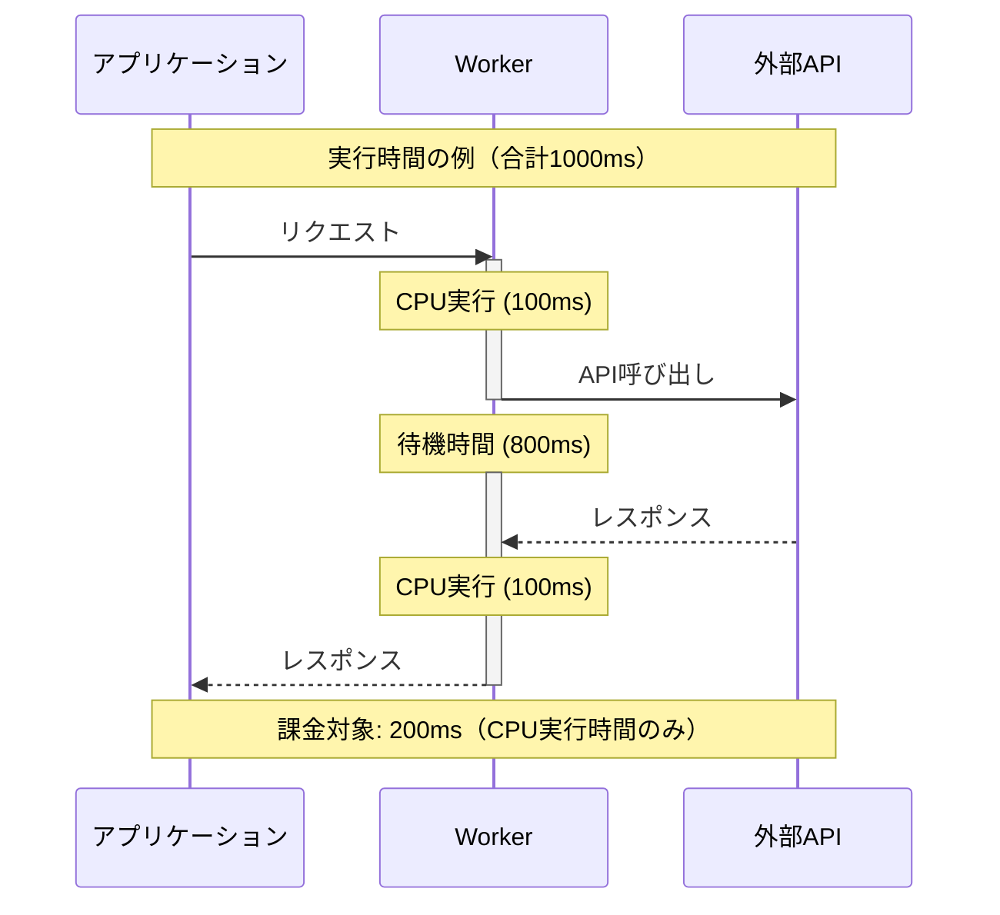
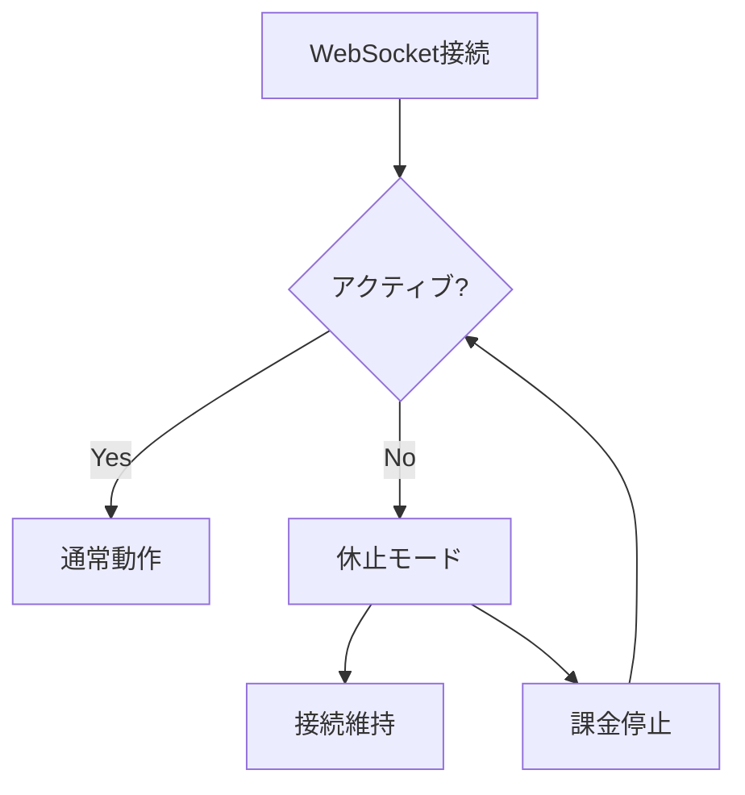

# The Platform For Building Agents

ref: <https://agents.cloudflare.com/>

## 1. 概要と定義

### エージェントAIとは

- 従来の生成AIを超えた自律的な意思決定能力を持つシステム
- 目標指向の推論と適応的な意思決定を統合
- 受動的な応答ではなく、能動的に計画を立て、環境と相互作用

## 2. プラットフォームの主要機能

### 2.1 ユーザー入力の取得

- **対応形式**:
  - Email (Email Workers)
  - チャット (WebSockets, Pages)
  - 音声 (Calls)

### 2.2 AI推論エンジン

- **選択肢**:
  - 自社ホスティングLLM (Workers AI)
  - 外部プロバイダー接続 (AI Gateway)

### 2.3 実行保証システム

- **主要コンポーネント**:
  - 状態管理 (Durable Objects)
  - 計算処理 (Workflows)
  - 動的な計画の再評価機能

### 2.4 アクション実行ツール

- **提供機能**:
  - API統合 (MCP servers)
  - ユーティリティ:
    - ブラウザレンダリング
    - ベクトル検索 (Vectorize)
    - データベース (D1)

## 3. スケーリングと価格設定の特徴

### 3.1 基本料金体系

- **Neurons単位の課金**:
  - 基本料金: $0.011 / 1,000 Neurons
  - 無料枠: 1日あたり10,000 Neurons
  - 日次リセット: UTC 00:00

### 3.2 プラン別料金

| プラン | 無料枠 | 追加利用料金 |
|--------|---------|--------------|
| Workers Free | 10,000 Neurons/日 | 利用不可 |
| Workers Paid | 10,000 Neurons/日 | $0.011/1,000 Neurons |

### 3.3 モデル別料金例

#### LLMモデル

- **Llama 3.3 70B**:
  - 入力: $0.293/100万トークン (26,668 Neurons/100万トークン)
  - 出力: $2.253/100万トークン (204,805 Neurons/100万トークン)
- **Mistral 7B**:
  - 入力: $0.110/100万トークン (10,000 Neurons/100万トークン)
  - 出力: $0.190/100万トークン (17,300 Neurons/100万トークン)

#### 埋め込みモデル

- **BGE Small**: $0.020/100万トークン (1,841 Neurons/100万トークン)
- **BGE Large**: $0.204/100万トークン (18,582 Neurons/100万トークン)

### 3.4 コスト最適化機能

- **CPU時間のみの課金**:
  - 実際の実行時間のみをカウント
  - I/O待ち時間は非課金
  - GPUリソースの効率的な利用（一般的な20-40%の使用率問題を解決）

### 3.5 WebSocket最適化

- Durable Objectsによる接続維持
- 非アクティブ時の自動休止機能
- 長時間接続時のコスト効率化

### 3.6 使用量モニタリング

- Cloudflare Workers AIダッシュボードでの使用量確認
- 日次制限の監視と管理
- 制限超過時のエラー通知

### 3.7 Only Pay For What You Use の仕組み

#### 従来のクラウドプロバイダーとの比較



#### 実行時間の課金方式



#### 主な特徴

1. **実行時間ベースの課金**
   - CPU実行時間のみが課金対象
   - I/O待ち時間は無料
   - バックグラウンド処理時間も非課金

2. **コスト最適化の例**

   | 処理内容 | 全体時間 | CPU時間 | 課金時間 |
   |----------|----------|----------|-----------|
   | API呼び出し | 1000ms | 200ms | 200ms |
   | DB操作 | 500ms | 100ms | 100ms |
   | ファイル処理 | 2000ms | 300ms | 300ms |

3. **リソース効率化のベストプラクティス**
   - 非同期処理の活用
   - バッチ処理の最適化
   - キャッシュの効果的な利用

#### WebSocket接続の最適化



この課金モデルにより、以下のメリットが得られます：

- 予測可能なコスト管理
- リソースの効率的な利用
- スケーラブルな運用
- コストの最適化

## 4. 実装例：ランチ選択エージェント

```typescript
import { Agent, unstable_callable as callable } from 'agents';

export class LunchAgent extends Agent<Env, LunchState> {
  // スケジュール設定
  onStart() {
    this.schedule('weekdays at 11:30pm', 'chooseLunch');
    this.schedule('daily at 5pm', 'resetLunch');
  }

  // レストラン候補の追加
  @callable()
  async nominateRestaurant(restaurantName: string) {
    await this.env.RESTAURANT_RESEARCHER_WORKFLOW.create({
      restaurantName,
      agent: this.name,
      near: this.state.officeAddress,
    });
  }

  // 投票システム
  @callable()
  async vote(username: string, restaurantName: string) {
    const votes = this.state.todaysVotes;
    votes.push({ username, restaurantName });
    this.setState({
      ...this.state,
      todaysVotes: votes,
    });
  }
}
```

## 5. 制限事項と注意点

- 一部機能が開発中（unstable_callableの使用など）
- APIの利用には適切な権限設定が必要
- 特定の機能はCloudflareのエンタープライズプランが必要な可能性あり

## 6. 主要な利点

1. **統合プラットフォーム**
   - すべての機能が単一のプラットフォームで提供
   - シームレスな統合と管理

2. **コスト効率**
   - 使用量ベースの課金
   - リソースの無駄を最小化

3. **スケーラビリティ**
   - 需要に応じた自動スケーリング
   - グローバルな展開が容易

4. **開発者体験**
   - 包括的なSDKとツール群
   - 詳細なドキュメント提供

この要約は、Cloudflare Agentsプラットフォームの主要な機能と特徴を網羅しています。プラットフォームは継続的に進化しており、最新の情報については公式ドキュメントを参照することをお勧めします。
