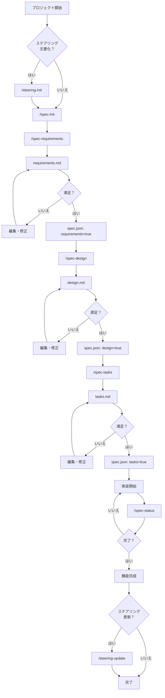
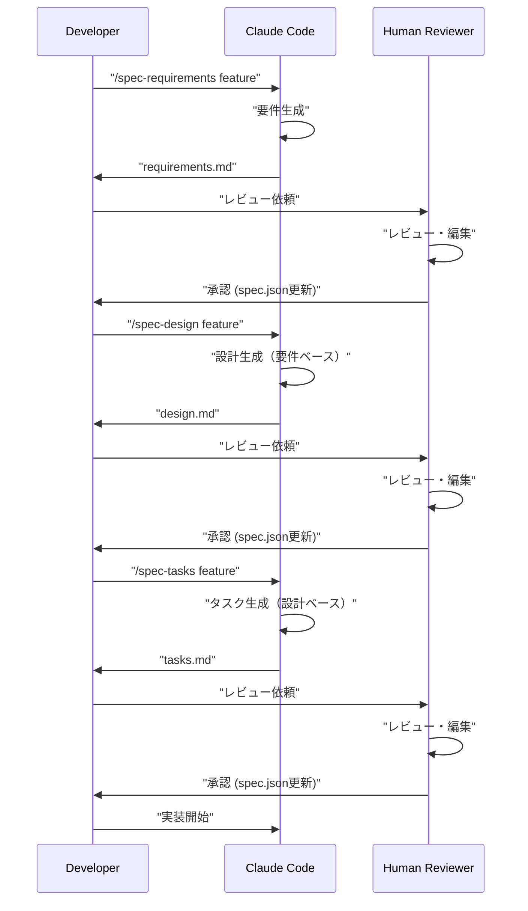

## 概要

`gotalab/claude-code-spec`は、[Claude Code](https://claude.ai/code)のSlash Commandsと`CLAUDE.md`を活用し、[Kiro IDE](https://kiro.com)にインスパイアされた**仕様駆動開発（Spec-Driven Development）**を実践するためのGitHubプロジェクトです。開発の各フェーズで特定のコマンドを使用することにより、体系的で品質の高い開発プロセスを支援します。

## 主な特徴

* **仕様駆動開発の実践**: 要件定義、技術設計、タスク生成という明確なフェーズを経て開発を進めます。
* **Slash Commands**: `/spec-init`, `/spec-requirements`などのコマンドで、各開発フェーズのドキュメントを効率的に生成します。
* **3フェーズ承認ワークフロー**: 各フェーズ（要件、設計、タスク）の完了時に、人間によるレビューと承認（`spec.json`ファイルの更新）を必須とし、品質を担保します。
* **ステアリング文書**: プロジェクトのアーキテクチャ、技術スタック、コーディング規約などの永続的な知識を`/steering-init`コマンドで文書化し、AIのコンテキストを強化します。

## セットアップ

自身のプロジェクトにこの開発手法を導入するには、以下の2つの要素をコピーします。

1. **`.claude/commands/`ディレクトリ**: Slash Commandsの定義ファイル群。
2. **`CLAUDE.md`ファイル**: Claude Codeに対するプロジェクト全体の設定と指示書。

## 使い方

開発ワークフローは以下のステップで進行します。

1. **プロジェクトの初期化**:
    * `(/steering-init)`: (オプション) プロジェクト全体の技術的・構造的な方針を定義するステアリング文書を作成します。
    * `/spec-init "機能の詳細な説明"`: 新機能の仕様策定を開始します。
2. **仕様の具体化**:
    * `/spec-requirements [feature-name]`: 要件定義書を生成します。レビュー後、`spec.json`で承認します。
    * `/spec-design [feature-name]`: 技術設計書を生成します。レビュー後、`spec.json`で承認します。
    * `/spec-tasks [feature-name]`: 実装タスクリストを生成します。レビュー後、`spec.json`で承認します。
3. **実装と進捗確認**:
    * 生成されたタスクに基づき実装を開始します。
    * `/spec-status [feature-name]`: 現在のフェーズやタスクの進捗状況を確認できます。

## プロセスフロー図

開発プロセス全体は以下の図で示されます。各ステップで生成されたドキュメントのレビューと承認が重要な役割を果たします。



## 3フェーズ承認ワークフロー

この開発プロセスの中核は、開発者、Claude Code、そして人間のレビュアーが連携する3段階の承認フローです。



## プロジェクト構造

この手法を導入したプロジェクトは、以下のディレクトリ構造を持ちます。

```
.
├── .claude/
│   └── commands/          # スラッシュコマンド定義
├── .kiro/
│   ├── steering/          # ステアリング文書
│   └── specs/             # 機能仕様
│       └── [feature-name]/
│           ├── spec.json      # フェーズ承認状態
│           ├── requirements.md # 要件定義書
│           ├── design.md      # 技術設計書
│           └── tasks.md       # 実装タスク
├── CLAUDE.md              # Claude Code用設定
└── README.md
```

## まとめ

`claude-code-spec`は、AI支援開発において、人間のレビューと承認プロセスを組み込むことで、開発の品質と透明性を高めるための具体的なフレームワークを提供します。これにより、AIの効率性と人間の監督を両立させた、より信頼性の高い開発が可能になります。
