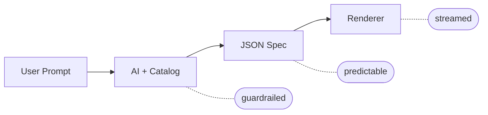

## 概要

**json-render** は Vercel Labs が開発した **Generative UI フレームワーク**。AIが自然言語のプロンプトからUIを生成する際に、開発者が事前に定義したコンポーネント「カタログ」の範囲内でのみ出力を制約することで、**安全性・予測可能性・信頼性**を両立する。

> Generate dynamic, personalized UIs from prompts without sacrificing reliability.

- **GitHub**: https://github.com/vercel-labs/json-render
- **公式サイト**: https://json-render.dev
- **ライセンス**: Apache-2.0
- **スター数**: 13,233+ (2026年3月時点)
- **言語**: TypeScript

---

## なぜ json-render なのか？（コア設計原則）

| 特徴 | 説明 |
| --- | --- |
| **Guardrailed** | AIはカタログに登録されたコンポーネントのみ使用可能 |
| **Predictable** | JSON出力は定義されたスキーマに常に一致 |
| **Fast** | モデルのレスポンスに合わせてストリーミング・プログレッシブレンダリング |
| **Cross-Platform** | 同一カタログからReact, Vue, Svelte, Solid (Web) + React Native (Mobile) に対応 |
| **Batteries Included** | 36個のshadcn/uiプリビルトコンポーネントをそのまま利用可能 |

---

## アーキテクチャ（動作フロー）



1. **ガードレールの定義** — AIが使用できるコンポーネント、アクション、データバインディングを定義
2. **プロンプト** — 自然言語で欲しいUIを記述
3. **AIがJSONを生成** — 出力は常に予測可能で、カタログに制約される
4. **高速レンダリング** — モデルの応答に合わせてストリーミング・プログレッシブにレンダリング

---

## クイックスタート（3ステップ）

### 1. カタログの定義

Zodスキーマを使ってコンポーネントのprops・利用可能なアクションを定義する。

```typescript
import { defineCatalog } from "@json-render/core";
import { schema } from "@json-render/react/schema";
import { z } from "zod";

const catalog = defineCatalog(schema, {
  components: {
    Card: {
      props: z.object({ title: z.string() }),
      description: "A card container",
    },
    Metric: {
      props: z.object({
        label: z.string(),
        value: z.string(),
        format: z.enum(["currency", "percent", "number"]).nullable(),
      }),
      description: "Display a metric value",
    },
    Button: {
      props: z.object({ label: z.string(), action: z.string() }),
      description: "Clickable button",
    },
  },
  actions: {
    export_report: { description: "Export dashboard to PDF" },
    refresh_data: { description: "Refresh all metrics" },
  },
});
```

### 2. コンポーネントの実装

```tsx
import { defineRegistry, Renderer } from "@json-render/react";

const { registry } = defineRegistry(catalog, {
  components: {
    Card: ({ props, children }) => (
      <div className="card"><h3>{props.title}</h3>{children}</div>
    ),
    Metric: ({ props }) => (
      <div className="metric">
        <span>{props.label}</span>
        <span>{format(props.value, props.format)}</span>
      </div>
    ),
    Button: ({ props, emit }) => (
      <button onClick={() => emit("press")}>{props.label}</button>
    ),
  },
});
```

### 3. AI生成Specのレンダリング

```tsx
function Dashboard({ spec }) {
  return <Renderer spec={spec} registry={registry} />;
}
```

AIがJSONを生成し、それを安全にレンダリングする。

---

## パッケージ一覧

### レンダラー

| パッケージ | 説明 |
| --- | --- |
| `@json-render/core` | スキーマ、カタログ、AIプロンプト生成、動的Props、SpecStreamユーティリティ |
| `@json-render/react` | Reactレンダラー、コンテキスト、フック |
| `@json-render/vue` | Vue 3レンダラー、composables、providers |
| `@json-render/svelte` | Svelte 5レンダラー（runesベースのリアクティビティ） |
| `@json-render/solid` | SolidJSレンダラー（きめ細かなリアクティブコンテキスト） |
| `@json-render/shadcn` | 36個のshadcn/uiプリビルトコンポーネント（Radix UI + Tailwind CSS） |
| `@json-render/react-three-fiber` | React Three Fiberレンダラー（19個の3Dコンポーネント内蔵） |
| `@json-render/react-native` | React Nativeレンダラー（25+標準モバイルコンポーネント） |
| `@json-render/remotion` | Remotionビデオレンダラー、タイムラインスキーマ |
| `@json-render/react-pdf` | React PDFレンダラー（PDF文書生成） |
| `@json-render/react-email` | React Emailレンダラー（HTML/プレーンテキストメール） |
| `@json-render/ink` | Inkターミナルレンダラー（対話型TUI用ビルトインコンポーネント） |
| `@json-render/image` | 画像レンダラー（SVG/PNG出力、OG画像、ソーシャルカード）Satori経由 |

### ツール・アダプター

| パッケージ | 説明 |
| --- | --- |
| `@json-render/codegen` | json-render UIツリーからのコード生成ユーティリティ |
| `@json-render/redux` | Redux / Redux Toolkit の `StateStore` アダプター |
| `@json-render/zustand` | Zustand の `StateStore` アダプター |
| `@json-render/jotai` | Jotai の `StateStore` アダプター |
| `@json-render/xstate` | XState Store (atom) の `StateStore` アダプター |
| `@json-render/mcp` | MCP Apps統合（Claude, ChatGPT, Cursor, VS Code対応） |
| `@json-render/yaml` | YAMLワイヤーフォーマット（ストリーミングパーサー、編集モード、AI SDK変換） |

---

## 対応プラットフォーム別レンダラー

### Web UI

- **React** — `defineRegistry` + `Renderer` でフラットSpec形式（root + elements map）をレンダリング
- **Vue 3** — `h()` 関数を使ったコンポーネント定義。テンプレート内で `<Renderer :spec="spec" :registry="registry" />` を使用
- **Svelte 5** — runesベースリアクティビティ対応。Svelte 5スニペットでコンポーネント定義
- **SolidJS** — きめ細かなリアクティブコンテキスト。`renderProps` パターンでコンポーネント定義
- **shadcn/ui** — 36個のプリビルト定義から必要なものを選択。`shadcnComponentDefinitions` と `shadcnComponents` をインポートして即利用

### モバイル

- **React Native** — 25+の標準コンポーネントを内蔵。`standardComponentDefinitions` と `standardActionDefinitions` をそのまま利用

### メディア生成

- **Remotion (動画)** — タイムラインSpec形式。`composition`（fps, 解像度, デュレーション）、`tracks`、`clips` で動画構成を定義
- **React PDF (文書)** — `renderToBuffer` でPDF出力。Document → Page → Heading/Table などの階層構造
- **React Email (メール)** — `renderToHtml` でHTMLメール生成。Html → Head/Body → Container → コンテンツの構造
- **Image (SVG/PNG)** — Satoriを使った画像レンダリング。OG画像やソーシャルカードの生成に最適

### 3D・ターミナル

- **Three.js (3D)** — React Three Fiber経由。Box, Sphere, Light, OrbitControlsなど19個の3Dコンポーネント内蔵。`ThreeCanvas` コンポーネントでレンダリング
- **Ink (ターミナル)** — Card, StatusLineなどのTUI用コンポーネント。`JSONUIProvider` で状態管理

---

## 主要機能

### ストリーミング（SpecStream）

AIレスポンスをプログレッシブにストリーミング処理。チャンクが到着するたびにUIを部分的に更新できる。

```typescript
import { createSpecStreamCompiler } from "@json-render/core";

const compiler = createSpecStreamCompiler<MySpec>();
const { result, newPatches } = compiler.push(chunk);
setSpec(result); // 部分的な結果でUIを更新
const finalSpec = compiler.getResult();
```

### AIプロンプト自動生成

カタログからシステムプロンプトを自動生成。コンポーネントの説明、Propsスキーマ、利用可能なアクションが含まれる。

```typescript
const systemPrompt = catalog.prompt();
```

### 条件付き表示（Conditional Visibility）

`visible` フィールドでステート値に基づく表示/非表示の制御が可能。

```json
{
  "type": "Alert",
  "props": { "message": "Error occurred" },
  "visible": [
    { "$state": "/form/hasError" },
    { "$state": "/form/errorDismissed", "not": true }
  ]
}
```

### 動的Props（Dynamic Props）

式（expression）を使ってデータドリブンなProp値を実現する4つの形式:

| 式 | 説明 |
| --- | --- |
| `{ "$state": "/state/key" }` | ステートモデルから値を読み取る |
| `{ "$cond": ..., "$then": ..., "$else": ... }` | 条件を評価して分岐 |
| `{ "$template": "Hello, ${/user/name}!" }` | ステート値を文字列に補間 |
| `{ "$computed": "fn", "args": { ... } }` | 登録済み関数を引数付きで呼び出し |

### アクション

コンポーネントからアクションをトリガー可能。ビルトインの `setState` アクションでステートモデルを直接更新し、可視性条件や動的Prop式を再評価する。

```json
{
  "type": "Pressable",
  "props": {
    "action": "setState",
    "actionParams": { "statePath": "/activeTab", "value": "home" }
  }
}
```

### ステートウォッチャー

ステート変更に反応してアクションをトリガー。`watch` はエレメントのトップレベルフィールド（`type`/`props`/`children` と同階層）。ウォッチャーは監視値が変化した時のみ発火し、初回レンダリング時には発火しない。

```json
{
  "type": "Select",
  "props": {
    "value": { "$bindState": "/form/country" },
    "options": ["US", "Canada", "UK"]
  },
  "watch": {
    "/form/country": {
      "action": "loadCities",
      "params": { "country": { "$state": "/form/country" } }
    }
  }
}
```

---

## インストール

```bash
# React
npm install @json-render/core @json-render/react
# React + shadcn/ui プリビルトコンポーネント
npm install @json-render/shadcn
# React Native
npm install @json-render/core @json-render/react-native
# 動画 (Remotion)
npm install @json-render/core @json-render/remotion
# PDF
npm install @json-render/core @json-render/react-pdf
# HTMLメール
npm install @json-render/core @json-render/react-email @react-email/components @react-email/render
# Vue
npm install @json-render/core @json-render/vue
# Svelte
npm install @json-render/core @json-render/svelte
# SolidJS
npm install @json-render/core @json-render/solid
# ターミナルUI (Ink)
npm install @json-render/core @json-render/ink ink react
# 3Dシーン (Three.js)
npm install @json-render/core @json-render/react-three-fiber @react-three/fiber @react-three/drei three
```

---

## デモ

```bash
git clone https://github.com/vercel-labs/json-render
cd json-render
pnpm install
pnpm dev
```

| デモ | URL / コマンド |
| --- | --- |
| Docs & Playground | http://json-render.localhost:1355 |
| ダッシュボード例 | http://dashboard-demo.json-render.localhost:1355 |
| React Email例 | http://react-email-demo.json-render.localhost:1355 |
| Remotion動画例 | http://remotion-demo.json-render.localhost:1355 |
| Chat例 | `pnpm dev` in `examples/chat` |
| Svelte例 | `pnpm dev` in `examples/svelte` |
| Vue例 | `pnpm dev` in `examples/vue` |
| 全レンダラー例 | `pnpm dev` in `examples/vite-renderers` |
| React Native例 | `npx expo start` in `examples/react-native` |

---

## 重要なポイント・所見

- **Generative UIの課題を解決**: AIにUIを生成させる際の最大の問題（出力の予測不能性、安全性の懸念）を、コンポーネントカタログによるガードレールで解決している
- **圧倒的なプラットフォーム対応**: Web (4フレームワーク)、モバイル、動画、PDF、メール、画像、3D、ターミナルと、ほぼすべてのUI出力先をカバー
- **状態管理の柔軟性**: Redux, Zustand, Jotai, XState といった主要な状態管理ライブラリとのアダプターを提供
- **MCP統合**: Claude, ChatGPT, Cursor, VS Codeとの統合パッケージにより、AIアシスタントからの直接的なUI生成に対応
- **ストリーミングファースト**: AIのレスポンスをチャンク単位でプログレッシブにレンダリングする設計が組み込まれている
