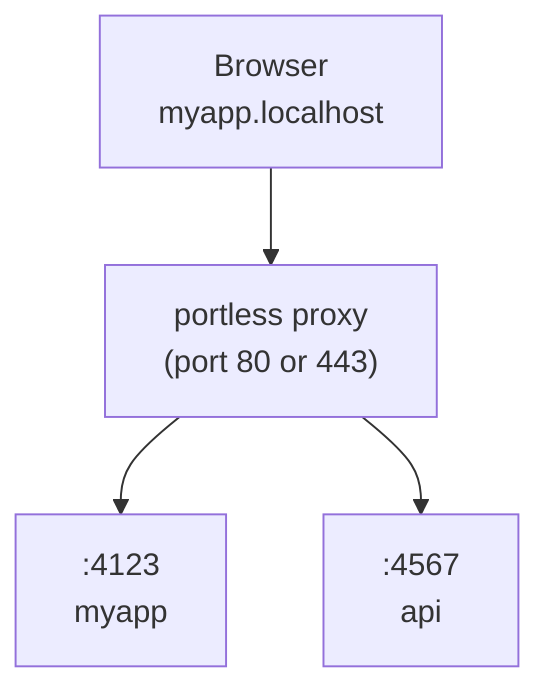

## 概要

**portless** は Vercel Labs が開発したCLIツールで、ローカル開発サーバーのポート番号（`http://localhost:3000`）を、安定した名前付きの `.localhost` URL（`https://myapp.localhost`）に置き換える。HTTPS + HTTP/2 をデフォルトで有効化し、ローカルCA生成・信頼設定を自動で行う。「人間にもAIエージェントにも」使いやすいローカル開発環境を目指している。

GitHub で 6,700+ スターを獲得しており、Apache-2.0 ライセンスで公開されている。主要コントリビューターは **ctate**。

## 主要なトピック

### インストールと基本的な使い方

- グローバルインストール（推奨）: `npm install -g portless`
- プロジェクト単位: `npm install -D portless`
- pre-1.0 のため、プロジェクト単位でのインストールではバージョン差異に注意

基本的な起動方法:

```bash
portless myapp next dev
# -> https://myapp.localhost
```

`package.json` の `scripts` に組み込む場合:

```json
{
  "scripts": {
    "dev": "portless run next dev"
  }
}
```

### アーキテクチャ（動作原理）



1. **プロキシの起動**: アプリ起動時に自動起動、または `portless proxy start` で明示起動
2. **アプリの実行**: `portless <name> <cmd>` でフリーポートを割り当て、プロキシに登録
3. **URLでアクセス**: `https://<name>.localhost` がプロキシ経由でアプリにルーティング

ランダムポート（4000〜4999）が `PORT` 環境変数経由で割り当てられる。Next.js、Express、Nuxt 等は自動で `PORT` を尊重する。Vite、Astro、Angular 等の `PORT` を無視するフレームワークには、portless が自動で `--port` フラグを注入する。

### HTTPS + HTTP/2

- **デフォルトで HTTPS/HTTP2 有効** — ブラウザの HTTP/1.1 の6接続制限を回避し、Vite や Nuxt 等のアンバンドルなファイル配信を高速化
- 初回起動時にローカルCAを生成し、システムの信頼ストアに自動追加（ブラウザ警告なし、手動設定不要）
- カスタム証明書（mkcert 等）の使用も可能
- `--no-tls` でプレーン HTTP（ポート80）に切り替え可能
- Linux は Debian/Ubuntu、Arch、Fedora/RHEL/CentOS、openSUSE をサポート。Windows は `certutil` 使用

### サブドメイン

サービスごとにサブドメインを割り当て可能:

```bash
portless api.myapp pnpm start     # -> https://api.myapp.localhost
portless docs.myapp next dev      # -> https://docs.myapp.localhost
```

- **デフォルト**: strict モード（明示的に登録されたサブドメインのみルーティング）
- `--wildcard` オプション: 未登録のサブドメインを親ルートにフォールバック（例: `tenant1.myapp.localhost` → `myapp` アプリ）

### Git Worktree 対応

`portless run` はGit Worktreeを自動検出し、リンクされたワークツリーではブランチ名をサブドメインとして付加:

```bash
# メインワークツリー
portless run next dev   # -> https://myapp.localhost

# "fix-ui" ブランチのワークツリー
portless run next dev   # -> https://fix-ui.myapp.localhost
```

`package.json` に一度 `portless run` を記述するだけで、メインとワークツリーの両方で衝突なく動作する。

### カスタム TLD

- デフォルトは `.localhost`（大半のブラウザで `127.0.0.1` に自動解決）
- `--tld test` で `.test` 等のカスタム TLD を使用可能
- **推奨**: `.test`（IANA 予約済み、衝突リスクなし）
- **非推奨**: `.local`（mDNS/Bonjour と競合）、`.dev`（Google所有、HSTS 強制）
- `/etc/hosts` の自動同期で名前解決を保証

### LAN モード

```bash
portless proxy start --lan
portless proxy start --lan --https
portless proxy start --lan --ip 192.168.1.42
```

- mDNS によるサービス検出で、同一ネットワーク上のデバイスから `.local` ドメインでアクセス可能
- LAN IPの自動検出、Wi-Fi/IP 変更への自動追従
- `--ip` で特定IPの固定も可能
- `PORTLESS_LAN=1` で LAN モードをデフォルト化
- macOS は `dns-sd`、Linux は `avahi-publish-address`（`avahi-utils`）を使用

### プロキシ間通信

フロントエンド開発サーバー（Vite、webpack等）が別の portless アプリに API プロキシする場合、`Host` ヘッダーの書き換えが必要。設定しないと無限ループが発生する。

- Vite: `changeOrigin: true` を設定
- webpack-dev-server: 同様に `changeOrigin: true`
- portless はこの誤設定を検出し、`508 Loop Detected` レスポンスを返す

### コマンド一覧

| コマンド | 説明 |
|---------|------|
| `portless run [--name <name>] <cmd>` | 名前を推論（またはオーバーライド）してプロキシ経由で実行 |
| `portless <name> <cmd>` | 指定名でアプリを起動 |
| `portless alias <name> <port>` | 静的ルートの登録（Docker等向け） |
| `portless list` | アクティブなルートの表示 |
| `portless trust` | ローカルCAをシステム信頼ストアに追加 |
| `portless clean` | 状態・CA信頼エントリ・hostsブロックを削除 |
| `portless hosts sync` | ルートを `/etc/hosts` に追加（Safari対策） |
| `portless proxy start/stop` | プロキシの起動/停止 |
| `PORTLESS=0 pnpm dev` | portless をバイパスして直接実行 |

### 環境変数

| 変数 | 説明 |
|------|------|
| `PORTLESS_PORT` | プロキシポートのオーバーライド |
| `PORTLESS_APP_PORT` | アプリの固定ポート指定 |
| `PORTLESS_HTTPS=0` | HTTPS無効化 |
| `PORTLESS_LAN=1` | LANモードの有効化 |
| `PORTLESS_TLD` | カスタムTLD指定 |
| `PORTLESS_WILDCARD=1` | 未登録サブドメインのフォールバック許可 |
| `PORTLESS_SYNC_HOSTS=0` | `/etc/hosts` 自動同期の無効化 |
| `PORT` | 子プロセスに注入されるエフェメラルポート |
| `PORTLESS_URL` | 公開URL（例: `https://myapp.localhost`） |

## 重要な事実・データ

- **GitHub スター数**: 6,761+（2026年4月時点）
- **ライセンス**: Apache-2.0
- **対応OS**: macOS, Linux, Windows
- **要件**: Node.js 20+
- **デフォルトポート範囲**: 4000〜4999（ランダム割り当て）
- **プロキシポート**: HTTPS時は443、HTTP時は80（カスタム指定可能）
- **対応フレームワーク**: Next.js、Express、Nuxt、Vite、VitePlus、Astro、React Router、Angular、Expo、React Native 等
- **リポジトリ構成**: pnpm ワークスペースモノレポ（Turborepo使用）、パッケージは `packages/portless/`

## 結論・示唆

### プロジェクトの意義

portless は、ローカル開発における「ポート番号管理」という普遍的な課題に対して、DNS ベースの名前解決とリバースプロキシを組み合わせたエレガントな解決策を提供する。特に以下の点で開発体験を大幅に向上させる:

- **記憶しやすいURL**: ポート番号の代わりに意味のある名前を使用
- **マイクロサービス開発**: サブドメインによるサービス分離が容易
- **チーム開発**: Git Worktree 対応により、複数ブランチの並行開発が衝突なく実現
- **AIエージェント対応**: 安定した名前付きURLは、AIエージェントがローカルサービスを特定・操作する際にも有効

### 実践的な示唆

- `package.json` に一度設定するだけで、チーム全体で一貫した開発URL を使用可能
- HTTP/2 によるパフォーマンス改善は、アンバンドルな開発サーバー（Vite等）で特に効果的
- LAN モードにより、モバイルデバイスでの実機テストが容易に

## 制限事項・注意点

- **pre-1.0**: ステートディレクトリのフォーマットがリリース間で変更される可能性あり（`portless trust` の再実行が必要になる場合がある）
- **Safari**: `.localhost` サブドメインの DNS 解決に問題がある場合、`portless hosts sync` で `/etc/hosts` への追記が必要
- **予約名**: `run`, `get`, `alias`, `hosts`, `list`, `trust`, `clean`, `proxy` はサブコマンドとしてアプリ名に直接使用不可（`portless run` または `--name` で回避可能）
- **LAN モード**: macOS では `dns-sd`、Linux では `avahi-utils` が必要。ネットワーク到達不能時はエラー終了
- **プロキシ間通信**: `Host` ヘッダーの書き換え（`changeOrigin: true`）を忘れると無限ループが発生
- **sudo 権限**: macOS/Linux でポート443へのバインドやCA信頼設定時に `sudo` が必要

---

*Source: [vercel-labs/portless](https://github.com/vercel-labs/portless)*
