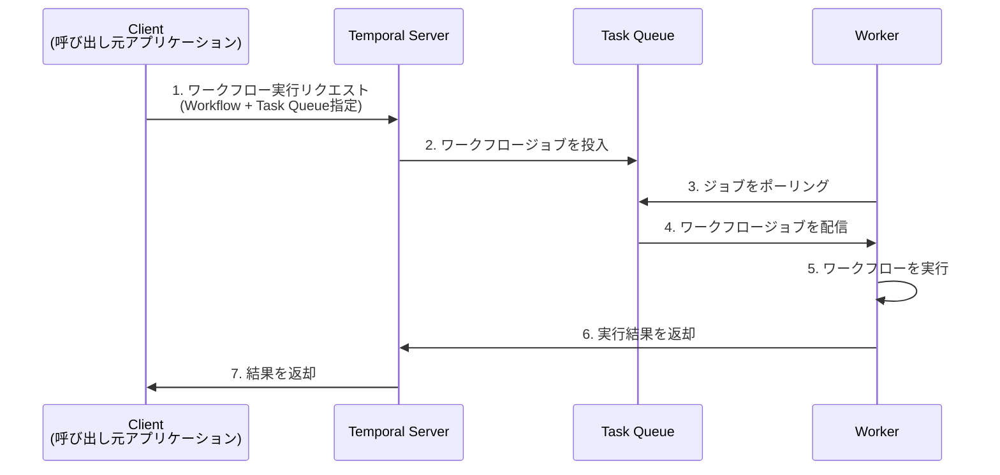

## 概要

本記事では、LLMを活用したアプリケーション開発におけるワークフローエンジン`Temporal`の有用性を紹介し、マルチテナントシステムで発生しやすい「ノイジーネイバー問題」への具体的な対策を提案します。レートリミットと2種類のTask Queueを組み合わせることで、特定のテナントによるリソース独占を防ぎ、システム全体の安定性を向上させる方法について解説します。

## Temporalとは

近年のLLMアプリケーション開発では、以下のような課題に対応する必要があります。

- 複数サービス間の依存関係管理
- APIリクエストの失敗に対する適切なリトライ処理
- 外部ツール呼び出しなどの長時間タスクの管理

`Temporal`は、これらの課題を解決するためのワークフローツールです。依存関係のあるタスク群を「ワークフロー」として管理し、各タスクの実行状態を永続化（Durable）することで、障害発生時にも適切に処理を再開できる仕組みを提供します。

### Temporalの基本構成

Temporalは主に3つの要素で構成されます。

1. **Temporal Server**: ワークフローの実行管理を行うコアコンポーネント。
2. **Worker**: Task Queueを監視し、実際のワークフロージョブを実行するプロセス。
3. **Task Queue**: 実行待ちのジョブが投入されるキュー。



## ノイジーネイバー問題

マルチテナントシステムにおいて、特定のテナントが大量のリクエストを送信することで、他のテナントの処理が遅延・停止してしまう問題を「ノイジーネイバー問題」と呼びます。

Temporalを用いたシステムでは、あるテナントが短時間に大量のジョブをTask Queueに投入すると、そのテナントの処理でキューが占有され、他のテナントのワークフローが実行できなくなる「Head of Line Blocking」が発生する可能性があります。

テナントごとに専用のTask QueueとWorkerを用意する案も考えられますが、テナント数が増えると管理が非常に複雑になるという課題があります。

## 提案手法: レートリミットと2つのTask Queue

そこで、よりシンプルな解決策として、レートリミットと2種類のTask Queueを組み合わせる方法を提案します。

1. **Rate Limiterの作成**: テナントごとに、単位時間あたりのジョブ投入回数を制限するRate Limiterを設けます。
2. **2種類のTask QueueとWorkerを用意**:
    - `NormalQueue`: 通常のテナント向け
    - `LimitingQueue`: レートリミットに抵触したテナント向け
3. **リクエストの振り分け**: クライアントがTemporal Serverにリクエストを送信する際、Rate Limiterでテナントの状態を確認し、制限を超えていなければ`NormalQueue`へ、超えていれば`LimitingQueue`へジョブを投入します。

この仕組みにより、大量のリクエストを送信するノイジーテナントの処理は`LimitingQueue`で律速され、他のテナントは`NormalQueue`で優先的に処理されるようになります。

### 実装例

レートリミットを適用するための`WorkflowClient`のラッパー実装例です。

```tsx
interface IRateLimiter {
  isRateLimited(tenantId: string): boolean;
  increaseCount(tenantId: string): void;
}
export class RateLimitWorkflowClient extends WorkflowClient {
  rateLimiter: IRateLimiter;
  constructor(rateLimiter: IRateLimiter, options?: WorkflowClientOptions) {
    super(options);
    this.rateLimiter = rateLimiter;
  }

  async start<T extends Workflow>(
    workflowTypeOrFunc: string | T,
    options: WorkflowStartOptions<T> & { tenantId: string }
  ): Promise<WorkflowHandleWithFirstExecutionRunId<T>> {
      // Rate Limitに抵触している場合はLimitingQueueを指定する
    if (options.tenantId && this.rateLimiter.isRateLimited(options.tenantId)) {
      options.taskQueue = `${options.taskQueue}-limiting`;
    }
    // Queueへの投入時にRate Limiterのカウントを増やす
    this.rateLimiter.increaseCount(options.tenantId);
    return super.start(workflowTypeOrFunc, options);
  }
}
```

## テスト結果

通常テナント（100ジョブ）と大量テナント（1000ジョブ）が同時にリクエストを行うシナリオでテストを実施しました。

### レートリミットなしの場合

両テナントのジョブが一つのキューで処理されるため、完了までに同じ時間がかかりました。

```
=== Non Rate Limiting Test ===
✨ 通常テナント: ALL 100 jobs completed in 65.0s
✨ 大量テナント: ALL 1000 jobs completed in 65.0s
```

### レートリミットありの場合

大量テナントのジョブが`LimitingQueue`に振り分けられた結果、通常テナントの処理時間が大幅に短縮されました。

```
=== Rate Limiting Test ===
✨ 通常テナント: ALL 100 jobs completed in 22.5s
✨ 大量テナント: ALL 1000 jobs completed in 96.6s
```

この結果から、提案手法によってHead of Line Blockingを効果的に防げることが確認できました。

## まとめ

本記事では、Temporalを用いたマルチテナントシステムにおけるノイジーネイバー問題に対し、レートリミットとキューの分離というシンプルな手法で対策できることを示しました。これにより、システムの安定性と公平性を保ちながら、LLMアプリケーションのスケーラビリティを確保することが可能になります。
