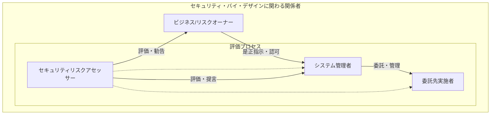
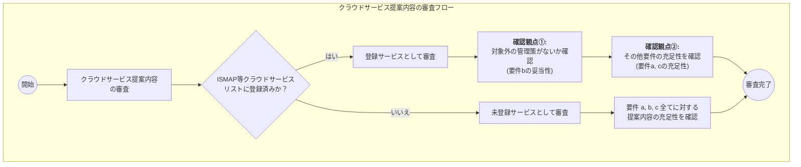

## 要約

本文書は、政府情報システム開発の企画から運用までの全工程で一貫したセキュリティ対策「セキュリティ・バイ・デザイン」を実践するためのガイドラインです。システムのライフサイクル全体でセキュリティを確保する具体的な実施内容と、実効性を高めるための関係者の役割を定義しています。

### 主なポイント

* **目的**: 政府情報システムの開発・運用者向けに、各工程で実施すべきセキュリティ・バイ・デザインの要求事項を示し、リスク管理体制や関係者の役割を定義する。
* **基本方針 (6原則)**: 予防的対策、全ライフサイクル保護、セキュリティ・バイ・デフォルト、過不足ない対策、リスク評価・管理、利便性との両立。
* **実施工程 (8段階)**:
    1. セキュリティリスク分析
    2. セキュリティ要件定義
    3. セキュア調達
    4. セキュリティ設計
    5. セキュリティ実装
    6. セキュリティテスト
    7. セキュリティ運用準備
    8. セキュリティ運用
* **リスク管理体制**: システム管理者、委託先実施者、ビジネス/リスクオーナー、セキュリティリスクアセッサー（評価者）の4者の役割と責任を明確化。
* **その他**: 段階的な導入と継続的な改善の重要性を強調。参照すべきセキュリティ標準やチェックリストなどの豊富な別紙資料を提供。

---

## 全文

### デジタル社会推進実践ガイドブック DS-200

**政府情報システムにおけるセキュリティ・バイ・デザインガイドライン**

2024（令和 6）年 1 月 31 日
デジタル庁

* **ドキュメントの位置付け**: Informative（参考とするドキュメント）
* **キーワード**: セキュリティ・バイ・デザイン、DevSecOps、システムライフサイクル保護
* **概要**:
    情報システムに対して効率的にセキュリティを確保するため、企画から運用まで一貫したセキュリティ対策を実施する「セキュリティ・バイ・デザイン」の必要性が高まっている。本文書ではシステムライフサイクルにおけるセキュリティ対策を俯瞰的に捉えるため、各工程でのセキュリティ・バイ・デザインの実施内容を記載する。併せてセキュリティ・バイ・デザインの実用性を確保するための関係者の役割を定義する。

### 改定履歴

| 改定年月日 | 改定内容 |
| :--- | :--- |
| 2022年6月30日 | 初版決定 |
| 2024年1月31日 | 第二版決定、改定内容は下記 • 各工程での実施内容や構成を見直して品質強化、実用的なセキュリティ対策のポイントを拡充し、使いやすさを向上 • リスク管理体制整備の重要性、具体的な体制整備に関連する内容の見直し • システム利用者や開発者/運用者等の「人に起因するセキュリティ脅威、対策の必要性、対策の考え方」を追記 • CISAのセキュア・バイ・デザイン、セキュア・バイ・デフォルト原則の内容を踏まえて更新 • クラウド・バイ・デフォルトを前提としたクラウドベースの記載を拡充 • 文章全体の誤記や不明瞭な表現を修正 • 別紙各種のセキュリティ・バイ・デザイン導入をサポートする補助資料の軽微な修正 |

---

### 目次

1. **はじめに**
    * 1.1 目的とスコープ
    * 1.2 適用対象
    * 1.3 位置づけ
    * 1.4 本書の構成
    * 1.5 用語
2. **セキュリティ・バイ・デザインの概要**
    * 2.1 セキュリティ・バイ・デザインの概要
    * 2.2 セキュリティ・バイ・デザインの導入メリット
    * 2.3 セキュリティ・バイ・デザインの基本方針
3. **セキュリティ・バイ・デザインのスコープ**
    * 3.1 セキュリティ・バイ・デザインの構成要素とスコープ
4. **セキュリティ・バイ・デザインの実施内容**
    * 4.1 セキュリティ・バイ・デザインの実施工程と概要
    * 4.2 セキュリティ・バイ・デザインの実施内容
5. **セキュリティ・バイ・デザインのリスク管理体制**
    * 5.1 セキュリティ・バイ・デザインのリスク管理に関わる関係者の役割
6. **セキュリティ・バイ・デザイン実施における留意事項**

* 別紙 1 各工程で参照可能なセキュリティ標準
* 別紙 2 各工程のセキュリティ関連の実施項目
* 別紙 3 システムにおける一般的なセキュリティ上の問題点
* 別紙 4 リスクランクに応じたセキュリティリスクアセッサーによる評価例
* 別紙 5 政府情報システムにおけるクラウドセキュリティ要件策定、審査手順

---

### 1. はじめに

社会全体のデジタルトランスフォーメーションが加速する中、サイバー攻撃の脅威も高まっており、政府情報システムにおいてもセキュリティ対策の強化が不可欠です。この背景から、開発の上流工程からセキュリティを組み込む「セキュリティ・バイ・デザイン」の必要性が高まっています。

#### 1.1 目的とスコープ

本書は、政府情報システムの開発・運用関係者に対し、開発から運用までの各工程で実施すべきセキュリティ・バイ・デザインの内容と要求事項を示すことを目的とします。また、品質確保のために必要なセキュリティリスク管理体制や関係者の役割もスコープに含みます。

#### 1.2 適用対象

政府情報システムを対象としますが、遵守を強制するものではない参考文書です。

#### 1.3 位置づけ

標準ガイドライン群のInformative（情報提供）レベルの参考文書です。

#### 1.4 本書の構成

* **第2章**: セキュリティ・バイ・デザインの概要、メリット、基本方針
* **第3章**: 本書が対象とするスコープ
* **第4章**: 各工程における具体的な実施内容と要求事項
* **第5章**: 品質確保のためのリスク評価と管理体制、関係者の役割
* **第6章**: 実施上の留意点

#### 1.5 用語

| 用語 | 意味 |
| :--- | :--- |
| サイバーレジリエンス | 攻撃下でも予測、耐性、回復、適応できる能力 |
| DevSecOps | DevOpsにセキュリティを組み込み、開発スピードを損なわない体制や手法 |
| アタックサーフェス（攻撃対象領域） | サイバー攻撃を受ける可能性のあるすべての攻撃点 |

---

### 2. セキュリティ・バイ・デザインの概要

#### 2.1 概要

システム開発の企画から設計、開発、運用までの全ライフサイクルにおいて、一貫したセキュリティを確保する方策です。システムだけでなく、「サービス」や「人」も対象とした総合的な対策が求められます。

#### 2.2 導入メリット

* **コスト削減**: 上流工程での対策により、手戻りを防ぎ、納期確保やコスト低減に繋がります。（図 2-1 参照）
* **品質向上**: 全システムで標準化された対策を実施し、組織全体のセキュリティ品質を底上げします。（図 2-2 参照）

#### 2.3 基本方針

1. **予防的対策**: 事後的でなく、予防的にセキュリティを組み込む。
2. **全ライフサイクル保護**: 全ての工程で一貫した対策を実施する。
3. **セキュリティ・バイ・デフォルト**: 初期設定でセキュリティが担保された状態を実現する。
4. **過不足ない対策**: システム特性や重要度に応じた対策を実施する。
5. **リスク評価・管理**: 対策の充足性やリスクを継続的に評価・管理する。
6. **利便性との両立**: 利便性を損なわずにセキュリティを確保する。

---

### 3. セキュリティ・バイ・デザインのスコープ

#### 3.1 構成要素とスコープ

本書では、セキュリティ・バイ・デザインの構成要素のうち、以下の2点をスコープとします。

1. **各工程での実施内容**: システムライフサイクル全体を対象に、工程ごとの実施内容を要求事項と合わせて記載。
2. **リスク管理体制**: リスク評価と管理に必要な関係者の役割を定義。

---

### 4. セキュリティ・バイ・デザインの実施内容

各工程で実施すべきセキュリティ対策の要求事項と実施内容を定義します。（図 3-1 実施プロセス参照）

#### 4.1 実施工程と概要

| セキュリティ・バイ・デザインの工程 | 概要 |
| :--- | :--- |
| 1. セキュリティリスク分析 | 想定脅威のリスク分析と対応方針の決定。 |
| 2. セキュリティ要件定義 | 機能・非機能両面でのセキュリティ要件定義。 |
| 3. セキュア調達 | 仕様策定、責任範囲明確化、安全な委託先・プロダクトの選定。 |
| 4. セキュリティ設計 | 機能・非機能、運用面のセキュリティ設計。 |
| 5. セキュリティ実装 | セキュアコーディング、プラットフォームの堅牢化。 |
| 6. セキュリティテスト | 機能テスト、脆弱性診断。 |
| 7. セキュリティ運用準備 | 運用体制・手順の確立。 |
| 8. セキュリティ運用 | 平時・有事のセキュリティ運用。 |

#### 4.2 実施内容詳細

**1) セキュリティリスク分析**

* **要求事項**: 脅威の特定、リスク分析の実施、対応方針の決定。
* **実施内容**: システムプロファイル作成、脅威特定、リスク分析、対応方針決定。
* **重要な考え方**: システム特性や重要度に適した対応方針を決定する。

**2) セキュリティ要件定義**

* **要求事項**: 機能・非機能両面でセキュリティ要件を定義。
* **実施内容**: 遵守すべき標準やリスク分析に基づき要件を定義。
* **重要な考え方**: 多層防御の考え方に基づき、防止策だけでなく検知・対応・復旧の対策も多層的に実装する。

**3) セキュア調達**

* **要求事項**: 委託先との責任範囲の明確化、網羅的仕様の策定、安全な委託先・プロダクトの選定。
* **実施内容**: セキュリティ仕様策定、責任範囲明確化、委託先・プロダクト選定。
* **重要な考え方**: 仕様を満たす能力を持つ委託先の選定・管理と、バックドア等が含まれない安全なプロダクトの選定。

**4) セキュリティ設計**

* **要求事項**: 堅牢でサイバーレジリエントな設計、人的ミスを低減する設計。
* **実施内容**: アプリケーション、OS、ネットワーク、クラウド等のセキュリティ設計。
* **重要な考え方**: アタックサーフェスの管理・防御、管理者アカウントの保護、サイバーレジリエントな設計、人的ミスへの対応。

**5) セキュリティ実装**

* **要求事項**: 設計に基づく実装、セキュアコーディング、プラットフォームの堅牢化。
* **実施内容**: 機能実装、セキュアコーディング、プラットフォーム設定。
* **重要な考え方**: テンプレートや自動化技術を活用し、ミスや品質のばらつきを防止する。

**6) セキュリティテスト**

* **要求事項**: セキュリティ機能の品質確保、脆弱性の排除。
* **実施内容**: 機能テスト、各種脆弱性診断、検出された問題の是正対応。
* **重要な考え方**: システム特性と重要度に応じた適切な脆弱性診断（例：高度なペネトレーションテスト）を実施する。

**7) セキュリティ運用準備**

* **要求事項**: 実効性のある運用体制と手順の確立。
* **実施内容**: 運用体制の確立、平時・有事の運用手順整備、インシデント対応訓練。
* **重要な考え方**: インシデント発生を想定した訓練を実施し、体制や手順の実行性を担保する。

**8) セキュリティ運用**

* **要求事項**: 構成・変更管理、継続的なリスク管理、迅速なインシデント検知・対応。
* **実施内容**: 要員の教育・訓練、平時・有事の運用実施。
* **重要な考え方**: ソフトウェア構成管理（SBOM等）、定常的な脅威・脆弱性情報への対応、サイバーレジリエントな運用。

---

### 5. セキュリティ・バイ・デザインのリスク管理体制

#### 5.1 関係者の役割と責任

客観的なリスク評価と継続的な管理のため、開発チームとは別に専門家による評価を求めます。プロジェクト開始前に以下の役割を明確にし、体制を整備することが必須です。（図 5-1 関係者図参照）

| 役割（呼称） | 責任 |
| :--- | :--- |
| **システム管理者** | セキュリティ対策全体を管理し、是正対応を行う。 |
| **委託先実施者** | 責任範囲内のセキュリティ対策を実施する。 |
| **ビジネス/リスクオーナー** | リスク対応の最終方針を決定し、サービス運用を認可する。 |
| **セキュリティリスクアセッサー（評価者）** | 独立した立場でリスクを評価し、勧告・提言を行う。 |

---

### 6. 実施における留意事項

* **一貫性の確保**: 工程間で整合性のとれた対策を実施する。
* **段階的導入**: 実現可能なところから運用を開始し、段階的に成熟度を向上させる。
* **継続的改善**: 新たな脅威やシステム更改に合わせて見直し、継続的にリスク対応を行う。

---

### 別紙資料

* **別紙1 各工程で参照可能なセキュリティ標準**: NISC、IPA、NIST等が公開する42のセキュリティ標準・ガイドラインのリスト。
* **別紙2 各工程のセキュリティ関連の実施項目**: 7つの工程（①リスク分析/要件定義〜⑦運用）ごとのチェックリスト。
* **別紙3 システムにおける一般的なセキュリティ上の問題点**: 認証不備、アクセス制御不備など、政府情報システムで頻出する8つの問題点をリストアップ。
* **別紙4 リスクランクに応じたセキュリティリスクアセッサーによる評価例**: (タイトルのみ記載)
* **別紙5 政府情報システムにおけるクラウドセキュリティ要件策定、審査手順**: ISMAP等を活用したクラウドサービスの要件策定と審査の手順。

##### 図．クラウドサービス提案内容の審査の全体概要

