# 関数型ドメインモデリング(Domain Modeling Made Functional)

- 関数型の視点からドメインモデリングを解説した本

- [関数型ドメインモデリング(Domain Modeling Made Functional)](#関数型ドメインモデリングdomain-modeling-made-functional)
  - [訳者前書き](#訳者前書き)
  - [はじめに](#はじめに)
    - [本書の内容](#本書の内容)
    - [他の方法でドメインモデリングを行う](#他の方法でドメインモデリングを行う)
  - [第1部　ドメインの理解](#第1部ドメインの理解)
    - [第1章 ドメイン駆動設計の紹介](#第1章-ドメイン駆動設計の紹介)
      - [1.1 モデルを共有することの重要性](#11-モデルを共有することの重要性)
      - [1.2 ビジネスイベントによるドメインの理解](#12-ビジネスイベントによるドメインの理解)
      - [1.2.4 コマンドの文書化](#124-コマンドの文書化)
      - [1.3 ドメインをサブドメインに分割する](#13-ドメインをサブドメインに分割する)
      - [1.4 境界づけられたコンテキストを利用した解決手段の作成](#14-境界づけられたコンテキストを利用した解決手段の作成)
      - [1.4.1 コンテキストを正しく区別する](#141-コンテキストを正しく区別する)
      - [1.4.2 コンテキストマップの作成](#142-コンテキストマップの作成)
      - [1.6 ドメイン駆動設計の概念の要約](#16-ドメイン駆動設計の概念の要約)
      - [1.7 まとめ](#17-まとめ)
  - [第2章 ドメインの理解](#第2章-ドメインの理解)
    - [2.1 ドメインエキスパートへのインタビュー](#21-ドメインエキスパートへのインタビュー)
    - [2.2 データベース駆動設計をしたいという衝動との戦い](#22-データベース駆動設計をしたいという衝動との戦い)
    - [2.3 クラス駆動設計をしたいという衝動との戦い](#23-クラス駆動設計をしたいという衝動との戦い)
    - [2.4 ドメインの文章化](#24-ドメインの文章化)
    - [2.6 複雑さをドメイン モデリングを表現する](#26-複雑さをドメイン-モデリングを表現する)
  - [関数型アーキテクチャ](#関数型アーキテクチャ)
    - [3.1 自律的なソフトウェアコンポーネントとしての境界づけられたコンテキスト](#31-自律的なソフトウェアコンポーネントとしての境界づけられたコンテキスト)
    - [3.2 境界づけられたコンテキストのコミュニケーション](#32-境界づけられたコンテキストのコミュニケーション)
      - [3.2.1 境界づけられたコンテキスト間のデータ転送](#321-境界づけられたコンテキスト間のデータ転送)
      - [3.2.2 信頼の境界線と検証](#322-信頼の境界線と検証)
    - [3.3 境界づけられたコンテキスト間の契約](#33-境界づけられたコンテキスト間の契約)
      - [3.3.1 腐敗防止層](#331-腐敗防止層)
      - [3.3.2 関係を記述したコンテキストマップ](#332-関係を記述したコンテキストマップ)

## 訳者前書き

- 本書は関数型プログラミングの概念やテクニックを応用したドメインモデリングについて紹介する本だが、それが機能的であること、実際に役に立つことも意識されている
- ソフトウェア開発における複雑性はさまざまな側面に現れる
  - 要件・設計・コード・データ・技術・人的要因
- これらの複雑性を単純化し、適切に管理することがソフトウエア開発のかなめ
- ここではイミュータブルなデータとイミュータブルな関数を組み合わせた「型」により、ドメインの状態遷移を明示的に表現する方法が提案されている
-

## はじめに

### 本書の内容

- ドメインの理解
- ドメインのモデリング
- モデルの実装

### 他の方法でドメインモデリングを行う

- 本書では、データ構造とそれに作用する関数を定義することでドメインモデリングを行う「主流」の方法に焦点を当てているが、状況によっては他のアプローチの方が適用しやすい場合もある
  - ドメインが反構造化データを中心に展開している場合、厳格なモデルは適しておらず、キーと値のペアを格納するマップなどの柔軟な構造を使用することがよりよいアプローチになるかもしれない
  - ドメインの重点が、要素を組み合わせて他の要素を作ることにある場合、データに注目する前に、これらの構成ルールが何であるか（いわゆる「台数」）に注目することは、じばし有用

## 第1部　ドメインの理解

### 第1章 ドメイン駆動設計の紹介

- 開発者の仕事はコードを書くことではなく、ソフトウェアによって課題を解決すること

#### 1.1 モデルを共有することの重要性

- 問題を解決するためには、その問題を正しく理解することが大切
- ソフトウェア開発プロセスの中には、仕様書や要件定義を使って問題の詳細を全て把握しようとするものがある
  - しかし、この方法では、問題をもっともよく理解している人と、その解決手段を作り出す人との間に、しばし距離が生じてしまう

        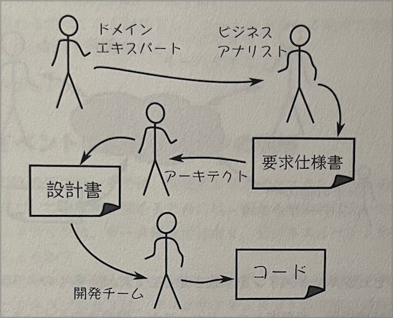

  - 伝言ゲームになり、開発者の問題理解とドメインエキスパートの問題理解のミスマッチはプロジェクトの成功に致命的な影響を与える
  - よりよい解決方法は、仲介者を排除し、ドメインエキスパートが開発プロセスに直接に関与することを奨励し、開発チームとドメインエキスパートの間にフィードバックループを導入すること

        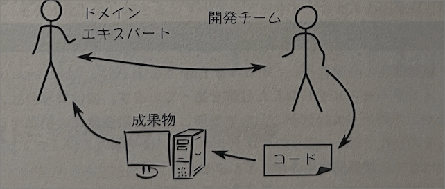

    - この方法も完璧ではない
      - 開発者は翻訳者として、ドメインエキスパートのメンタリングモデルをコードに翻訳するがそこで誤解してエラーを引き起こす危険性が高い
  - 3つめのアプローチ
    - ドメインエキスパート、開発チーム、その他のステークホルダー、そして(もっども重要な)ソースコード自体が、全て同じモデルを共有していいればドメインエキスパートの要件からコードへの翻訳はない
    - 共有されたメンタルモデルを直接反映するようにコードが設計される

            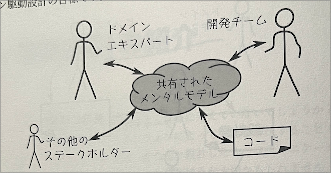

    - ソフトウェアモデルとビジネスドメインを一致させることには多くのメリットがある
      - 市場投入までの時間短縮
      - ビジネス価値の向上
      - 無駄の削減
      - メンテナンスと進化の容易さ
- そうしたら共通のモデルを作成することができるか？
  - ドメイン駆動設計のコミュニティのガイドライン
    - データ構造ではなく、ビジネスイベントやワークフローに焦点を当てる
    - メインをより小さなサブドメインに分割する
    - 各サブドメインのモデルを解決空間に作成する
    - プロジェクトに関わる全ての人が共有し、コードのあらゆる場所で使用される共通言語を開発する

#### 1.2 ビジネスイベントによるドメインの理解

- ビジネスは単にデータを持っているだけではなく、何らかの方法でデータを変換する
- イベントストリーミングによってビジネスイベントを洗い出す

    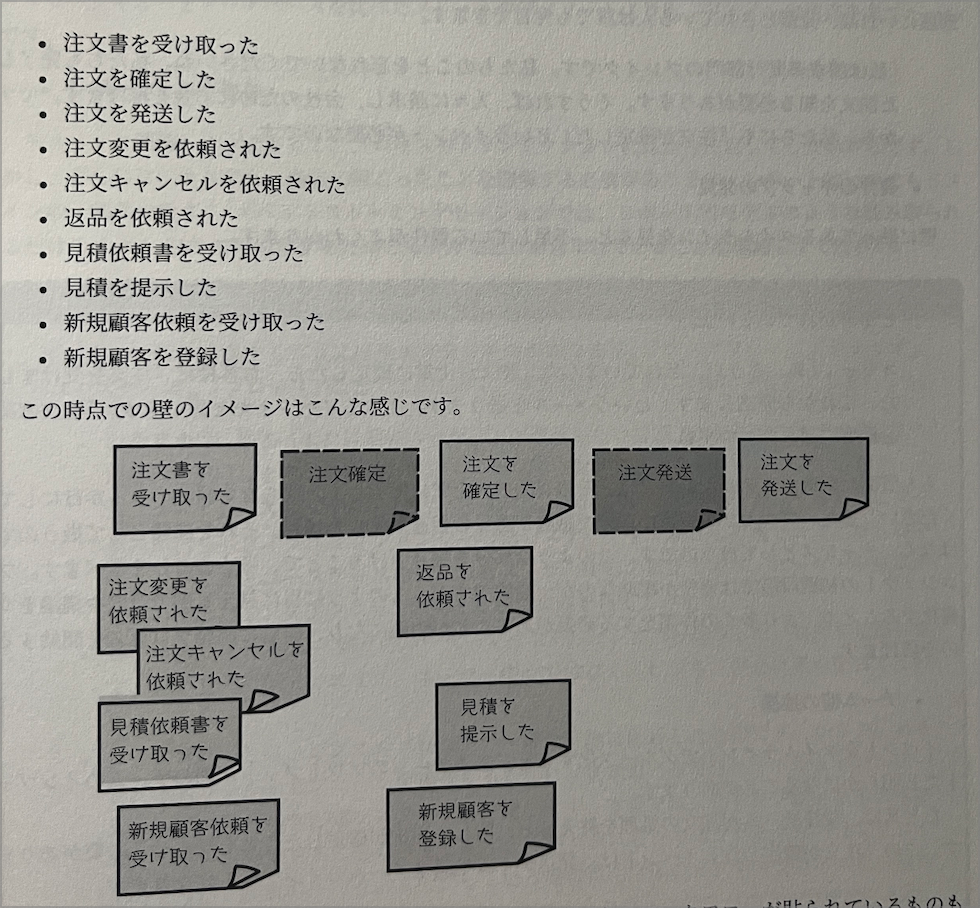

- ビジネス活動を表現する言葉
  - 「ワークフロー」・「シナリオ」・「ユースケース」・「プロセス」

    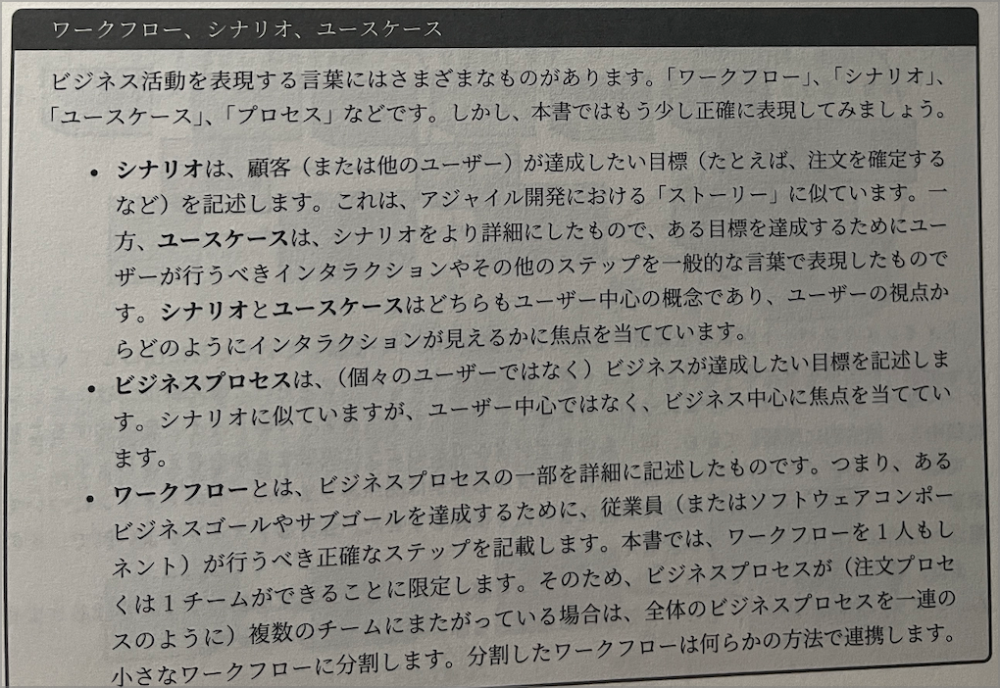

#### 1.2.4 コマンドの文書化

- イベントを引き起こした依頼を「コマンド」と呼ぶ
  - コマンドが「〜する」だった場合、ワークフローが〜すれば、対応するドメインイベントは「~した」「~された」となる
- すべてのイベントがコマンドに関連づく必要はない
  - 月末締のようにスケジューラによってtriggerされるものもある

#### 1.3 ドメインをサブドメインに分割する

- イベントとコマンドのリストができ、さまざまなビジネスプロセスが何であるかをよく理解できたがまだ混沌としている
- ドメインという言葉はドメイン構造設計の世界では、「ドメイン」を「首尾一貫した知識の領域」と定義できる
- 1つのドメインの中にも、特徴的な領域があるかも知れない
  - このような領域をサブドメインと呼んでいる
  - ドメインは少しずつ重なっている

        

#### 1.4 境界づけられたコンテキストを利用した解決手段の作成

- 問題を理解したからと言って、解決手段(ソリューション)の構築が簡単になるわけではない

    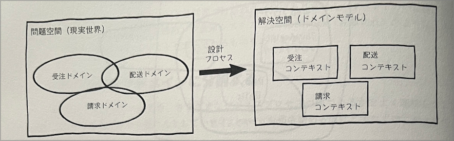

- 解決空間では、問題空間のドメインとサブドメインが、DDD用語で境界づけられたコンテキストと呼ばれるものにマッピングされる
- サブシステムの代わりに境界づけられたコンテキストという言葉を使うのは、解決手段を設計する際に重要なこと

#### 1.4.1 コンテキストを正しく区別する

- 理論でなく職人芸の世界だが、ガイドラインがある
  - ドメインエキスパートの声に耳を傾ける
    - 彼らが皆同じ言語を共有し同じ問題に焦点を当てている場合、彼らはおそらく同じサブドメインで作業している
  - 既存のチームや部門の境界に注目しましょう
  - 境界づけられたコンテキストの「境界づけられた」という部分を忘れてはいけない
  - 自立性を目指して設計しましょう
  - 摩擦のないビジネスワークフローを目指して設計しましょう

#### 1.4.2 コンテキストマップの作成

- これらのコンテキストを定義した後は、設計の詳細に巻き込まれることなく、コンテキスト間の相互作用(全体像)を伝える方法が必要 = コンテキストマップ

    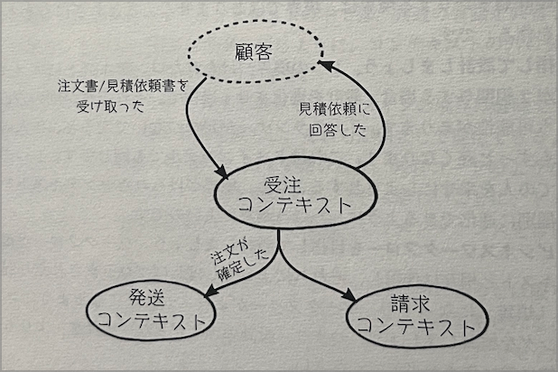

#### 1.6 ドメイン駆動設計の概念の要約

- ドメイン
  - 解決しようとしている問題に関する知識の領域
  - 単純に「ドメインエキスパート」が専門としているものごと
- ドメインモデル
  - あるドメインにおいて、特定の問題に関連した側面を単純化して表現したものの集合
  - ドメインモデルは解決空間の一部だが、ドメインモデルが表現するドメインは問題空間の一部
- ユビキタス言語
  - ドメインに関連する概念と語彙の集合
  - チームメンバーとソースコードの両方で共有される
- 境界づけられたコンテキスト
- コンテキストマップ
- ドメインイベント
- コマンド

#### 1.7 まとめ

- データよりもイベントやプロセスに焦点を当てる
- ドメインをより小さなサブドメインに分割する
- 各サブドメインのモデルを解決空間に作成する
- プロジェクトに関わるすべての人が共有できる「ユビキタス言語」を開発する

## 第2章 ドメインの理解

### 2.1 ドメインエキスパートへのインタビュー

- 要件と非機能要件のそれぞれをインタビューを通して理解する
- インプットとアウトプットを考える

    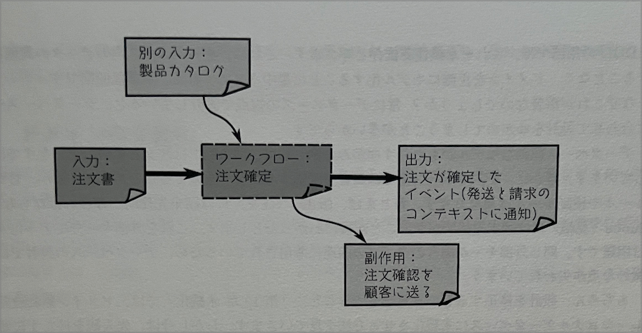

### 2.2 データベース駆動設計をしたいという衝動との戦い

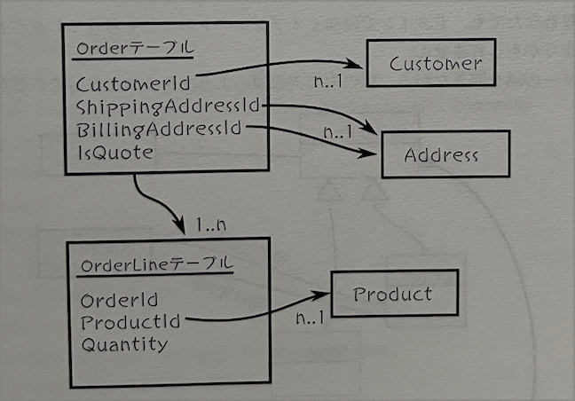

- ドメイン駆動設計ではドメインから設計を導き出す
  - 現実の紙ベースのシステムではデータベースは存在しない
  - DDDの用語では、これを永続性非依存と呼ぶ
  - データベース内のデータ表現を気にすることなく、ドメインを正確にモデル化することに集中させてくれる
- データベースの視点で設計していると、データベースモデルに合わせて設計を歪めてしまうことが多い

### 2.3 クラス駆動設計をしたいという衝動との戦い

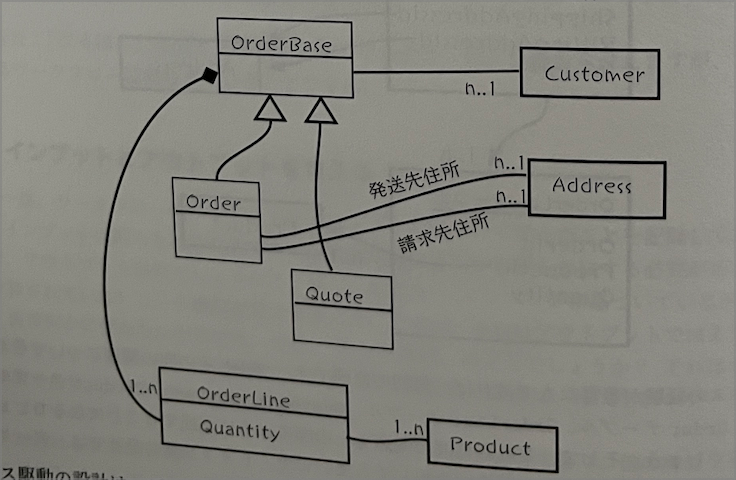

- クラス駆動の設計は、データベース駆動の設計と同じ暗い危険
  - 要件収集の際には全てを受け入れる姿勢を保ち、自分の技術的な考えをドメインに押し付けないことです

### 2.4 ドメインの文章化

- UMLなどの視覚的な図を使うこともできるが、これは作業がしにくく、ドメインの微妙な部分を表すには十分な詳細さが得られないことがある
- ミニ言語を使って「注文確定」のワークフローを記述する
  - ワークフローではインプットとアウトプットを主に文書化する
  - ビジネスロジックはごく簡単な疑似コードで表現するに留める
  - データ構造では、Name AND Addressのように、ANDを使用して両方が必須なことを表し、Email OR PhoneNumberのようにORを使用してどちらか一方が必須なことを表す

        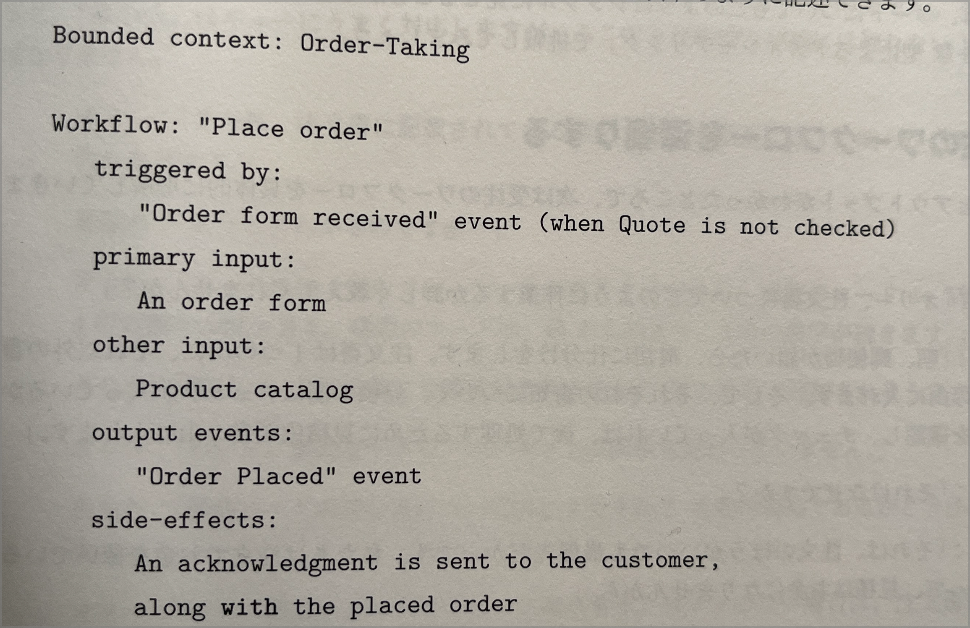

        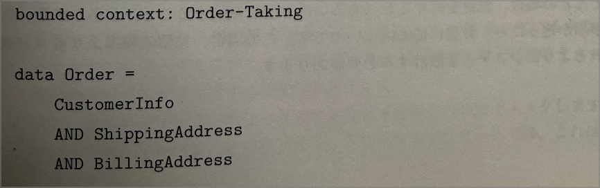

        

### 2.6 複雑さをドメイン モデリングを表現する

- ワークフローを深掘りすると、ドメインモデルはより複雑になっていく
- 複雑さを理解するために時間を費やすのは、コーディングの最中になってからではなく、今の方がいい

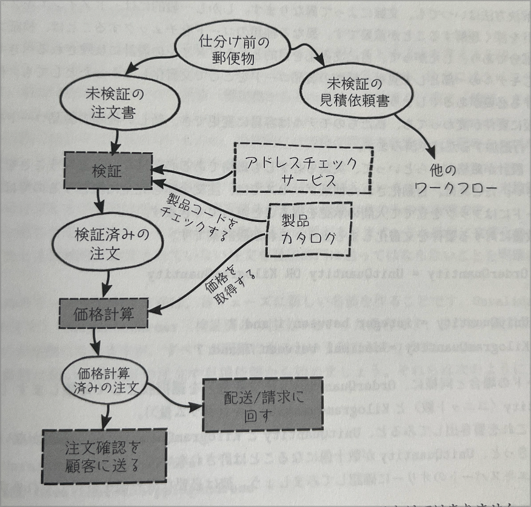

## 関数型アーキテクチャ

- 無知の極みにいる
  - 時間をもっと有効に使えるのは、この無知を解消すること
  - イベントストリーミング・インタビュー・その他の要件収集に関するあらゆるベストプラクティスを行うこと
- サイモンブラウンの4Cアプローチ
  - アーキテクチャは4つのレベルで構成される
    - 「システムコンテキスト」
      - システム全体を表す最上位の概念
    - 「コンテナ」
      - システムコンテキストを構成する要素
      - Webサイト、Webサービス、データベースなどデプロイ可能な単位
    - 「コンポーネント」
      - 各コンテナを構成する要素
      - コードの構成において主要な構成要素
    - 「クラス」(関数型アーキテクチャでは「モジュール」)
    - 低レベルのメソッドや関数の集合
- 優れたアーキテクチャの目的の1つは、コンテナ・コンポーネント・モジュール間のさまざまな境界を定義し、新しい要件が発生した時に「変更コスト」を最小限に抑えること

### 3.1 自律的なソフトウェアコンポーネントとしての境界づけられたコンテキスト

- コンテキスト
  - 自律的なサブシステム
  - 明確に定義された境界を持つ
- システム全体が単一のモノリシックなデプロイ単位（前述したC4用語で言えば、単一コンテナ）として実装されている場合
  - 境界づけられたコンテキストは、明確に定義されたインターフェイスを持つ独立したモジュールのように、単純なものになるかもしれない
  - これは古典的なサービス指向アーキテクチャの姿
  - さらに細分化して、ワークフローを独立してデプロイ可能なコンテナの単位にもできる(マイクロサービスアーキテクチャ
- しかし、この初期段階では、特定のアプローチに拘束される必要はない。
  - 境界づけられたコンテキストが独立し、自立性を確保する限り、論理的な設計からデプロイ可能な形式への変換は重要ではない
- 当然ながら、プロジェクトの初期段階で適切な境界を設定することは困難
  - ドメインについての知識が深まるにつれて境界は変化すると想定するべき
  - モノリスはリファクタリングが容易なため、最初はモノリスとしてシステムを構築し、必要に応じて疎結合コンテナにリファクタリングするのが良い方法
  - マイクロサービスの利点が欠点を上回ると確信できない限り、マイクロサービスに飛びついて「マイクロサービス・プレミアム」（運用上の余計な負担）を支払う必要はない

### 3.2 境界づけられたコンテキストのコミュニケーション

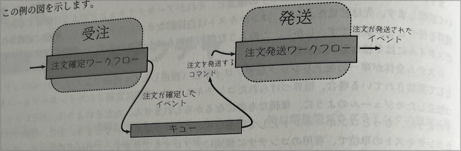

- 完全に疎結合な設計
  - 上流コンポーネントと下流コンポーネントはお互いを意識せず、イベントを通じてのみコミュニケーションをとっている
- コンテキスト間でイベントを送信するための具体的なメカニズムは、選択するアーキテクチャによって異なる
  - キューはバッファリングされた非同期通信に適しているので、マクロサービスやエージェントを使った実装では最初の選択肢となる
  - モノリシックなシステムでは同じキューイングアプローチを内部で使うこともできるし、上流コンポーネントと下流コンポーネントを関数呼び出しで段順に直接繋げることもできる

#### 3.2.1 境界づけられたコンテキスト間のデータ転送

- 一般に、コンテキスト間のコミュニケーションに使用されるイベントは、単なる信号ではなく、下流コンポーネントがイベントを処理するために必要な全てのデータを含む
  - データが大きすぎてイベントに含められない場合は、代わりに共有データストレージの位置をしめす、何らかの参照を送信できる
- 渡されるデータオブジェクトは、境界づけられたコンテキスト内で定義されたオブジェクト(ドメインオブジェクト)と表面的には似ているかも知れないが、同じではなく、コンテキスト間のインフラストラクチャの一部としてシリアライズされ共有されるように設計されている
  - これらのオブジェクトをデータ転送オブジェクト(DTO)と呼ぶことにする

        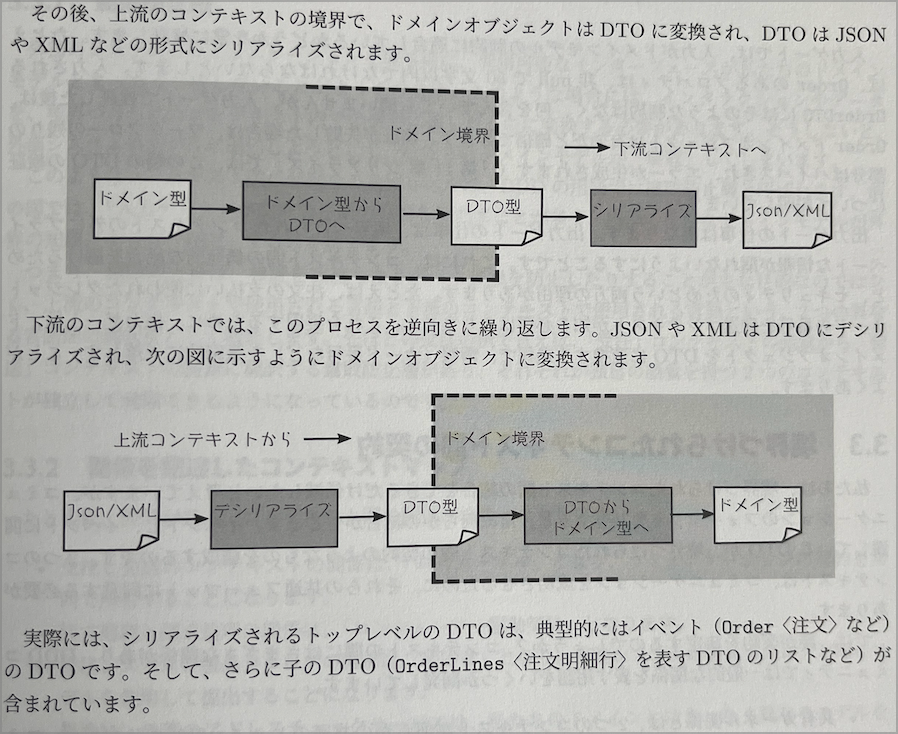

#### 3.2.2 信頼の境界線と検証

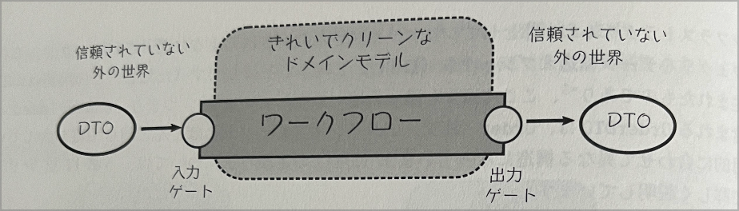

- 入力ゲートでは入力がドメインモデルの制約に適合しているかどうかを常に検証する
- 出力ゲートの仕事は異なる
  - 出力ゲートの仕事は、境界づけられたコンテキストの外にプライベートな情報が漏れないようにすること
    - 偶発的な結合をさけるkとお、セキュリティのためという両方の理由がある

### 3.3 境界づけられたコンテキスト間の契約

- 2つのコンテキストは、コミュニケーションを成功させるために、それらの共通フォーマットに同意する必要がある
  - 誰が契約を決定する？
    - 「共有カーネル関係」
      - 2つのコンテキストが何らかの共通のドメイン設計を共有しているため、関係するチームが協力しなければならない場合
    - 「顧客/提供者(コンシューマー駆動契約)」
      - 下流コンテキストが上流のコンテキストに提供してほしい契約を定義する
      - ボトムアップ
    - 「順応者」
      - コンシューマー駆動とは逆

#### 3.3.1 腐敗防止層

- 外部のシステムとコミュニケーションを取る際に、利用可能なインターフェイスが私たちのドメインモデルと全く一致しないことがよくある
  - ドメインモデルの腐敗を防止するために、変換が必要になる

#### 3.3.2 関係を記述したコンテキストマップ

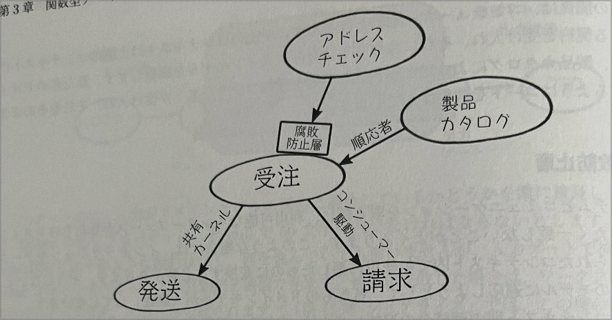

### 3.4 境界づけられたコンテキストでのワークフロー

- 関数型アーキテクチャではワークフローを一つの関数としてマッピングする


#### 3.4.1 ワークフローのインプットとアウトプット

- ワークフローへの入力は、常にコマンドに関連するデータであり、出力は、常に他のコンテキストに伝えるためのイベントのセット


#### 3.4.2 境界づけられたコンテキス内ではドメインイベントを避ける

- オブジェクト指向設計では、境界づけられたコンテキスト内で内部的に発生するドメインイベントを持つことが一般的


- これでは隠れた依存関係が発生することになるため、関数型設計では避ける。代わりにあるイベントの「リスナー」が必要な場合、ワークフローの最後に次のように追加する


### 3.5 境界づけられたコンテキストの中のコード構造

- ワークフローは、次の図に示されているように、最上層から始まり、データベースレイヤーまで作業を進め、最上層に戻ってくる
- 
- しかしこの方法には多くの問題点がある。
  - 特に問題なのは `「一緒に変更されるコードは一緒に配置されるべき」`という重要な設計原則を破ってしまうこと
  - レイヤーは「水平方向」に組み立てられているため、ワークフローの動作方法を変更すると、全てのレイヤーに手を入れる必要がある
- よりよい方法は、「垂直方向」のスライスに切り替えること

- しかし、これはまだ理想的ではない。そこでワークフローを横方向のパイプにして、その中でレイヤーを見てみる

- ロジックを理解する(そしてそれをテストする)のが不必要に複雑になるような方法で、レイヤーが混ざり合っているには明らか

#### 3.5.1 オニオンアーキテクチャ

- ドメインコードを中心におき、その周りに他の側面を配置する
- その際のルールは、各レイヤーは内側のレイヤーにのみ依存し、外側のレイヤーには依存しないようにする


#### 3.5.2 I/Oを恥に追いやる

- 関数型プログラミングの主な目的は、内側を見なくても、予測可能で理解しやすい関数をあつかうこと
- これを実現するために、私たちは可能な限り不変のデータを扱い、関数が隠れた依存関係ではなく、明示的な依存関係を持つようにする
- もっとも重要なことは、関数の副作用を避けること
- 例えばデータベースやファイルシステムを読み書きする関数は「不純」とみなされるため、コアドメインではこのような種類の関数を避けるようにする
- 代わりにあらゆるI/Oをオニオンの端に追いやること
  - 例えば、データベースへのアクセスは、ワークフローの内側ではなく、ワークフローの開始時または終了時のみに行うようにする
- 実際、I/Oをデータベースへのアクセスを端に追いやるという手法は、「永続性非依存」という概念に非常にマッチしている

### 3.6 まとめ

- `ドメインオブジェクト`
  - データ転送オブジェクトとは対照的に、あるコンテキストの境界内でのみ使用するように設計されたオブジェクト
- `データ転送オブジェクト`
  - 境界づけられたコンテキスト間でデータを転送するために使用されるオブジェクト
- `共通カーネル・顧客/供給者・順応者`
  - 境界づけられたコンテキスト間の契約を定義するための3つの異なるアプローチ
- `腐敗防止層`
  - 結合を減らしてドメインが独立して進化できるように、あるドメインから別のドメインに概念を変換するコンポーネント
- `永続性非依存`
  - ドメインモデルがドメイン自体の概念のみに基づいていて、データベースやその他の永続化メカニズムを意識するべきではないこと

## 第2部　ドメインのモデリング

### 第4章 型の理解

#### 4.1 関数の理解


#### 4.1.1 型シグネチャ

- apple -> bananaというきほうは　`型シグネチャ(別名: 関数シグネチャ)`と呼ばれる

```f#
let add1 x = x + 1 // 型シグネチャ: int -> int
let add x y = x + y // 型シグネチャ: int -> int -> int
```

### 4.2 型と関数

- 関数型プログラミングにおける型は、オブジェクト指向プログラミングにおけるクラスとは異なり、もっとシンプル


- 概念的には、型の中のものは、どんな種類のものでも、現実でも仮装でもよい


### 4.3 型の合成

- 関数プログラミグでは、関数型設計の基礎となる「合成（コンポジション）」という言葉がよく使われる
- F#では2つの方法で小さな型から新しい型が作られる
  - ANDでまとめられる
    - ANDをつかって作られた型を**直積型**と呼ぶ
    - ORをつかって作られた型を**直和型**や**タグ付き共用体**と呼ぶ
  - ORでまとめられる

#### 4.3.3 単純型

- 次のように選択肢が1つしかない選択肢を定義することがよくある

```f#
type ProductCode = ProductCode of string
```

- なぜこのような型を作るのか
　- プリミティブ(stringやintなど)を内部の値として含む型である「ラッパー」を簡単に作れるから

### 4.5 型の合成によるドメインモデルの構築

- Eコーマスサイトの支払いを追跡する例

```f#
type CheckNumber = CheckNumber of int
type CardNumber = CardNumber of string

type CardType = Visa | MasterCard  // 'OR'型

type CreaditCard = { // 'AND'型
    CardNumber: CardNumber
    CardType: CardType
}

type PaymentMethod =
    | Cash
    | Check of CheckNumber
    | CreditCard of CreaditCard

type PaymentAmount = PaymentAmount of decimal
type Currency = EUR | USD 

type Payment = {
    Amount: PaymentAmount
    Currency: Currency
    Method: PaymentMethod
}
```

- このモデルはオブジェクト指向モデルではなく、関数型モデルなので、これらの型に直接関連する動作はない
- 例えば、Payment型を使って未払いの請求書の支払い処理をして、最終的には支払い済みの請求書になる方法を示したい場合、次のような関数型を定義できる

```f#
type PaymInvoice = UnpaidInvoice -> Payment -> PaidInvoice
```

### 4.6 省略可能な値、エラー、およびコレクションのモデリング
