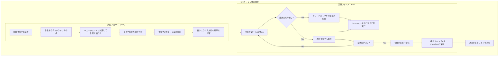

# 【実践ガイド】AI駆動開発を成功に導くタスクリスト駆動開発


こんにちは、皆さん。今日は、多くの開発者が直面しているAIとの効率的な協業方法について、実践的なアプローチを紹介します。

「AIと一緒に開発しているけど、思うような結果が得られない…」
「AIに何度も同じ説明をしている気がする…」
「チームでAIを活用したいけど、知識共有がうまくいかない…」

こんな悩みを抱えていませんか？

## AIとの協業で最も重要なのは「コンテキスト管理」

AIとの協業で成功を左右する最大の要因は、**コンテキスト管理の質**です。特に以下の3要素が重要です：

1. **量・圧縮** - 情報過多になっていませんか？
2. **一貫性** - 矛盾した指示を出していませんか？
3. **構造** - 情報は整理されていますか？

これらの課題を解決する具体的な方法論が「**タスクリスト駆動開発**」です。

## タスクリスト駆動開発とは何か？

タスクリスト駆動開発は、AI駆動開発を「計画（Plan）」と「実行（Act）」の2フェーズに分けて進める方法論です。

この方法の最大の特徴は、**各タスクを独立したセッションで実行する**ことにあります。つまり、各タスクには必要な情報を全て含め、AIのコンテキストが混乱することを防ぎます。

### メリット

- 🔄 **ベンダー非依存** - 特定のAIツールに縛られない
- 📏 **コンテキスト最適化** - 情報の肥大化を防止
- 🔁 **高い再現性** - 同じタスクなら同じ結果
- 🛠️ **効率的な修正** - 問題発生時に一括修正が可能

## 実践！タスクリスト駆動開発の進め方

### ステップ1: ドキュメント管理体系を構築する

タスクリスト駆動開発には3種類のドキュメントが必要です：

1. **Specification（仕様）** - プロジェクトの基盤情報
   - プロジェクト概要、アーキテクチャ、背景情報など
   - `specs/`ディレクトリに保存

2. **Procedure（手順）** - 再利用可能なプロンプトテンプレート
   - 成功したタスク実行の一般化
   - 類似作業のためのテンプレート集

3. **Task（タスク）** - 具体的な作業指示
   - AIに提供する唯一のコンテキスト
   - **重要**: 各タスクに必要情報を全て含める

> 💡 **ポイント**: 従来の「Memory-bank」のような永続的コンテキストではなく、タスク単位でセッションを分離することがコンテキスト管理の鍵です！

### ステップ2: 計画フェーズを実行する

1. 作業単位のディレクトリを作成（例: `tasks/feature-x/`）
2. AIと対話しながら作業を細分化
3. タスクの優先順位を決定
4. 各タスクに超具体的な作業指示を含むMDファイルを作成
   - 番号やタイムスタンプで順序付け（例: `1_setup.md`）
   - 全てのコンテキストをタスク内に含める

### ステップ3: 実行フェーズに移る

1. **タスク実行**: 現在のタスクのみをAIに提供
2. **結果評価**: 期待通りなら次のタスクへ、そうでなければ修正
3. **プロセス一般化**: 成功したタスクから再利用可能なプロンプトを作成

## 実例: タスク記述ファイルの書き方

```markdown
# タスク: React Todoコンポーネントの実装

## 背景
- プロジェクトはReact 18を使用
- TypeScriptで実装
- Tailwind CSSでスタイリング

## 要件
1. Todoアイテムの表示
2. チェックボックスで完了/未完了を切り替え
3. 削除ボタンの実装

## 既存コード構造
コンポーネントは src/components/ ディレクトリに配置

## 具体的な作業指示
1. TodoItemコンポーネントを実装する
2. 適切なプロップタイプを定義する
3. スタイリングはTailwind CSSを使用する
```

## 高度なテクニック集：AIとの協業を極める

### テクニック1: プロンプト理解の確認

AIがプロンプトを正しく理解しているか確認するために、以下のような工夫が効果的です：

- タスク開始時に特定の文言を表示させる（例: `[ACTIVE]`）
- 規範となるルールを読み込んだら特定の口調に変える

### テクニック2: 構造化されたプロンプト設計

- **シンプルな文構造**: 複雑な日本語より、短文の積み重ねが効果的
- **段階的な指示**: 複雑なタスクは段階に分けて指示する

### テクニック3: AIの応答品質を高める

研究によると、感情を促す言葉を使うことでAIの性能が向上することがあります：

- 「君ならできる！」
- 「成功しないと怒ります」

### テクニック4: AIにプロンプトを生成させる

AIに対するプロンプトをAI自身に作成させる方法も効果的です：

```
あなたは優秀なプロンプトエンジニアです。以下の目的に最適なプロンプトを作成してください：
[目的の説明]
```

## まとめ：タスクリスト駆動開発のフロー



タスクリスト駆動開発は、AI駆動開発における「最小限の文脈」と「最大限の効果」を実現する方法論です。この方法を取り入れることで、AIとの協業がより効率的になり、開発プロセス全体の品質と一貫性が向上するでしょう。

最後に、AI技術は急速に進化しています。今日のベストプラクティスが明日には古くなるかもしれません。常に最新の動向をキャッチアップし、柔軟に方法論を更新していくことが大切です。

## 参考リンク

- [言語モデルの長文コンテキスト処理：「Lost in the Middle」現象の実態と最新研究](https://zenn.dev/kimkiyong/articles/c0250864d53595)
- [NoLiMa：リテラルマッチングを超えた長文脈評価の新基準](https://zenn.dev/kimkiyong/articles/15cbd1049fb2f3)
- [AI開発者が知るべき真実：コンテキスト一貫性とAIコーディングエージェントの性能の関係](https://zenn.dev/kimkiyong/articles/8c98ca7b425d18)
- [意味的構造化プロンプト設計：AIとの効果的な協働のための新パラダイム](https://zenn.dev/kimkiyong/articles/0320559fc099c6)
- [AI プロンプトエンジニアリングの新視点：ClaudeとGeminiの指示理解の違いと最適化戦略](https://zenn.dev/kimkiyong/articles/84c8488400118d)

あなたのAI駆動開発が成功することを願っています！何か質問があれば、コメント欄でお待ちしています。

---

*この記事は、タスクリスト駆動開発の基本的な枠組みを提供するものです。プロジェクトの特性や使用するAIモデルによって適宜調整することをお勧めします。*
