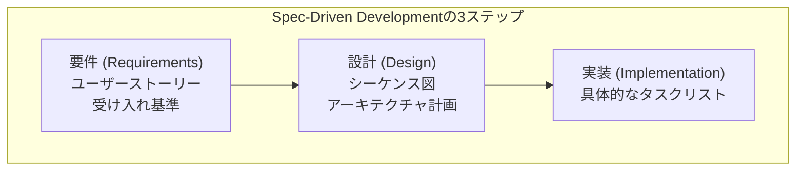

# Kiroが変える？ AI時代のドキュメントとの付き合い方

こんにちは！

突然ですが、みなさんはソフトウェア開発のドキュメント作成、好きですか？
「好き！」って即答できる人は、たぶん、とってもマメな人なんだと思います。

正直なところ、多くの人は「うーん、大事なのはわかってるんだけど、ちょっと面倒なんだよな…」と感じているのではないでしょうか。

コードを書くのは楽しいけど、仕様書やREADMEを更新するのは後回しにしがち。
そして気づいた頃には、コードとドキュメントが全然違うことを言っている「化石ドキュメント」が爆誕…。

これ、開発現場の「あるある」ですよね。私も何度も経験があります。

最近はCopilotやCursorみたいなAIコーディングアシスタントが出てきて、コードを書くスピードはめちゃくちゃ速くなりました。
でも、ドキュメントの悩みって、実はあんまり解決されていない気がしませんか？

「AIがコードは書いてくれるけど、結局ドキュメントは人間が頑張って書くしかないのかな…」
そんな風に思っていたら、先日AWSから「Kiro」という、ちょっと変わった新しいAIツールが登場したんです。

今日は、このKiroが提案する、新しいドキュメントとの付き合い方について、少し書いてみたいと思います。

## 「速く書く」から「正しく、ずっと使えるものを書く」へ

これまでのAIコーディングツールって、どちらかというと「いかに速くコードを完成させるか」に焦点を当てていたように思います。

でも、Kiroの考え方は少し違っていて、「vibe coding to viable code」という哲学を掲げているそうです。
ものすごくざっくり言うと、「なんかいい感じのフワッとしたアイデアを、ちゃんと動いて、しかも将来もメンテナンスしやすいコードにしようぜ」くらいの意味合いでしょうか。

そのためにKiroが一番大事にしているのが、なんと「ドキュメント」なんです。
「え、AIがコードじゃなくてドキュメントを？」って思いますよね。

そうなんです。Kiroは、開発を始める前に、まずAIと一緒にしっかりとした仕様書や設計書を作るところからスタートします。

これを「Spec-Driven Development（仕様駆動開発）」と呼ぶらしいのですが、難しく考える必要はありません。
例えるなら、家を建てる前に設計士さんと一緒に「どんな間取りがいいかな？」「キッチンは対面式がいいな」とじっくり話し合って、詳細な設計図を固める作業に似ています。

いきなり勘で柱を立て始めるんじゃなくて、最初にしっかり計画を立てる。
当たり前のようで、ソフトウェア開発だと意外と忘れがちなことかもしれません。

Kiroに「ユーザーレビュー機能が欲しいな」みたいに簡単な言葉で伝えると、
「なるほど！じゃあ、レビューを書くだけじゃなくて、星で評価したり、悪意のある投稿はできないようにしたりする必要もありますよね？」
みたいに、プロの設計士さんのように、私たちが考えもしなかった細かいところまで洗い出してくれます。

この最初の **「要件（Requirements）」** フェーズでは、私たちのフワッとした要望を、具体的な **ユーザーストーリー** と **受け入れ基準** （「こういう状態になったらOK」というゴール設定のことですね）の形にきれいに整理してくれるんです。

次に、その要件をもとに **「設計（Design）」** フェーズに移ります。
ここでは、システムの動きを時系列で表した **シーケンス図** や、プロジェクト全体の構造を示す **アーキテクチャ計画** なんかも含んだ、かなり本格的な技術設計書を自動で作り上げてくれます。

そして最後が **「実装（Implementation）」** フェーズです。
設計書に基づいて、具体的に「これを、この順番で作りましょう」という細かい **タスクリスト** まで自動で生成してくれるんですよ。

これだけ最初に固まっていれば、後からの手戻りが減って、すごく助かりそうですよね。

## まるで執事？ ファイルを保存するだけでドキュメントが更新される

とはいえ、「最初に立派なドキュメントを作っても、どうせコードを書き始めたら、またズレてきちゃうんじゃないの？」
そう思いませんでしたか？

私も思いました。計画は計画、現実は現実、ですもんね。

でも、Kiroのすごいところはここからです。「Agent Hooks」という機能があります。
これは、私たちの開発中の行動をきっかけに、Kiroが「かしこまりました」と言わんばかりに、関連するドキュメントを自動で更新してくれる、まるで執事のような機能なんです。

例えば、あなたが新しい画面のコンポーネントを一つ作って、ファイルを保存したとします。
するとKiroがその行動を察知して、

「お、新しいコンポーネントですね。では、使い方を説明するドキュメントと、対応するテストコードを更新しておきますね」
「ついでに、他の人がこのコンポーネントを探しやすいように、Storybookのストーリーとコンポーネントカタログにも登録しておきました！」

…と、こんな感じで、私たちが頼んでもいないのに、必要な作業を先回りして全部やってくれるんです。
APIのエンドポイントを変更した時なんかも、自動でAPI仕様書を最新の状態に保ってくれます。
すごくないですか？

これなら、ドキュメントが古くなって「化石」になる心配もなさそうです。

## プロジェクトの「お作法」、ちゃんと教えられます

もう一つ、面白い機能があります。
プロジェクトって、それぞれに「暗黙のルール」や「お作法」みたいなものがありますよね。

「このプロジェクトでは、ボタンの色は基本的にこの青色を使う」とか、「データベースのテーブル名は、こういうルールで付ける」とか。

Kiroには「Steering Docs」という機能があって、こうしたプロジェクト固有の情報をあらかじめファイルに書いておくと、それを全部理解して、お作法に沿ったコードやドキュメントを生成してくれるようになります。

具体的には、`.kiro/steering/`というディレクトリに、

* `product.md`：プロダクトの目的やターゲットユーザーについて
* `structure.md`：プロジェクトのフォルダ構成やアーキテクチャについて
* `tech.md`：使っている技術やコーディング規約について

…といったファイルを置いておくことで、Kiroに「うちの家（プロジェクト）のルールはこうだから、よろしくね！」って最初に教え込めるわけです。
これがあれば、Kiroがトンチンカンなコードを書いてくる心配も減って、チーム全体のコードの一貫性も保ちやすくなりますね。

## というわけで

ここまで、Kiroが提案する新しいドキュメントとの付き合い方について見てきました。

これまでの開発が「まずコードを書いて、後から頑張ってドキュメントを整備する」という流れだったとしたら、Kiroは「ドキュメントを作りながら、コードも一緒に作っていく」という、全く新しい流れを提案しているように感じます。

もちろん、AIが生成する仕様がいつも完璧とは限らないでしょうし、これから改善が必要な点もたくさんあると思います。

仕様駆動で開発を進め、Agent Hooksで自動更新し、Steering Docsで一貫性を保つ。
これら全体が、Kiroが目指す「Living Documentation（生きたドキュメント）」という考え方につながっているんですね。

でも、「ドキュメントは面倒なもの」「管理が大変なもの」という考え方から、
「ドキュメントは、開発を楽にしてくれる頼もしい相棒」
という風に、私たちの意識を変えてくれるきっかけになるんじゃないかな、と少しワクワクしました。

もしドキュメント作成に少しでも悩みを感じているなら、この「Kiro」という新しい風に触れてみるのも、面白いかもしれませんね。

---

*本記事は2025年7月15日時点の情報に基づいています。Kiroは現在パブリックプレビュー中のため、機能や仕様は変更される可能性があります。*

## 参考リンク

* [Kiro公式サイト](https://kiro.dev)
* [Kiro GitHubリポジトリ](https://github.com/kirodotdev/Kiro)
* [AWS Developer Blog - Introducing Kiro](https://kiro.dev/blog/introducing-kiro/)
* [Kiro Docs - Specs](https://kiro.dev/docs/specs/index)
