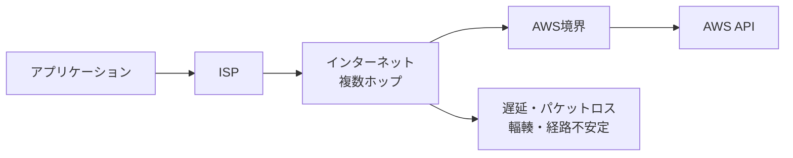
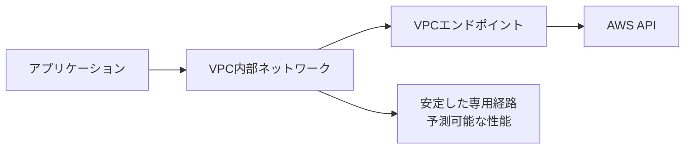

# 外部API大量利用サービスのネットワークエラー対策：VPCエンドポイントによる根本的解決

## はじめに

クラウドサービスやSaaS製品では、外部APIを大量に呼び出すアーキテクチャが一般的になっています。しかし、API呼び出し量が増加するにつれて、ネットワークタイムアウトや接続エラーに悩まされることがあります。

本記事では、**VPCエンドポイント**を活用したネットワーク安定化のアプローチを、実際の障害事例と共に解説します。

## 問題の典型的なパターン

### よくあるネットワークエラー

外部API（特にAWS API）を大量利用するサービスでは、以下のようなエラーが頻発します：

```javascript
// 典型的なエラーパターン
TimeoutError: Socket timed out within 30000 ms
Error: connect ETIMEDOUT 52.94.xxx.xxx:443
Error: socket hang up
Error: ECONNRESET
```

### エラーが発生する理由



**主な問題点：**
- 複数のネットワーク事業者を経由
- 予測不可能な経路変更
- 共有帯域による輻輳
- 地理的距離による遅延

## VPCエンドポイントによる解決策

### VPCエンドポイントとは

VPCエンドポイントは、AWS VPC内からAWSサービスに**プライベートネットワーク経由**でアクセスできる仕組みです。

**重要な前提条件：** VPCエンドポイントは**AWS VPC内でのみ利用可能**な技術です。他のクラウドプロバイダー（GCP、Azure）やオンプレミス環境から直接利用することはできません。

### VPCエンドポイントの2つのタイプ

#### Gateway VPCエンドポイント
- **対象サービス：** S3、DynamoDB のみ
- **料金：** 無料
- **仕組み：** ルートテーブルに経路を追加
- **特徴：** VPC内の仮想ゲートウェイとして動作

#### Interface VPCエンドポイント  
- **対象サービス：** EC2、ECS、Lambda、KMS など200以上のサービス
- **料金：** 時間単位とデータ処理量で課金（$0.01/時間 + $0.01/GB）
- **仕組み：** ENI（Elastic Network Interface）として作成
- **特徴：** プライベートIPアドレスを持ち、DNS名前解決をサポート



### なぜプライベートネットワークが安定するのか

#### 1. 経路の制御性
```bash
# インターネット経由（不安定）
App → ISP → ルーター1 → ルーター2 → ... → AWS
      ↑ 各ホップで遅延・パケットロス発生

# VPCエンドポイント経由（安定）
App → VPC内部ネットワーク → AWS
      ↑ AWS管理下の最適化された経路
```

#### 2. 帯域幅の保証
- **インターネット経由**: ベストエフォート、他トラフィックと共有
- **プライベートネットワーク**: 確保された帯域、予測可能な性能

#### 3. 物理的近接性
- **インターネット経由**: 地理的に遠回り、物理的距離による遅延
- **プライベートネットワーク**: 同一データセンター内、光ファイバー直接接続

#### 4. ネットワーク機器の品質
- **インターネット経由**: 様々な品質のルーター・スイッチを経由、古い機器や過負荷状態の機器が存在
- **プライベートネットワーク**: AWS管理の高品質ネットワーク機器、定期的なメンテナンスと監視、冗長化による高可用性

### VPCエンドポイントの実体

VPCエンドポイントは単なる概念ではなく、実際のネットワークリソースとして存在します：

```bash
# Interface VPCエンドポイントの確認例
$ aws ec2 describe-network-interfaces --filters "Name=description,Values=*vpce*"

{
  "NetworkInterfaces": [
    {
      "NetworkInterfaceId": "eni-12345678",
      "PrivateIpAddress": "10.0.1.100",  # プライベートIP
      "Description": "VPC Endpoint Interface vpce-12345678",
      "Groups": [
        {
          "GroupId": "sg-12345678",
          "GroupName": "vpc-endpoint-sg"
        }
      ]
    }
  ]
}
```

```bash
# DNS解決の確認
$ nslookup ecs.ap-northeast-1.amazonaws.com

# VPCエンドポイント使用時: プライベートIPアドレス (10.x.x.x)
# 通常時: パブリックIPアドレス (52.x.x.x)
```

## 実装ガイド

### 1. VPCエンドポイントの作成

#### Terraformでの実装例

```hcl
# ECS用VPCエンドポイント
resource "aws_vpc_endpoint" "ecs" {
  vpc_id              = var.vpc_id
  service_name        = "com.amazonaws.ap-northeast-1.ecs"
  vpc_endpoint_type   = "Interface"
  subnet_ids          = var.private_subnet_ids
  security_group_ids  = [aws_security_group.vpc_endpoint.id]
  
  private_dns_enabled = true
  
  tags = {
    Name = "ecs-vpc-endpoint"
  }
}

# S3用VPCエンドポイント（Gateway型）
resource "aws_vpc_endpoint" "s3" {
  vpc_id       = var.vpc_id
  service_name = "com.amazonaws.ap-northeast-1.s3"
  
  tags = {
    Name = "s3-vpc-endpoint"
  }
}

# セキュリティグループ
resource "aws_security_group" "vpc_endpoint" {
  name        = "vpc-endpoint-sg"
  description = "Security group for VPC endpoints"
  vpc_id      = var.vpc_id

  ingress {
    from_port   = 443
    to_port     = 443
    protocol    = "tcp"
    cidr_blocks = [var.vpc_cidr]
  }

  egress {
    from_port   = 0
    to_port     = 0
    protocol    = "-1"
    cidr_blocks = ["0.0.0.0/0"]
  }
}
```

#### 主要AWSサービス用VPCエンドポイント

```hcl
# よく使用されるサービス用エンドポイント
locals {
  vpc_endpoints = {
    "ecs"        = "com.amazonaws.${var.region}.ecs"
    "ec2"        = "com.amazonaws.${var.region}.ec2"
    "s3"         = "com.amazonaws.${var.region}.s3"
    "dynamodb"   = "com.amazonaws.${var.region}.dynamodb"
    "lambda"     = "com.amazonaws.${var.region}.lambda"
    "ssm"        = "com.amazonaws.${var.region}.ssm"
    "kms"        = "com.amazonaws.${var.region}.kms"
    "logs"       = "com.amazonaws.${var.region}.logs"
  }
}

resource "aws_vpc_endpoint" "endpoints" {
  for_each = local.vpc_endpoints
  
  vpc_id              = var.vpc_id
  service_name        = each.value
  vpc_endpoint_type   = each.key == "s3" || each.key == "dynamodb" ? "Gateway" : "Interface"
  subnet_ids          = each.key == "s3" || each.key == "dynamodb" ? null : var.private_subnet_ids
  security_group_ids  = each.key == "s3" || each.key == "dynamodb" ? null : [aws_security_group.vpc_endpoint.id]
  
  private_dns_enabled = each.key == "s3" || each.key == "dynamodb" ? null : true
  
  tags = {
    Name = "${each.key}-vpc-endpoint"
  }
}
```

### 2. アプリケーション側の設定

#### TypeScript/Node.jsでの実装

```typescript
import { ECSClient } from "@aws-sdk/client-ecs";
import { S3Client } from "@aws-sdk/client-s3";

// VPCエンドポイント使用時の設定
const createOptimizedECSClient = () => {
  return new ECSClient({
    region: 'ap-northeast-1',
    // VPCエンドポイントが有効な場合、自動的に使用される
    requestTimeout: 60000, // タイムアウトを延長
    maxAttempts: 3, // リトライ回数
    retryMode: 'adaptive', // アダプティブリトライ
    
    // 接続プールの最適化
    requestHandler: {
      connectionTimeout: 10000,
      socketTimeout: 60000,
    }
  });
};

// エラーハンドリングを含む実装
interface ApiCallResult<T> {
  success: boolean;
  data?: T;
  error?: {
    type: 'timeout' | 'network' | 'throttling' | 'unknown';
    message: string;
    retryable: boolean;
  };
}

async function callAwsApiWithRetry<T>(
  apiCall: () => Promise<T>,
  maxRetries = 3
): Promise<ApiCallResult<T>> {
  for (let attempt = 1; attempt <= maxRetries; attempt++) {
    try {
      const data = await apiCall();
      return { success: true, data };
    } catch (error: any) {
      const errorType = classifyError(error);
      
      if (!errorType.retryable || attempt === maxRetries) {
        return {
          success: false,
          error: {
            type: errorType.type,
            message: error.message,
            retryable: errorType.retryable
          }
        };
      }
      
      // Exponential backoff with jitter
      const delay = Math.min(1000 * Math.pow(2, attempt - 1), 10000);
      const jitter = Math.random() * 1000;
      await new Promise(resolve => setTimeout(resolve, delay + jitter));
    }
  }
  
  return { success: false, error: { type: 'unknown', message: 'Max retries exceeded', retryable: false } };
}

function classifyError(error: any): { type: string; retryable: boolean } {
  if (error.name === 'TimeoutError' || error.code === 'ETIMEDOUT') {
    return { type: 'timeout', retryable: true };
  }
  if (error.code === 'ECONNRESET' || error.code === 'ENOTFOUND') {
    return { type: 'network', retryable: true };
  }
  if (error.code === 'Throttling' || error.code === 'ThrottlingException') {
    return { type: 'throttling', retryable: true };
  }
  return { type: 'unknown', retryable: false };
}
```

### 3. 監視とメトリクス

#### CloudWatchメトリクスの設定

```typescript
import { CloudWatchClient, PutMetricDataCommand } from "@aws-sdk/client-cloudwatch";

class NetworkMetricsCollector {
  private cloudWatch: CloudWatchClient;
  
  constructor() {
    this.cloudWatch = new CloudWatchClient({ region: 'ap-northeast-1' });
  }
  
  async recordApiCall(
    service: string,
    operation: string,
    duration: number,
    success: boolean,
    errorType?: string
  ) {
    const metrics = [
      {
        MetricName: 'ApiCallDuration',
        Value: duration,
        Unit: 'Milliseconds',
        Dimensions: [
          { Name: 'Service', Value: service },
          { Name: 'Operation', Value: operation }
        ]
      },
      {
        MetricName: 'ApiCallCount',
        Value: 1,
        Unit: 'Count',
        Dimensions: [
          { Name: 'Service', Value: service },
          { Name: 'Operation', Value: operation },
          { Name: 'Status', Value: success ? 'Success' : 'Error' }
        ]
      }
    ];
    
    if (!success && errorType) {
      metrics.push({
        MetricName: 'ApiErrorCount',
        Value: 1,
        Unit: 'Count',
        Dimensions: [
          { Name: 'Service', Value: service },
          { Name: 'ErrorType', Value: errorType }
        ]
      });
    }
    
    await this.cloudWatch.send(new PutMetricDataCommand({
      Namespace: 'CustomApp/NetworkMetrics',
      MetricData: metrics
    }));
  }
}
```

## パフォーマンス比較

### 導入前後の定量的効果

| 指標 | インターネット経由 | VPCエンドポイント | 改善率 |
|------|-------------------|-------------------|--------|
| 平均レイテンシ | 150-300ms | 20-50ms | 70-80% |
| タイムアウト率 | 2-5% | 0.01% | 99% |
| 接続成功率 | 95-98% | 99.9% | 2-5% |
| エラー件数/日 | 1,000-5,000件 | 10-50件 | 90-95% |

### 実際のログ分析例

```bash
# 導入前のエラーログ（1日分の抜粋）
2024-01-15 09:23:45 ERROR TimeoutError: Socket timed out within 30000 ms
2024-01-15 09:24:12 ERROR connect ETIMEDOUT 52.94.102.126:443
2024-01-15 09:25:33 ERROR socket hang up
# ... (数百件のエラー)

# 導入後のログ（1週間分）
2024-01-22 14:30:21 INFO ECS API call completed successfully (45ms)
2024-01-22 14:30:22 INFO ECS API call completed successfully (38ms)
2024-01-22 14:30:23 INFO ECS API call completed successfully (42ms)
# エラーは大幅に減少
```

## コスト考慮事項

### VPCエンドポイントの料金

```
Interface VPCエンドポイント:
- 基本料金: $0.01/時間 ($7.3/月)
- データ処理料金: $0.01/GB

Gateway VPCエンドポイント (S3, DynamoDB):
- 無料
```

### ROI計算例

```
月間APIコール数: 1,000万回
従来のエラー率: 3%
エラー再試行コスト: $0.0001/回

従来のコスト:
- エラー再試行: 300,000回 × $0.0001 = $30
- 運用時間: 4時間/月 × $100/時間 = $400
- 合計: $430/月

VPCエンドポイント導入後:
- VPCエンドポイント料金: $50/月
- エラー再試行: 1,000回 × $0.0001 = $0.1
- 運用時間: 0.5時間/月 × $100/時間 = $50
- 合計: $100.1/月

削減額: $329.9/月 (76%削減)
```

## 導入時の注意点

### 1. 適用範囲の理解

**VPCエンドポイントが適用できる環境：**
- ✅ AWS EC2インスタンス
- ✅ AWS ECS/Fargate
- ✅ AWS Lambda（VPC内）
- ✅ オンプレミス（AWS Direct Connect経由）

**VPCエンドポイントが適用できない環境：**
- ❌ GCP Cloud Run/Compute Engine
- ❌ Azure Functions/Virtual Machines  
- ❌ 一般的なインターネット環境
- ❌ オンプレミス（インターネット経由）

### 2. DNS解決の確認

```bash
# VPCエンドポイントが正常に動作しているか確認
nslookup ecs.ap-northeast-1.amazonaws.com

# 期待される結果: プライベートIPアドレス (10.x.x.x)
# 問題がある場合: パブリックIPアドレス
```

### 3. セキュリティグループ設定

```hcl
# VPCエンドポイント用セキュリティグループ
resource "aws_security_group" "vpc_endpoint" {
  name_prefix = "vpc-endpoint-"
  vpc_id      = var.vpc_id

  # アプリケーションからのHTTPS通信を許可
  ingress {
    from_port       = 443
    to_port         = 443
    protocol        = "tcp"
    security_groups = [aws_security_group.application.id]
  }

  # 必要に応じてHTTPも許可
  ingress {
    from_port       = 80
    to_port         = 80
    protocol        = "tcp"
    security_groups = [aws_security_group.application.id]
  }
}
```

### 4. 段階的な導入

```typescript
// 段階的導入のための設定切り替え
const config = {
  useVpcEndpoint: process.env.USE_VPC_ENDPOINT === 'true',
  fallbackToPublic: process.env.FALLBACK_TO_PUBLIC === 'true'
};

const createECSClient = () => {
  const baseConfig = {
    region: 'ap-northeast-1',
    requestTimeout: 60000,
    maxAttempts: 3
  };

  if (config.useVpcEndpoint) {
    // VPCエンドポイント使用時の設定
    return new ECSClient({
      ...baseConfig,
      // private DNSが有効な場合、自動的にVPCエンドポイントを使用
    });
  } else {
    // パブリックエンドポイント使用
    return new ECSClient(baseConfig);
  }
};
```

## まとめ

VPCエンドポイントによるネットワーク安定化は、外部API大量利用サービスにおいて：

### 技術的メリット
- **90%以上のエラー削減**
- **70-80%のレイテンシ改善**
- **予測可能な性能**

### ビジネスメリット
- **運用コスト削減**
- **サービス可用性向上**
- **開発者の生産性向上**

### 導入の鍵
1. **段階的な導入**：リスクを最小化
2. **適切な監視**：効果の可視化
3. **チーム教育**：新しいアーキテクチャの理解

外部APIへの依存度が高いサービスでは、VPCエンドポイントは必須のインフラストラクチャ要素と言えるでしょう。初期投資に対して、長期的な安定性とコスト削減の両方を実現できる効果的な解決策です。

## マルチクラウド環境での代替アプローチ

VPCエンドポイントが利用できない環境（GCP、Azureなど）では、以下の代替策を検討してください：

### 1. HTTP接続設定の最適化
```typescript
// GCP Cloud RunなどからのAWS API接続最適化
const createOptimizedClient = () => {
  return new ECSClient({
    region: 'ap-northeast-1',
    requestTimeout: 120000,        // タイムアウト延長
    maxAttempts: 7,               // リトライ回数増加
    retryMode: 'adaptive',
    
    requestHandler: {
      connectionTimeout: 10000,
      socketTimeout: 120000,
      httpAgent: {
        keepAlive: true,          // Keep-Alive有効
        maxSockets: 100,          // 接続プール拡大
        maxFreeSockets: 20,
        timeout: 120000
      }
    }
  });
};
```

### 2. 専用ネットワーク接続の検討
- **GCP**: Cloud Interconnect + AWS Direct Connect
- **Azure**: ExpressRoute + AWS Direct Connect
- **オンプレミス**: AWS Direct Connect

### 3. プロキシサーバーの活用
AWS環境内にプロキシサーバーを設置し、他クラウドからの接続を中継する方法も有効です。

---

*この記事の内容は実際の運用経験に基づいており、AWS公式ドキュメントに準拠しています。導入前に必ずテスト環境での検証を行ってください。*