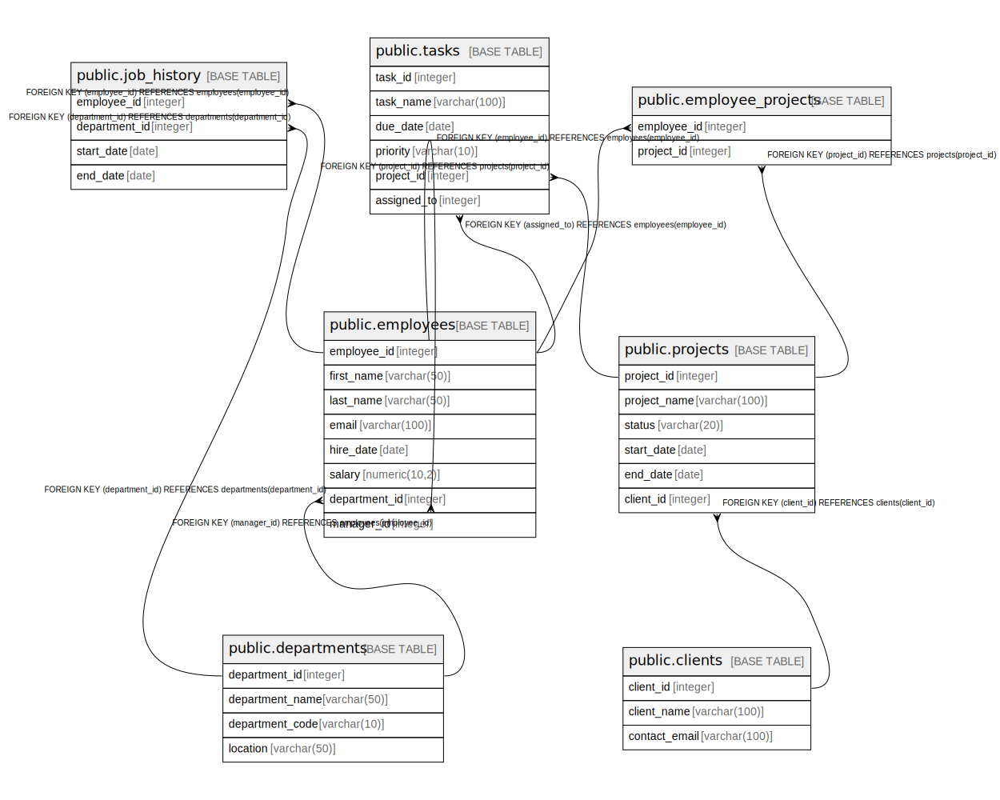

# testdb

## Tables

| Name | Columns | Comment | Type |
| ---- | ------- | ------- | ---- |
| [public.departments](public.departments.md) | 4 |  | BASE TABLE |
| [public.clients](public.clients.md) | 3 |  | BASE TABLE |
| [public.employees](public.employees.md) | 8 |  | BASE TABLE |
| [public.projects](public.projects.md) | 6 |  | BASE TABLE |
| [public.employee_projects](public.employee_projects.md) | 2 |  | BASE TABLE |
| [public.tasks](public.tasks.md) | 6 |  | BASE TABLE |
| [public.job_history](public.job_history.md) | 4 |  | BASE TABLE |

## Relations

---

> Generated by [tbls](https://github.com/k1LoW/tbls)
