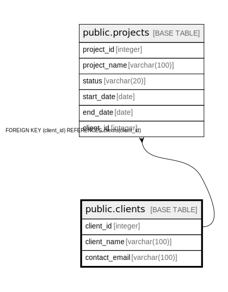

# public.clients

## Description

## Columns

| Name | Type | Default | Nullable | Children | Parents | Comment |
| ---- | ---- | ------- | -------- | -------- | ------- | ------- |
| client_id | integer | nextval('clients_client_id_seq'::regclass) | false | [public.projects](public.projects.md) |  |  |
| client_name | varchar(100) |  | false |  |  |  |
| contact_email | varchar(100) |  | false |  |  |  |

## Constraints

| Name | Type | Definition |
| ---- | ---- | ---------- |
| clients_pkey | PRIMARY KEY | PRIMARY KEY (client_id) |
| clients_contact_email_key | UNIQUE | UNIQUE (contact_email) |

## Indexes

| Name | Definition |
| ---- | ---------- |
| clients_pkey | CREATE UNIQUE INDEX clients_pkey ON public.clients USING btree (client_id) |
| clients_contact_email_key | CREATE UNIQUE INDEX clients_contact_email_key ON public.clients USING btree (contact_email) |

## Relations

---

> Generated by [tbls](https://github.com/k1LoW/tbls)
