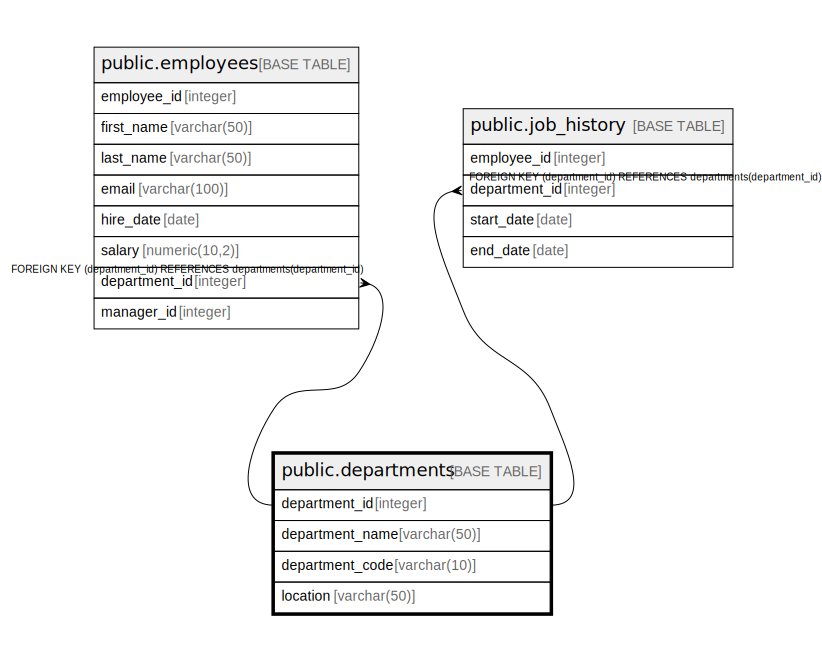

# public.departments

## Description

## Columns

| Name | Type | Default | Nullable | Children | Parents | Comment |
| ---- | ---- | ------- | -------- | -------- | ------- | ------- |
| department_id | integer | nextval('departments_department_id_seq'::regclass) | false | [public.employees](public.employees.md) [public.job_history](public.job_history.md) |  |  |
| department_name | varchar(50) |  | false |  |  |  |
| department_code | varchar(10) |  | false |  |  |  |
| location | varchar(50) |  | true |  |  |  |

## Constraints

| Name | Type | Definition |
| ---- | ---- | ---------- |
| departments_pkey | PRIMARY KEY | PRIMARY KEY (department_id) |
| uq_department_name | UNIQUE | UNIQUE (department_name) |
| uq_department_code | UNIQUE | UNIQUE (department_code) |

## Indexes

| Name | Definition |
| ---- | ---------- |
| departments_pkey | CREATE UNIQUE INDEX departments_pkey ON public.departments USING btree (department_id) |
| uq_department_name | CREATE UNIQUE INDEX uq_department_name ON public.departments USING btree (department_name) |
| uq_department_code | CREATE UNIQUE INDEX uq_department_code ON public.departments USING btree (department_code) |

## Relations

---

> Generated by [tbls](https://github.com/k1LoW/tbls)
