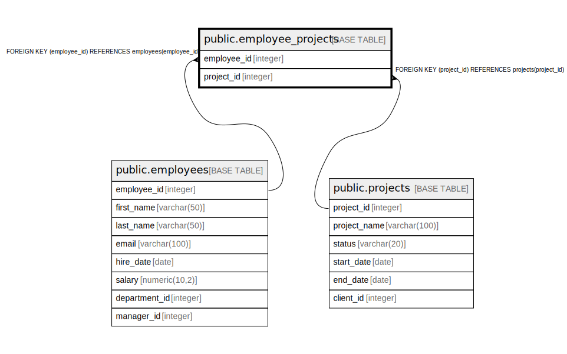

# public.employee_projects

## Description

## Columns

| Name | Type | Default | Nullable | Children | Parents | Comment |
| ---- | ---- | ------- | -------- | -------- | ------- | ------- |
| employee_id | integer |  | false |  | [public.employees](public.employees.md) |  |
| project_id | integer |  | false |  | [public.projects](public.projects.md) |  |

## Constraints

| Name | Type | Definition |
| ---- | ---- | ---------- |
| employee_projects_employee_id_fkey | FOREIGN KEY | FOREIGN KEY (employee_id) REFERENCES employees(employee_id) |
| employee_projects_project_id_fkey | FOREIGN KEY | FOREIGN KEY (project_id) REFERENCES projects(project_id) |
| employee_projects_pkey | PRIMARY KEY | PRIMARY KEY (employee_id, project_id) |

## Indexes

| Name | Definition |
| ---- | ---------- |
| employee_projects_pkey | CREATE UNIQUE INDEX employee_projects_pkey ON public.employee_projects USING btree (employee_id, project_id) |

## Relations

---

> Generated by [tbls](https://github.com/k1LoW/tbls)
