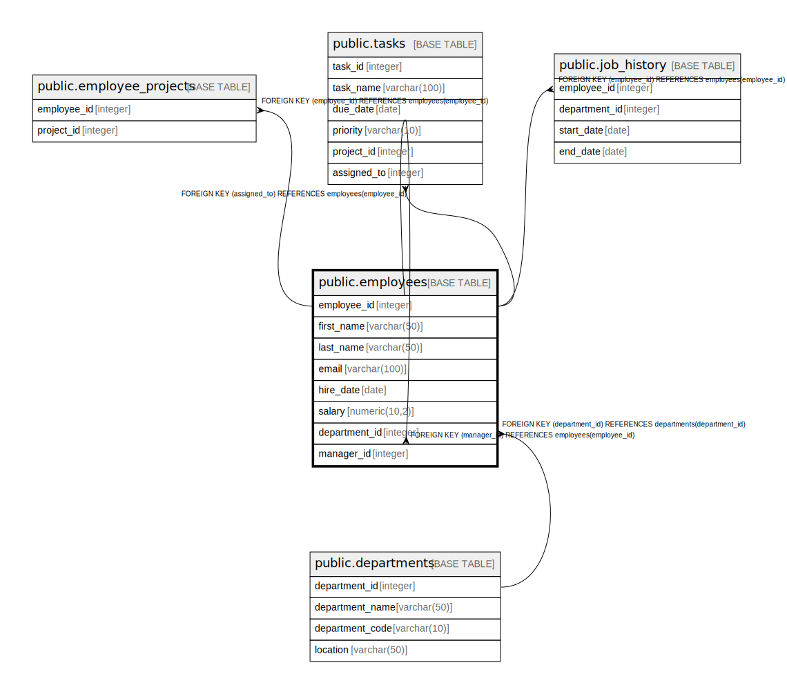

# public.employees

## Description

## Columns

| Name | Type | Default | Nullable | Children | Parents | Comment |
| ---- | ---- | ------- | -------- | -------- | ------- | ------- |
| employee_id | integer | nextval('employees_employee_id_seq'::regclass) | false | [public.employees](public.employees.md) [public.employee_projects](public.employee_projects.md) [public.tasks](public.tasks.md) [public.job_history](public.job_history.md) |  |  |
| first_name | varchar(50) |  | false |  |  |  |
| last_name | varchar(50) |  | false |  |  |  |
| email | varchar(100) |  | false |  |  |  |
| hire_date | date | CURRENT_DATE | false |  |  |  |
| salary | numeric(10,2) | 3000.00 | false |  |  |  |
| department_id | integer |  | false |  | [public.departments](public.departments.md) |  |
| manager_id | integer |  | true |  | [public.employees](public.employees.md) |  |

## Constraints

| Name | Type | Definition |
| ---- | ---- | ---------- |
| chk_salary_positive | CHECK | CHECK ((salary > (0)::numeric)) |
| employees_department_id_fkey | FOREIGN KEY | FOREIGN KEY (department_id) REFERENCES departments(department_id) |
| employees_manager_id_fkey | FOREIGN KEY | FOREIGN KEY (manager_id) REFERENCES employees(employee_id) |
| employees_pkey | PRIMARY KEY | PRIMARY KEY (employee_id) |
| uq_employee_email | UNIQUE | UNIQUE (email) |

## Indexes

| Name | Definition |
| ---- | ---------- |
| employees_pkey | CREATE UNIQUE INDEX employees_pkey ON public.employees USING btree (employee_id) |
| uq_employee_email | CREATE UNIQUE INDEX uq_employee_email ON public.employees USING btree (email) |

## Relations

---

> Generated by [tbls](https://github.com/k1LoW/tbls)
