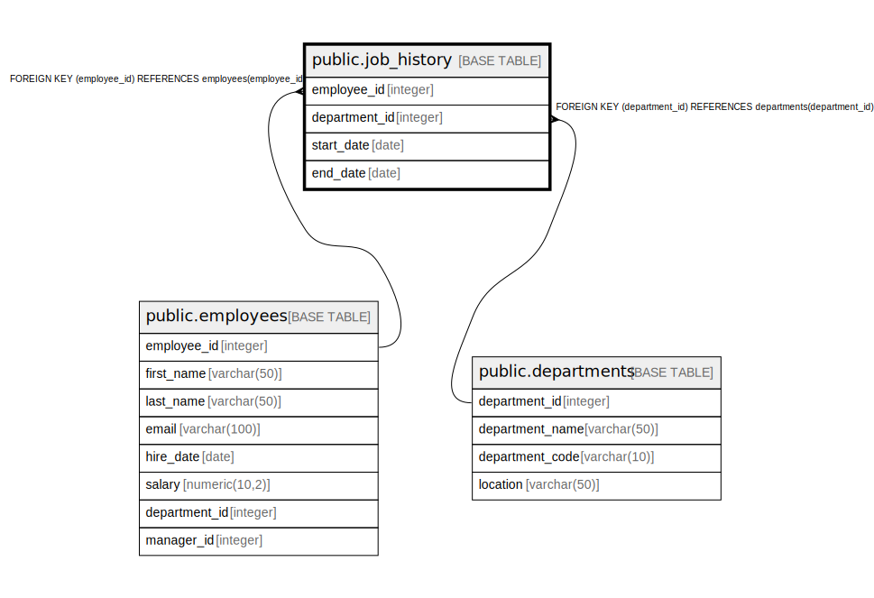

# public.job_history

## Description

## Columns

| Name | Type | Default | Nullable | Children | Parents | Comment |
| ---- | ---- | ------- | -------- | -------- | ------- | ------- |
| employee_id | integer |  | false |  | [public.employees](public.employees.md) |  |
| department_id | integer |  | false |  | [public.departments](public.departments.md) |  |
| start_date | date |  | false |  |  |  |
| end_date | date |  | true |  |  |  |

## Constraints

| Name | Type | Definition |
| ---- | ---- | ---------- |
| job_history_department_id_fkey | FOREIGN KEY | FOREIGN KEY (department_id) REFERENCES departments(department_id) |
| job_history_employee_id_fkey | FOREIGN KEY | FOREIGN KEY (employee_id) REFERENCES employees(employee_id) |
| job_history_pkey | PRIMARY KEY | PRIMARY KEY (employee_id, department_id, start_date) |

## Indexes

| Name | Definition |
| ---- | ---------- |
| job_history_pkey | CREATE UNIQUE INDEX job_history_pkey ON public.job_history USING btree (employee_id, department_id, start_date) |

## Relations

---

> Generated by [tbls](https://github.com/k1LoW/tbls)
