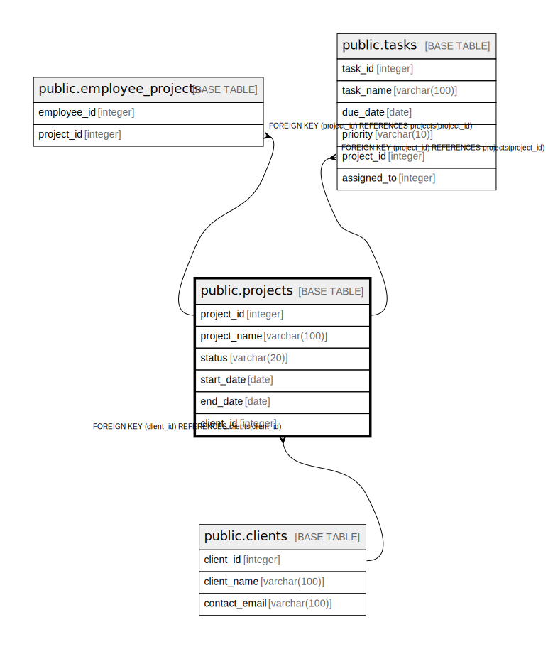

# public.projects

## Description

## Columns

| Name | Type | Default | Nullable | Children | Parents | Comment |
| ---- | ---- | ------- | -------- | -------- | ------- | ------- |
| project_id | integer | nextval('projects_project_id_seq'::regclass) | false | [public.employee_projects](public.employee_projects.md) [public.tasks](public.tasks.md) |  |  |
| project_name | varchar(100) |  | false |  |  |  |
| status | varchar(20) | 'Proposed'::character varying | false |  |  |  |
| start_date | date | CURRENT_DATE | false |  |  |  |
| end_date | date |  | true |  |  |  |
| client_id | integer |  | false |  | [public.clients](public.clients.md) |  |

## Constraints

| Name | Type | Definition |
| ---- | ---- | ---------- |
| chk_project_status | CHECK | CHECK (((status)::text = ANY ((ARRAY['Proposed'::character varying, 'Active'::character varying, 'Completed'::character varying])::text[]))) |
| projects_client_id_fkey | FOREIGN KEY | FOREIGN KEY (client_id) REFERENCES clients(client_id) |
| projects_pkey | PRIMARY KEY | PRIMARY KEY (project_id) |

## Indexes

| Name | Definition |
| ---- | ---------- |
| projects_pkey | CREATE UNIQUE INDEX projects_pkey ON public.projects USING btree (project_id) |

## Relations

---

> Generated by [tbls](https://github.com/k1LoW/tbls)
