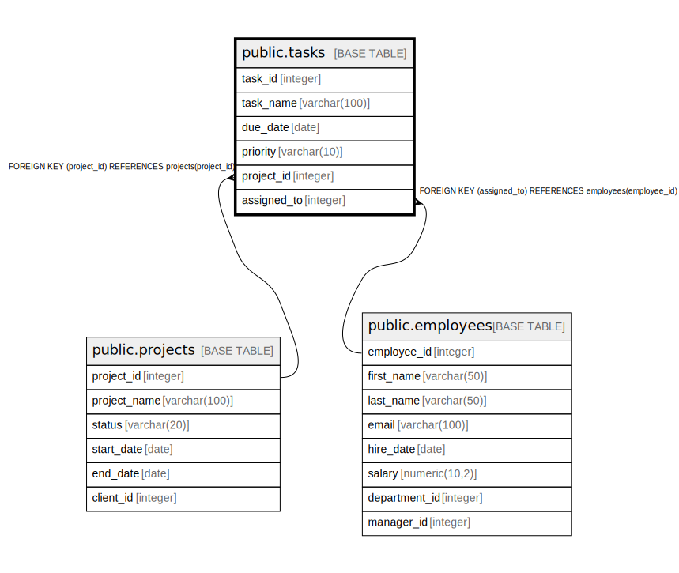

# public.tasks

## Description

## Columns

| Name | Type | Default | Nullable | Children | Parents | Comment |
| ---- | ---- | ------- | -------- | -------- | ------- | ------- |
| task_id | integer | nextval('tasks_task_id_seq'::regclass) | false |  |  |  |
| task_name | varchar(100) |  | false |  |  |  |
| due_date | date |  | true |  |  |  |
| priority | varchar(10) | 'Medium'::character varying | false |  |  |  |
| project_id | integer |  | false |  | [public.projects](public.projects.md) |  |
| assigned_to | integer |  | true |  | [public.employees](public.employees.md) |  |

## Constraints

| Name | Type | Definition |
| ---- | ---- | ---------- |
| chk_priority | CHECK | CHECK (((priority)::text = ANY ((ARRAY['Low'::character varying, 'Medium'::character varying, 'High'::character varying])::text[]))) |
| tasks_assigned_to_fkey | FOREIGN KEY | FOREIGN KEY (assigned_to) REFERENCES employees(employee_id) |
| tasks_project_id_fkey | FOREIGN KEY | FOREIGN KEY (project_id) REFERENCES projects(project_id) |
| tasks_pkey | PRIMARY KEY | PRIMARY KEY (task_id) |

## Indexes

| Name | Definition |
| ---- | ---------- |
| tasks_pkey | CREATE UNIQUE INDEX tasks_pkey ON public.tasks USING btree (task_id) |

## Relations

---

> Generated by [tbls](https://github.com/k1LoW/tbls)
