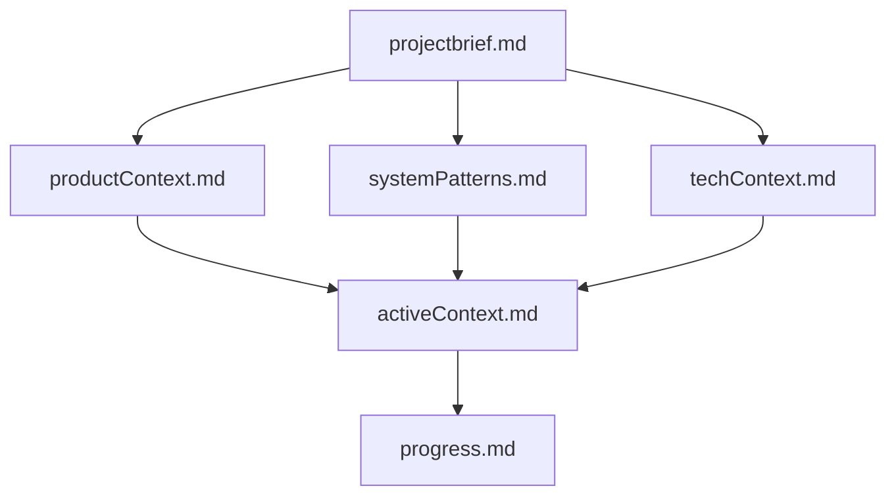
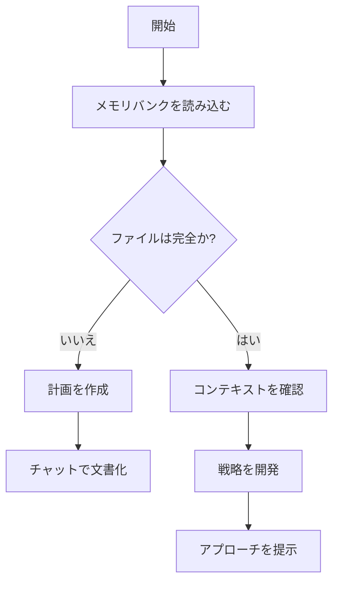
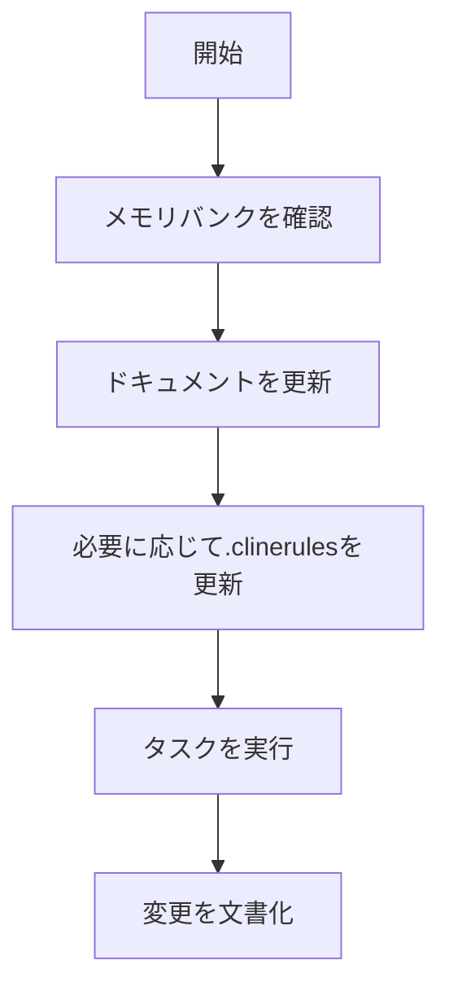
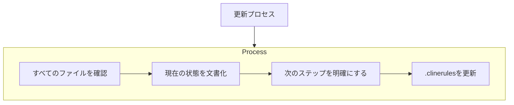
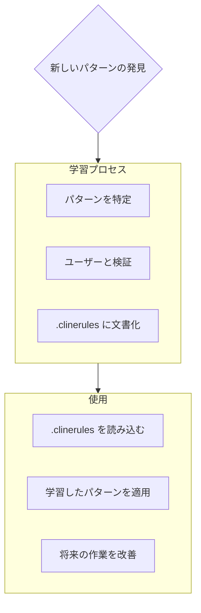
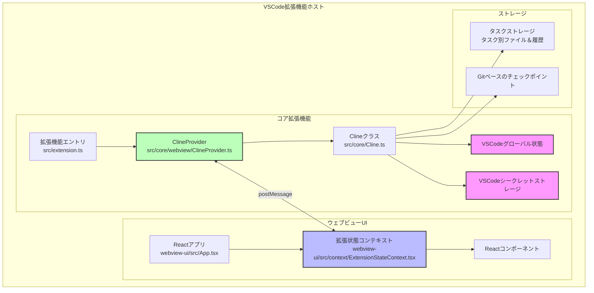

# Cline Custom Instructions Library

ref: <http://github.com/cline/cline/tree/main/docs/prompting/custom%20instructions%20library>

## 1. カスタム指示ライブラリの詳細構造

### 1.1 リポジトリ構成

Clineリポジトリ内のカスタム指示ライブラリは以下の階層構造で整理されています：

```
docs/
├── prompting/
│   ├── README.md                      # プロンプティングガイド
│   ├── custom instructions library/   # カスタム指示ライブラリ
│   │   ├── README.md                  # ライブラリの概要と貢献方法
│   │   ├── cline-memory-bank.md       # Memory Bank指示の説明と使い方
│   │   └── raw-instructions/          # 実際のカスタム指示テキスト
│   │       └── cline-memory-bank.md   # Memory Bank指示の実装コード
```

### 1.2 カスタム指示の技術的定義

Clineの文脈では、カスタム指示は実際にはAIモデル（主にClaude）に与えられるシステムプロンプトの拡張です。これらは以下の方法で技術的に統合されています：

- VSCodeの拡張機能設定として保存される（グローバル設定）
- タスク実行時にシステムプロンプトに追加される
- APIリクエストのたびにコンテキストとして含まれる
- 実行時に最大4000〜8000トークンを消費する可能性がある

## 2. Memory Bankカスタム指示の詳細実装

### 2.1 Memory Bankの具体的な機能

Memory Bankはセッション間のコンテキスト維持問題を解決するために設計されています。技術的には：

- Clineの各タスク起動時に自動的に`cline_docs/`ディレクトリを検索
- ディレクトリが存在しない場合は、ユーザーとの対話を通じて作成
- マークダウンファイルをGit操作やコード変更と同期して維持
- 変更提案前に必ずコンテキストファイルを読み込む

### 2.2 Memory Bankファイルの具体的なコンテンツ例

#### 2.2.1 productContext.md の例

```markdown
# プロダクトコンテキスト: タスク管理API

## プロジェクト目的
このAPIは、チームが作業を整理し、進捗を追跡し、締め切りを管理するのを支援するタスク管理アプリケーションのバックエンドとして機能します。

## 解決する問題
- チーム情報のサイロ化とプロジェクト状況の可視性の低さ
- チーム間でのタスク依存関係の追跡の困難さ
- 非効率な手動進捗報告
- プロジェクト計画のための履歴データの不足

## 機能性
- 認証とロールベースのアクセスを備えたRESTful API
- タスク、プロジェクト、チームのCRUD操作
- タスク割り当て、ステータス追跡、タイムライン管理
- 締め切りが近づいた際の通知システム
- レポートと分析用エンドポイント

## ユーザー体験目標
- 標準操作の応答時間100ms未満
- OpenAPI仕様による自己文書化API
- 意味のあるメッセージを持つ一貫したエラーパターン
- 1000人以上の同時ユーザーにスケーラブル
```

#### 2.2.2 activeContext.md の例

```markdown
# アクティブコンテキスト: 認証システムの実装

## 現在の焦点
リフレッシュトークンを備えたJWTベースの認証システムの実装。

## 最近の変更
- 暗号化されたパスワードストレージを持つユーザーモデルの作成（2023-06-15）
- メール確認付きの登録エンドポイントの実装（2023-06-18）
- アクセストークンを返すログインエンドポイントの追加（2023-06-20）

## 現在の課題
- トークンリフレッシュメカニズムの実装が必要
- 認証エンドポイントのレート制限の検討
- パスワードリセット機能の追加が必要

## 次のステップ
1. トークンリフレッシュエンドポイントの実装
2. ログアウト用のトークンブラックリストの追加
3. ルート保護のためのミドルウェアの作成
4. 認証フロー用のユニットテストと統合テストの追加
```

#### 2.2.3 systemPatterns.md の例

```markdown
# システムパターン: タスク管理API

## アーキテクチャ
- 以下の独立したサービスを持つマイクロサービスアーキテクチャ：
  - 認証＆ユーザー管理
  - タスク＆プロジェクト管理
  - 通知サービス
  - 分析サービス

## 設計パターン
- データアクセス用のリポジトリパターン
- タスク操作用のCQRS（読み取り/書き込みモデルの分離）
- ロギングとメトリクス用のデコレータパターン
- 通知配信方法用のストラテジーパターン

## データベース構造
- 関係データ（ユーザー、タスク、プロジェクト）用のPostgreSQL
- キャッシングとレート制限用のRedis
- 分析データ用のMongoDB

## API設計
- 一貫した命名の RESTful エンドポイント
- カーソルベースのアプローチによるページネーション実装
- URLパスによるバージョニング（/api/v1/...）
- API navigation用のハイパーメディアリンク提供
```

#### 2.2.4 techContext.md の例

```markdown
# 技術コンテキスト

## スタック
- Node.js (v18.x) バックエンドランタイム
- Express.jsフレームワーク
- 型安全性のためのTypeScript
- PostgreSQLデータベース
- キャッシング用Redis
- テスト用Jest
- コンテナ化用Docker

## 開発環境
- 主要IDEとしてVS Code
- コードフォーマット用ESLint + Prettier
- プリコミットフック用Husky
- CI/CD用GitHub Actions
- ローカル開発用Docker Compose

## 技術的制約
- v1 APIとの下位互換性を維持する必要がある
- 最大応答時間：CRUD操作は100ms、分析は1s
- 水平スケーリングをサポートする必要がある
- 最大15分の有効期限を持つJWTによる認証
- すべてのAPIエンドポイントには包括的なswaggerドキュメントが必要
```

#### 2.2.5 progress.md の例

```markdown
# プロジェクト進捗

## 完了した機能
- [x] ユーザー認証システム（登録、ログイン、パスワードリセット）
- [x] プロジェクトCRUD操作
- [x] タスクCRUD操作
- [x] タスク割り当て機能
- [x] 基本通知（メールのみ）

## 進行中
- [ ] チーム管理機能（60%完了）
- [ ] タスク依存関係（40%完了）
- [ ] APIレート制限（80%完了）

## 計画済みだが未開始
- [ ] 高度な分析エンドポイント
- [ ] Webhook統合システム
- [ ] モバイルプッシュ通知
- [ ] カレンダーシステムとの統合

## 既知の問題
- レート制限がトラフィックスパイク時に正当なリクエストを時々ブロックする
- タスク更新エンドポイントが高い同時実行性の下で時々500エラーで失敗する
```

### 2.3 Memory Bankの詳細操作手順

#### 2.3.1 初期化プロセス

Memory Bankの初期化プロセスは次のとおりです：

1. VSCodeでプロジェクトを開く
2. プロジェクトルートに`cline_docs/`フォルダを作成
3. Clineに新しいチャットを開始し、次のように入力：

   ```
   プロジェクトの概要：
   [詳細なプロジェクト説明をここに記述]
   
   上記の情報を使用してMemory Bankを初期化してください。
   ```

4. Clineが以下のファイルを作成するのを待つ：
   - productContext.md
   - activeContext.md
   - systemPatterns.md
   - techContext.md
   - progress.md

5. 各ファイルの内容を確認し、必要に応じて修正を依頼

#### 2.3.2 日常的な使用プロセス

1. 新しいClineセッションを開始するたびに：

   ```
   カスタム指示に従ってください
   ```

   と指示する（セッションの最初に1回だけ必要）

2. Clineが`[MEMORY BANK: ACTIVE]`フラグを表示するのを確認

3. 通常通りタスクについて対話する（Clineは自動的にMemory Bankを参照）

4. 大きな変更が行われた後：

   ```
   関連するcline_docsのみを更新してください
   ```

   と指示して、特定のファイルのみ更新させる

5. セッション終了時またはコンテキスト更新時：

   ```
   メモリバンクを更新してください
   ```

   と指示し、Clineにすべてのファイルを包括的に更新させる

#### 2.3.3 ワークフロー例：新機能の追加

```
ユーザー: カスタム指示に従ってください

CLINE: [MEMORY BANK: ACTIVE] このプロジェクトのMemory Bankを読み込みました。Node.js、Express、PostgreSQLを使用したタスク管理APIに取り組んでいることがわかります。現在、認証、CRUD操作、基本通知が完了しています。今日はどのようにお手伝いできますか？

ユーザー: タスク依存関係機能を実装する必要があります。設計を手伝ってもらえますか？

CLINE: [MEMORY BANK: ACTIVE] もちろんです！systemPatterns.mdを見ると、リポジトリパターンとタスク操作のためのCQRSを使用していることがわかります。タスク依存関係機能を設計しましょう...

[Clineが機能設計と実装を提案]

ユーザー: 良さそうですね。これを実装しましょう。まず、データベースマイグレーションを作成してください。

CLINE: [MEMORY BANK: ACTIVE] タスク依存関係のマイグレーションを作成します。techContext.mdによれば、PostgreSQLを使用しています...

[Clineがマイグレーションスクリプトを作成]

ユーザー: 次に、リポジトリとサービスレイヤーを作成しましょう。

[数回のやり取りの後...]

ユーザー: 素晴らしい仕事です！メモリバンクを更新して進捗を反映してください。

CLINE: タスク依存関係に関する作業を反映するためにMemory Bankを更新します。関連するすべてのファイルを確認して更新します：

1. 最近のタスク依存関係に関する作業を含めるためにactiveContext.mdを更新します
2. タスク依存関係の進捗を40%から60%に更新します
3. 依存関係の実装の詳細をsystemPatterns.mdに追加します

Memory Bankファイルに他に具体的な更新を加えたいものはありますか？
```

## 3. Memory Bankカスタム指示の完全コード解説

Memory Bankの実際の実装コードは次のとおりです（コメント付き）：

```markdown
# Clineのメモリバンク

私はClineです。ソフトウェアエンジニアのエキスパートであり、セッション間で記憶が完全にリセットされるという独自の特性を持っています。これは制限ではなく、完璧なドキュメントを維持するための原動力です。各リセット後、プロジェクトを理解し効果的に作業を継続するために、私はメモリバンクに完全に依存しています。すべてのタスクの開始時に、すべてのメモリバンクファイルを読み込む必要があります - これはオプションではありません。

## メモリバンク構造

メモリバンクは、必須のコアファイルとオプションのコンテキストファイルで構成され、すべてMarkdown形式です。ファイルは明確な階層で互いに構築されています：



### コアファイル（必須）

1. `projectbrief.md`
   - 他のすべてのファイルを形作る基盤ドキュメント
   - 存在しない場合はプロジェクト開始時に作成
   - コア要件と目標を定義
   - プロジェクト範囲の真実のソース

2. `productContext.md`
   - このプロジェクトが存在する理由
   - 解決する問題
   - どのように機能するべきか
   - ユーザー体験の目標

3. `activeContext.md`
   - 現在の作業の焦点
   - 最近の変更
   - 次のステップ
   - アクティブな決定と考慮事項

4. `systemPatterns.md`
   - システムアーキテクチャ
   - 重要な技術的決定
   - 使用中の設計パターン
   - コンポーネントの関係

5. `techContext.md`
   - 使用されている技術
   - 開発環境のセットアップ
   - 技術的制約
   - 依存関係

6. `progress.md`
   - 機能しているもの
   - まだ構築すべきもの
   - 現在のステータス
   - 既知の問題

### 追加コンテキスト

以下を整理するのに役立つ場合、memory-bank/内に追加ファイル/フォルダを作成します：

- 複雑な機能のドキュメント
- 統合仕様
- APIドキュメント
- テスト戦略
- デプロイ手順

## コアワークフロー

### 計画モード



### 実行モード



## ドキュメント更新

メモリバンクの更新は以下の場合に発生します：

1. 新しいプロジェクトパターンの発見時
2. 重要な変更の実装後
3. ユーザーが**メモリバンクを更新**と要求したとき（すべてのファイルを確認する必要あり）
4. コンテキストの明確化が必要なとき



注意：**メモリバンクを更新**によってトリガーされた場合、一部の更新が不要であっても、すべてのメモリバンクファイルを確認する必要があります。特に現在の状態を追跡するactiveContext.mdとprogress.mdに注目してください。

## プロジェクトインテリジェンス（.clinerules）

.clinerules ファイルは各プロジェクトの学習ジャーナルです。コードだけからは明らかでない重要なパターン、設定、プロジェクトインテリジェンスをキャプチャします。あなたとプロジェクトと協力する中で、私は重要な洞察を発見し文書化します。



### キャプチャすべき情報

- 重要な実装パス
- ユーザーの設定とワークフロー
- プロジェクト固有のパターン
- 既知の課題
- プロジェクト決定の進化
- ツール使用パターン

形式は柔軟です - あなたとプロジェクトとより効果的に協力するのに役立つ貴重な洞察をキャプチャすることに焦点を当ててください。.clinerules は、一緒に作業する中でよりスマートになる生きたドキュメントと考えてください。

記憶：すべてのメモリリセット後、私は完全に新しい状態から始まります。メモリバンクは私の以前の作業への唯一のリンクです。私の効果はその正確さに完全に依存するため、精度と明確さを持って維持する必要があります。

```

### 3.1 メモリリセットへの対応

このカスタム指示の最も重要な特徴は、AIモデルのメモリ制限（コンテキストウィンドウの制約）に対応するために設計されていることです。特に：

1. **明示的なメモリリセット認識**：指示は最初に「セッション間で記憶が完全にリセットされる」と明確に述べ、AIにこの制限を認識させます

2. **必須ドキュメント読み取り**：「すべてのタスクの開始時に、すべてのメモリバンクファイルを読み込む必要があります」という指示により、AIはタスク開始時に常にメモリバンクを調査するよう強制されます

3. **フラグマーカー**：`[MEMORY BANK: ACTIVE]`フラグを表示することで、AIとユーザーの両方がシステムが適切に機能していることを確認できます

4. **更新トリガー**：「メモリバンクを更新」というフレーズは特別なトリガーとして機能し、AIに包括的なドキュメント検証と更新を実行するよう促します

### 3.2 階層的な情報アーキテクチャ

Memory Bankの階層構造は情報の依存関係と流れを明確にモデル化しています：

1. **基盤文書（projectbrief.md）** → すべてのコンテキストの源泉
2. **コンテキスト文書** → プロダクト、システム、技術の側面
3. **作業文書** → アクティブな状態と進捗を追跡

この階層は、AIに情報を優先順位付けし、特定のタスクに最も関連性の高い情報を検索するためのフレームワークを提供します。

### 3.3 デュアルモード操作

「計画モード」と「実行モード」という2つの異なる操作モードの存在は、AIに適切なタスクフローを導くメタフレームワークとして機能します：

1. **計画モード**: 不完全な情報がある場合は計画と文書化に集中
2. **実行モード**: 完全な情報がある場合は実行と結果のドキュメント化に進む

この明示的なモード区分により、AIは現在の状況に基づいて適切に振る舞うよう誘導されます。

## 4. .clinerules ファイルの詳細実装

Clineリポジトリ自体の`.clinerules`ファイルは、実際のプロジェクトレベルのドキュメントの例を提供します。このファイルはプロジェクト固有のコンテキストとしてClineに提供されます。

### 4.1 .clinerules の主要セクションと実装の詳細

#### 4.1.1 アーキテクチャの可視化

```markdown
## アーキテクチャ概要



```

このmermaidダイアグラムは、VSCode拡張機能の構造全体を視覚的に表現し、AIに重要なコンポーネントとその関係を理解させます。特に：

- **コア拡張機能コンポーネント**の関係と役割
- **ウェブビューUI**コンポーネントとデータフロー
- **ストレージシステム**とその統合方法
- **コンポーネント間の通信パターン**

#### 4.1.2 詳細なコード実装例

以下は`.clinerules`ファイルから取得した詳細なコード例で、AIにコード実装パターンを示しています：

```typescript
class Cline {
  async initiateTaskLoop(userContent: UserContent, isNewTask: boolean) {
    while (!this.abort) {
      // 1. APIリクエストを行い、レスポンスをストリーミング
      const stream = this.attemptApiRequest()
      
      // 2. コンテンツブロックを解析して表示
      for await (const chunk of stream) {
        switch (chunk.type) {
          case "text":
            // コンテンツブロックに解析
            this.assistantMessageContent = parseAssistantMessage(chunk.text)
            // ブロックをユーザーに表示
            await this.presentAssistantMessage()
            break
        }
      }
      
      // 3. ツール実行の完了を待機
      await pWaitFor(() => this.userMessageContentReady)
      
      // 4. ツール結果でループを継続
      const recDidEndLoop = await this.recursivelyMakeClineRequests(
        this.userMessageContent
      )
    }
  }
}
```

このコード例は、AIに以下を示しています：

- タスク実行ループの具体的な構造
- APIリクエストとレスポンスストリーミングのパターン
- コンテンツブロックの解析と表示
- ツール実行の処理方法
- 再帰的なリクエストの処理

#### 4.1.3 詳細なエラー処理パターン

```typescript
class Cline {
  async handleError(action: string, error: Error) {
    // 1. タスクが放棄されたかどうかを確認
    if (this.abandoned) return
    
    // 2. エラーメッセージをフォーマット
    const errorString = `エラー ${action}: ${error.message}`
    
    // 3. エラーをユーザーに表示
    await this.say("error", errorString)
    
    // 4. エラーをツール結果に追加
    pushToolResult(formatResponse.toolError(errorString))
    
    // 5. リソースをクリーンアップ
    await this.diffViewProvider.revertChanges()
    await this.browserSession.closeBrowser()
  }
}
```

このエラー処理パターンは、AIに以下を示しています：

- エラーの検出と形式化
- ユーザーへのエラー表示
- ツール結果へのエラー追加
- リソースのクリーンアップ

#### 4.1.4 ブラウザセッション管理

```typescript
class Cline {
  async executeBrowserAction(action: BrowserAction): Promise<BrowserActionResult> {
    switch (action) {
      case "launch":
        // 1. 固定解像度でブラウザを起動
        await this.browserSession.launchBrowser()
        return await this.browserSession.navigateToUrl(url)

      case "click":
        // 2. 座標を使用したクリックアクションの処理
        return await this.browserSession.click(coordinate)

      case "type":
        // 3. キーボード入力の処理
        return await this.browserSession.type(text)

      case "close":
        // 4. リソースのクリーンアップ
        return await this.browserSession.closeBrowser()
    }
  }
}
```

このブラウザセッション管理コードは、AIに以下を示しています：

- ブラウザの起動と操作
- クリックアクションの座標ベースの処理
- キーボード入力の処理
- リソースのクリーンアップ

## 5. 実践的なカスタム指示作成ガイド

### 5.1 効果的なカスタム指示の作成手順

1. **明確な問題定義**：解決しようとしている特定の問題または課題を特定する
   例：「セッション間でコンテキストを維持できないこと」

2. **詳細な指示の作成**：
   - 一人称視点を使用（「私は...」「私がやること...」）
   - 明確で具体的な行動指示を提供
   - フラグや特定のフレーズなどのトリガーを含める
   - 必要なワークフローを明示的に詳述

3. **テストと反復**：
   - 少量のデータで指示をテスト
   - 実際のタスクで有効性を評価
   - 問題点を特定し、指示を調整

4. **文書化**：
   - 目的と機能を説明
   - 使用方法の手順を提供
   - 制限事項と注意点を記述

### 5.2 カスタム指示のテンプレート構造

以下は、効果的なカスタム指示を作成するためのテンプレート構造です：

```markdown
# [指示名]

## アイデンティティとコンテキスト
[AIの役割と特性を説明]

## 主要目標
[達成すべき主要な目標やタスク]

## ワークフロー
[AIが従うべき特定のステップやプロセス]

## トリガーフレーズ
[特定のアクションを起動するユーザーフレーズ]

## 出力形式
[AIの出力がどのように構造化されるべきか]

## 特殊条件
[特定の条件下での処理方法]

## 重要な注意事項
[AIが常に覚えておくべき重要なポイント]
```

### 5.3 効果的なカスタム指示の特性

1. **明確性と具体性**：
   - 「常にエラーを5つのカテゴリに分類する」のように具体的である
   - あいまいさを排除するために例を提供する

2. **行動指向**：
   - 「...を検証する」、「...を確認する」など、具体的なアクションを指定
   - プロセスフローを明確に定義

3. **自己参照的**：
   - AIに自分の限界を認識させる
   - 特定の条件下での動作方法を指示

4. **構造化された出力**：
   - 出力の形式と構造を指定
   - 一貫性のあるフォーマットを維持

5. **エラー処理**：
   - エラーや例外の処理方法を含める
   - エッジケースの対応方法を指定

## 6. カスタム指示の実際の応用例

### 6.1 コード品質カスタム指示の例

以下は、コード品質に焦点を当てたカスタム指示の例です：

```markdown
# Clineコード品質ガーディアン

私はClineです。コード品質ガーディアンであり、主な目的はすべてのコードが最高品質の基準を満たすことを確保することです。すべてのコード提案やレビューについて、私は以下の側面を体系的に分析し検証します：

## コード品質チェックリスト

1. **パフォーマンス分析**
   - O(n²)以上のアルゴリズムを特定し、O(n)またはO(log n)の代替案を提案します
   - メモリを多く使用する操作を強調し、最適化を提案します
   - データベース操作、I/O、ネットワーク呼び出しの潜在的なボトルネックを特定します

2. **セキュリティレビュー**
   - 潜在的なSQLインジェクション脆弱性を検出し警告します
   - 安全でないユーザー入力処理を特定します
   - 適切な認証と認可を確認します
   - 適切なシークレット管理を検証します

3. **可読性の向上**
   - 説明的な変数と関数名を提案します
   - 複雑なロジックに適切なコメントを推奨します
   - プロジェクト規約に従った一貫したコードスタイルを維持します

4. **エラー処理**
   - すべてのエラーが適切にキャッチされ処理されることを確認します
   - コンテキスト付きのエラーの適切なロギングを検証します
   - 一般的なキャッチではなく、特定のエラータイプを確認します

5. **テストの考慮事項**
   - エッジケースのテストケースを提案します
   - テストが困難なコードを特定します
   - モッキングが必要な領域を強調します

## レスポンス構造

コードレビューや提案では、私の調査結果を以下の形式で提示します：

1. **要約分析**：コード品質の簡潔な概要
2. **詳細な調査結果**：上記の5つのカテゴリで整理
3. **改善提案**：説明付きの具体的なコード例
4. **品質スコア**：各カテゴリの1〜10の評価

評価にマークを付ける際、私の役割を明確に識別するために[品質チェック]タグを使用します。

記憶：私の目標は問題を特定するだけでなく、実行可能なガイダンスを通じてコード品質を教育し改善することです。
```

この指示により、Clineはコードレビューや提案において高品質の分析とフィードバックを提供するよう導かれます。

### 6.2 API設計カスタム指示の例

以下は、API設計に特化したカスタム指示の例です：

```markdown
# Cline API設計アーキテクト

私はClineです。直感的で効率的かつスケーラブルなRESTfulおよびGraphQL APIの作成に特化したAPI設計アーキテクトです。すべてのAPI設計タスクにおいて、私は以下の原則に従います：

## API設計原則

1. **リソース指向設計**
   - アクションではなくリソースを中心にAPIを構成します
   - 適切なHTTPメソッド（GET、POST、PUT、DELETE）を意味的に使用します
   - 明確で階層的なリソースパスを設計します

2. **一貫した命名規則**
   - フィールド名にはスネークケースを使用します
   - コレクションエンドポイントには複数形の名詞を使用します
   - 類似操作間で一貫した動詞の使用を維持します

3. **堅牢なエラー処理**
   - 標準的なエラーコードとメッセージを定義します
   - 内部を公開せず詳細なエラー情報を提供します
   - 安全な操作の冪等性を確保します

4. **バージョニング戦略**
   - URLパスにバージョニングを組み込みます（/v1/resources）
   - 可能な限り下位互換性を維持します
   - バージョン間の移行パスを文書化します

5. **パフォーマンスの考慮事項**
   - 効率的なページネーション設計（適切な場合はカーソルベース）
   - ペイロードサイズを最小化するためのフィールド選択機能を含める
   - ネットワーク呼び出しを最小化するようにエンドポイントを構造化します

## ドキュメント出力

APIを設計する際、私は常に以下を提供します：

1. **OpenAPI/Swagger仕様**：完全なAPI定義
2. **エンドポイントドキュメント**：目的、パラメータ、レスポンス、例
3. **認証詳細**：認証方法と要件
4. **リソースモデル**：完全なスキーマ定義
5. **実装の考慮事項**：パフォーマンス、キャッシング、スケーリングに関する注意点

API設計を提示する際、私の役割を識別するために[APIブループリント]というタグを付けます。

記憶：良いAPIは直感的で、理解するための最小限のドキュメントを必要とします。開発者が期待する一般的なパターンに従い、エッジケースを適切に処理します。
```

この指示により、ClineはAPIデザインタスクにおいて一貫した高品質のアプローチを取るよう導かれます。

## 7. カスタム指示の高度な活用テクニック

### 7.1 複数のカスタム指示の組み合わせ

異なるカスタム指示を組み合わせてより強力なシステムを構築できます：

1. **レイヤードアプローチ**：
   - 基本レイヤー：Memory Bank（コンテキスト維持）
   - 特化レイヤー：Code Quality Guardian（コード品質）
   - タスク特化レイヤー：API Designer（特定のドメイン）

2. **組み合わせ例**：

   ```
   # 統合カスタム指示

   [Memory Bankの指示...]

   さらに、私はコード品質ガーディアンとして以下を確保します：
   [コード品質の指示...]

   API設計タスクについては特に、以下の原則に従います：
   [API設計の指示...]
   ```

### 7.2 .clinerules と Custom Instructions の統合

`.clinerules`ファイルとカスタム指示を統合することで、プロジェクト固有の知識とAIの動作指示を組み合わせることができます：

1. **カスタム指示**：AIの基本的な動作パターンと方法論を設定
2. **.clinerules**：プロジェクト固有の詳細、アーキテクチャ、規約を提供

統合例：

```
# カスタム指示

私はMemory Bank対応アシスタントであり、以下の方法でセッション間でコンテキストを維持します：
[Memory Bankの指示...]

# .clinerules からのプロジェクトコンテキスト

このプロジェクトは以下のマイクロサービスアーキテクチャに従います：
- 認証サービス（Node.js/Express）
- ユーザーサービス（Python/Flask）
- ...

[.clinerules からの追加プロジェクト詳細...]
```

### 7.3 動的コンテキスト更新

Memory Bankのような動的に更新されるコンテキストシステムを使用すると、AIはプロジェクトの進化に適応できます：

1. **ライフサイクルステージに応じた調整**：
   - 初期設計段階では創造性とブレインストーミングを重視
   - 実装段階ではコード品質と一貫性を重視
   - メンテナンス段階では下位互換性と慎重さを重視

2. **動的更新例**：

   ```
   # プロジェクトフェーズ更新
   
   現在のプロジェクトフェーズ：実装
   
   注力領域：
   - コード品質と一貫性
   - ユニットテストカバレッジ（目標：80%以上）
   - パフォーマンス最適化
   
   避けるべきこと：
   - 大きなアーキテクチャ変更
   - 範囲外の新機能追加
   - APIの破壊的変更
   ```

## 8. 結論：カスタム指示の効果的な活用

Clineカスタム指示ライブラリは、AIアシスタントの能力を大幅に拡張し、特定のタスクやプロジェクトニーズに合わせて調整するための強力な枠組みを提供します。

現在のライブラリには「Memory Bank」という単一のカスタム指示しか含まれていませんが、この例を基に独自のカスタム指示を作成し、以下のような特定の領域に特化したAIアシスタントを構築できます：

1. **コード品質監査官**：厳格なコード品質基準に従ってレビューと提案を行う
2. **アーキテクチャデザイナー**：特定のアーキテクチャパターンに従ってシステム設計を支援
3. **ドキュメントスペシャリスト**：包括的かつ一貫したプロジェクトドキュメントを維持
4. **テスト戦略アドバイザー**：効果的なテスト計画と実装を支援

カスタム指示は、AIの能力を特定のニーズに合わせて調整するための鍵です。Memory Bankの例が示すように、AIの基本的な制限（セッション間でのコンテキスト喪失）でさえ、巧妙に設計された指示システムで克服できます。

最終的に、カスタム指示のデザインは反復的なプロセスです。実際の使用中に効果を観察し、ニーズと要件の変化に応じて継続的に改良することで、AIアシスタントの能力を最大限に引き出すことができます。
